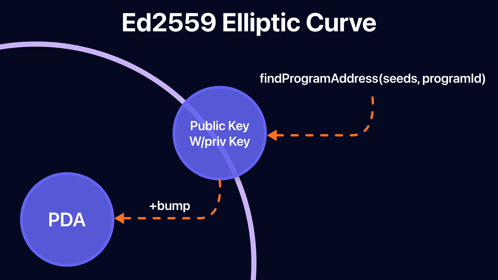

## Program Derived Address
- PDA is the home of an account designed to be controlled by a specific program.
- A PDA allows a program to sign a specific address programmatically without the need for a private key.
- Serves as the basis for cross-program calls, which allows Solana apps to configure with each other.
- A 32-byte string that looks like a public key, but doesn't have a corresponding private key
- Deterministically derive the PDA from findProgramAddress programID, Seed(collections of bytes).
- bump(1byte) is used to push the potential PDA out of the ed25519 elliptic curve.
- Program can sign PDA by providing seed and bump to invoke_signed.
- A PDA can only be signed by a derived program.
- In addition to allowing the program to sign other commands, the PDA also provides an interface such as a hashmap for indexing accounts.
- PDA is an essential building block for developing programs in Solana.
- Allows programs to sign accounts while preventing external users from creating valid signatures for the same account.
- In addition to signing an account, certain programs may modify the account on the PDA.

## Create PDA
- To understand the concept behind PDA, it can be helpful to consider that PDA is technically discovered rather than created.
- The PDA executes the combination of the seed (e.g string “vote_account”) and programID through the sha256 hash function to check whether it generates the public key in the ed25519 elliptic curve.
- When executing programID , seed via a hash function, there is a ~50% chance of actually having a valid public key in an elliptic curve.
- In this case, all you need to do is change the input slightly and add something to try again.
- The technical term for this fuzzy vector is bump.
- In Solana we start with (bump = 255) and repeat (bump=254, bump=253) and so on until we get an address that is not in the elliptic curve.It may seem rudimentary, but once discovered it provides a deterministic counter-measure that continues to lead to the same PDA.



## PDA Interaction
- When the PDA is created, it returns both the findProgramAddress address and the bump used to start the address on the elliptic curve.
- A program armed with this conflict can sign any command that requires a PDA.
- The program for signing invoke_signed the Seed and Bump used to derive the Instrument, Account List, and PDA
- In addition to signing the instrument, the PDA must also sign its own creation via invoke_signed.
- When building with PDA, it is common to save bump and seed.
- In the account data itself, this allows the developer to easily validate the PDA without the need to pass bumps to instruction parms.

## Other Resources
- [PDA](https://www.brianfriel.xyz/understanding-program-derived-addresses/)

```toc
```