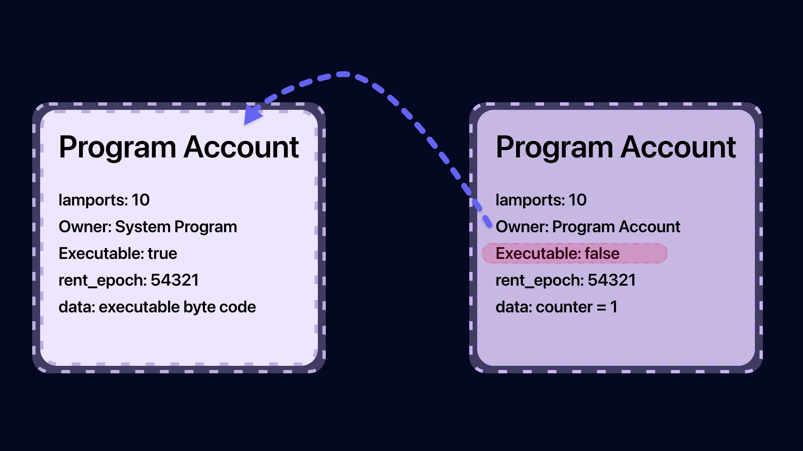

## Account
- state is used to store data
- Essential building blocks for development in Solana
- Each account has a unique address
- The maximum size of the account is 10MB
- The maximum size of PDA Account is 10KB.
- PDA Account is used to sign on behalf of the program
- Account Size is fixed at creation time, but can be adjusted using realloc.
- Account Data Storage is paid as rent.
- The default account holder is the system program.

## Account Model
### 3 types of accounts
- Data Account (Data storage purpose)
- Program Account (Executable Program Storage Purpose)
- Default Account (System, Stake and Vote Program)

## Data Account
- System Owner Account
- PDA (Program Derived Address) Account

## Account Struct
- Each account has an address (usually a public key) and an owner (program account address)
- The full list of fields in the account repository is as follows.

<table>
<thead>
<tr>
<th>Field</th>
<th>Description</th>
</tr>
</thead>
<tbody>
<tr>
<td>lamports</td>
<td>Number of lamps owned by the account</td>
</tr>
<tr>
<td>owner</td>
<td>Program owner of the account</td>
</tr>
<tr>
<td>Executable</td>
<td>Executable?</td>
</tr>
<tr>
<td>rent_epoch</td>
<td>Next payable rent level</td>
</tr>
<tr>
<td>data</td>
<td>raw data byte array stored in the account</td>
</tr>
</tbody>
</table>

## Ownership Rules
- Only the owner of the data account can modify the data and debit lamps.
- Anyone can credits lamports to their data account
- When the data in the account becomes 0, the account owner can designate a new owner.

## Program Account does not save state.
- If there is a counter program that can increment the counter, you need to create two accounts.
- one to store the program code and the other to store the counter
- You must pay rent to prevent your account from being deleted.


## Rent
- Storing data in an account costs SOL to maintain and is financed by what is called rent.
- Your account will be exempt from paying rent if you maintain a minimum balance in your account equal to two years of rental payments.
- You can recover the rent by closing your account and sending the lamports back to your wallet.
- The percentage of rent collected from the account will be forfeited and the rest will be distributed to the Vote Account when all slots are finished.
- If the account is not sufficient to pay rent, the account will be de-allocated and data will be removed.
## Rent is paid at two different times.
- When referenced by a transaction
Once an epoch

## Other Resource

[Solanacookbook: account-model](https://solanacookbook.com/core-concepts/accounts.html#account-model)

[SolanaWiki: account-storage](https://solana.wiki/zh-cn/docs/account-model/#account-storage)


```toc
```