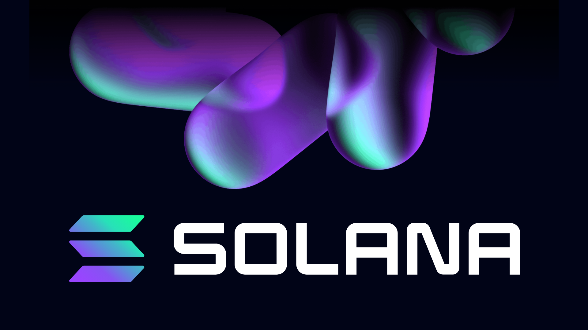

## Programs
- Developers can write and deploy programs on the Solana blockchain.
- Program (referred to as Smart Contract in Ethereum Protocol)
- The basic role of on-chain Horadong that supports everything such as Defi, NFT, Social Media, etc.
- The program handles the commands of the end user and other programs
- All programs are stateless, all data they interact with is stored in a separate account passed through commands
- The program itself is stored in an account marked as executable
- All programs are owned by BPF Loader and executed in Solana Runtime
- Developers most commonly write Rust and C++ programs, but you can choose any language that targets BPF or LLVM in the backend.
- Every program has a single entry point where instruction processing takes place. (i.e. Process_instruction)
- program_id: pubkey
- accounts: array,
- instruction_data: byte array

## Unlike other blockchains, Solana completely separates code and data.
- All data with which the program interacts is stored in a separate account and -passed by reference through instructions.
- This model allows a single generic program to operate on multiple accounts without further deployment.
- Common examples of this pattern can be found in native and SPL programs.

## Native Program, Solana Program Lib

- It has several programs that serve as key building blocks for on-chain interactions.
- The Natebee program provides the basic functions necessary to operate the validator.
- The most well-known of these programs is the system program.
- Responsible for managing new accounts and transferring SOLs between the two parties.
- The SPL program supports a variety of on-chain activities including token creation, exchange and lending, creating stake pools and maintaining on-chain name services.
- Can be called directly through the SPL token program, while others like the Associated Token Account Program are usually configured as user-defined programs.

## Write Program

- Programs are most commonly developed in Rust and C++, but can be developed in any language targeting LLVM and BPF backends.
- It provides EVM activation compatibility such as Solidity and enables developers to write programs in Solidity.

## Rust-based program architecture
<table>
<thead>
<tr>
<th>File</th>
<th>Description</th>
</tr>
</thead>
<tbody>
<tr>
<td><a href="http://lib.rs">lib.rs</a></td>
<td>Registering Modules</td>
</tr>
<tr>
<td><a href="http://entrypoint.rs">entrypoint.rs</a></td>
<td>EntryPoint to the Program</td>
</tr>
<tr>
<td><a href="http://instruction.rs">instruction.rs</a></td>
<td>Program API, (de)serializing instruction data</td>
</tr>
<tr>
<td><a href="http://state.rs">state.rs</a></td>
<td>Program Objects, (de)serializing</td>
</tr>
<tr>
<td><a href="http://erro.rs">erro.rs</a></td>
<td>Program-specific erros</td>
</tr>
</tbody>
</table>

- Recently, Anchor (similar to Ruby on Rails) is a unique framework that reduces usage and simplifies the (deserialization) process for Rust-based development.
- Programs are generally developed and tested on Localhost and Devnet environments before being distributed to Testnet or Mainnet.

<table>
<thead>
<tr>
<th>Cluster Env</th>
<th>RPC Connection URL</th>
</tr>
</thead>
<tbody>
<tr>
<td>Mainnet-Beta</td>
<td><a href="https://api.mainnet-beta.solana.com">https://api.mainnet-beta.solana.com</a></td>
</tr>
<tr>
<td>Testnet</td>
<td><a href="https://api.testnet.solana.com">https://api.testnet.solana.com</a></td>
</tr>
<tr>
<td>Devnet</td>
<td><a href="https://api.devnet.solana.com">https://api.devnet.solana.com</a></td>
</tr>
<tr>
<td>Localhost</td>
<td>default port: 8899</td>
</tr>
</tbody>
</table>

## Program Deploy
- Programs can be deployed through CLI.

``` tsx
    solana program deploy <PROGRAM_FILEPATH>
```

- When the program is distributed, it is compiled into an ELF Sharing Object.
- BPF Byte Code, upload to Solana Cluster
- An Executable program exists in the account (very similar to everything else in Solana), except that this account is marked and assigned as a BPF Loader.
- `program_id` is the address of your account, which will be used to refer to the program in all future transactions
- Supports Upgradable BPF Loader, manages program account (program_id)
- When called, the program is executed by Solana Runtime.


## Other Resources
- [Solana on-chain-programs](https://docs.solana.com/developing/on-chain-programs/overview)
- [Program-deploys](https://jstarry.notion.site/Program-deploys-29780c48794c47308d5f138074dd9838)

```toc
```