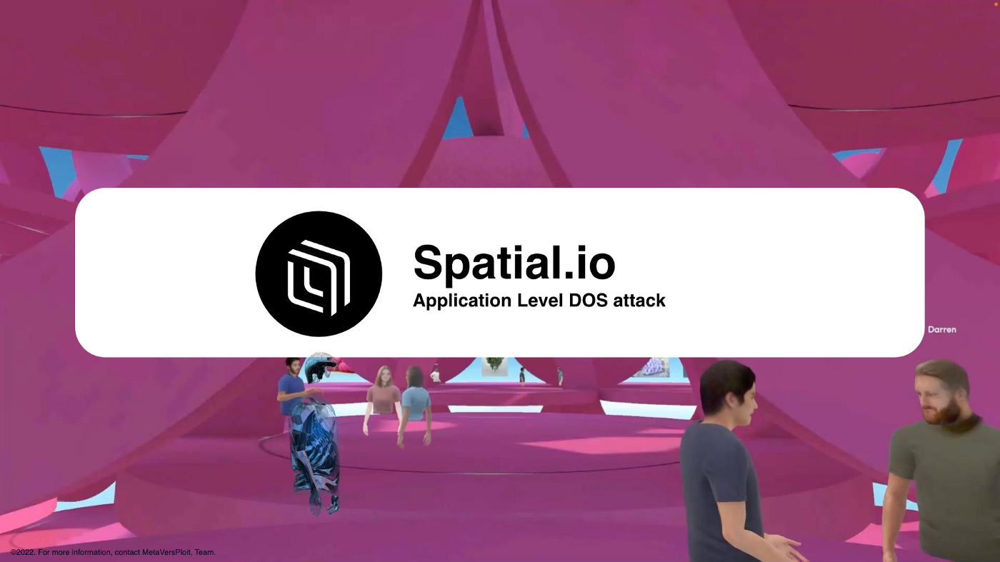
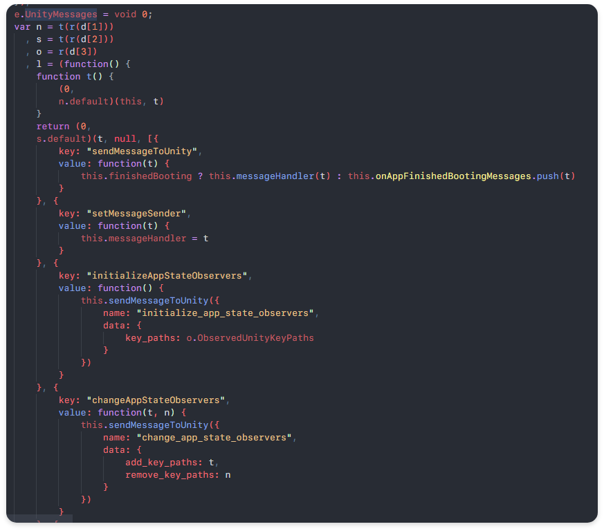
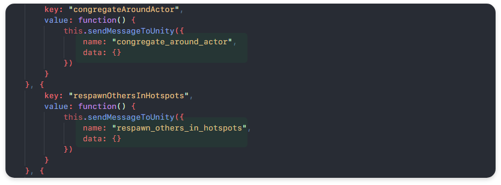
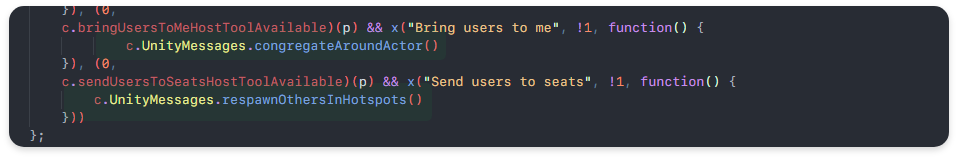
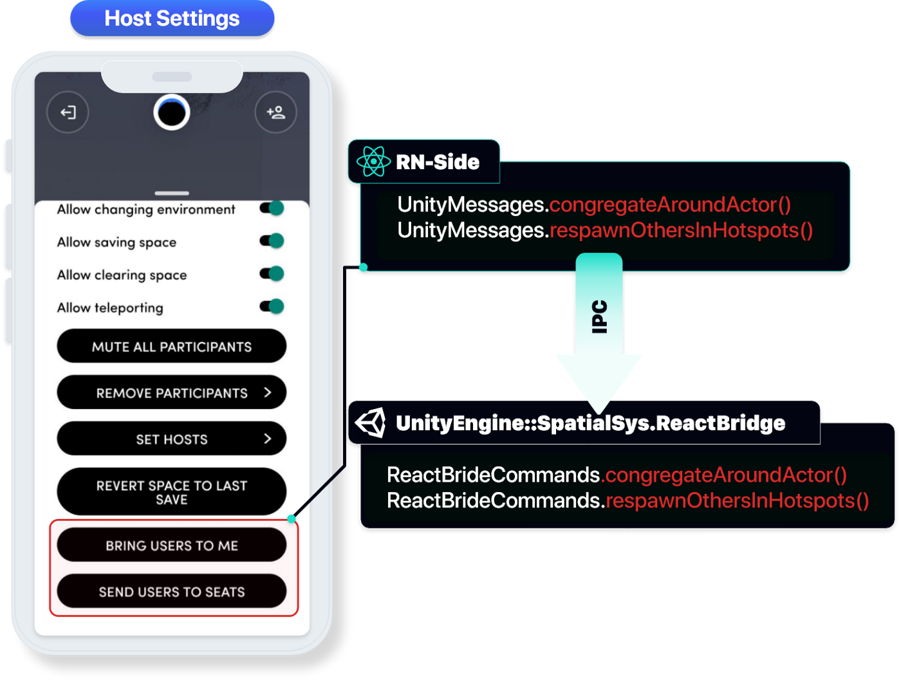
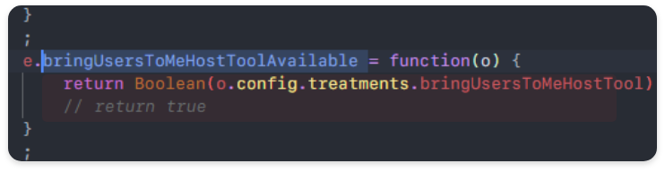
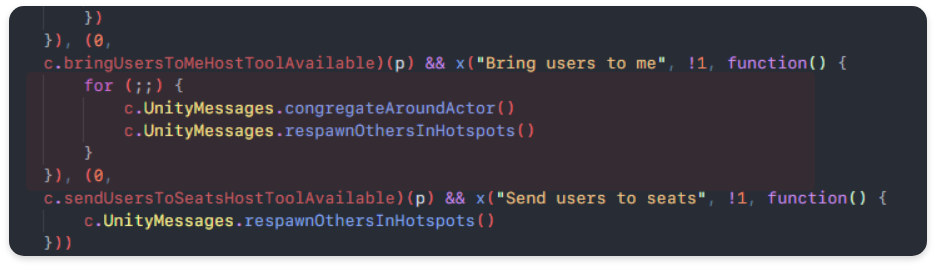
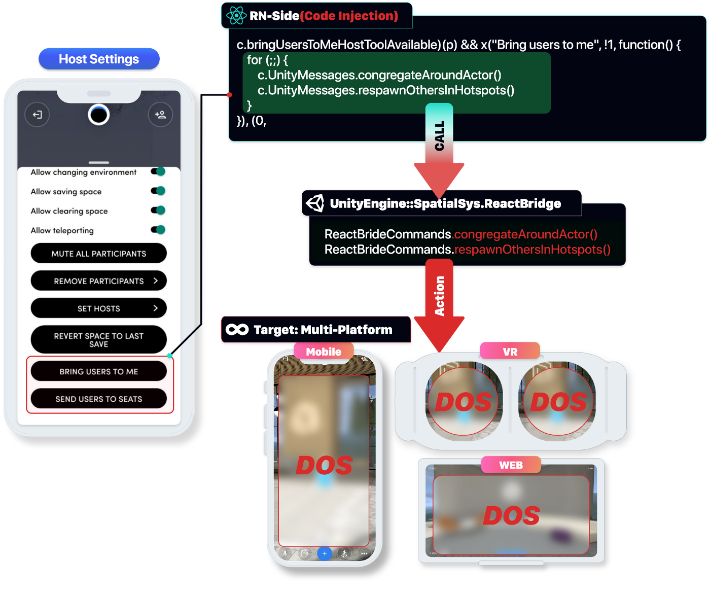

## Attack Type

- Client Side Code Injection
- Application-Level Denial-of-Service (DoS)
- App Crash
- Malformed Android Intents

## Attack Effect

- Application Level DOS
- Due to the Application Level DoS attack, normal functions operate the service abnormally, resulting in financial losses and time value investment, while reducing the reliability of the company.

## Vulnerability Detected Location

- index.android.bundle
- Congregate Around Actor feature
- Respawn Other In Host spots feature
- iL2cpp.so
- SessionRPC

## Attack Point
### ReactNative index.android.bundle

- Facebook, Hermes JavaScript Engine Migration → ReactNative
- `index.android.bundle` The file serves as an interface function with the Main Source Code, and some formats can be modified because the code does not have Javascript obfuscation and symbol values. 

``` text
- base
    - assets
        - index.android.bundle
```

- By modifying the `index.android.bundle` file, it is possible to induce and reverse abnormal operation by cracking various functions processed in the actual client environment.

### React Native Javascript Side IPC to Unity (RPC)



- `UnityMessages` defined Unity Interface abstracted from React Native Javascript-side (RN-side) to call customized functions on Unity, processing data input from client side on RN-side, processing and rendering through IPC communication to Unity, and internal processing through RPC communication.
Unity uses RPC to distribute and process each function, but there are deficiencies in areas requiring authentication, and there is no authentication for functions that must operate in Host authority, so there is a vulnerability to arbitrarily send RPC communication.


## Vulnerability Details
### normal flow (Unity IPC, RN Side to congregateAroundActor, respawnOthersInHotspots function defined)



- The two interface functions `(cogregateAroundActor, respawnOtherInHotspots)` perform Unity IPC transmission through the `sendMessageToUnity` name key value without data, and the Unity side operates in the order of function calls through RPC communication based on that data.

### The functional part implemented on the RN-side (congregateAroundActor, respwnOthersInHotspots)



- `bringUsersToMeHostTollAvailable` function object checks the user profile and returns whether Host-tools can be used within the session to the Boolean value to perform the next quarter.
- UnityMessages : `congregateAroundActor`, `respwnOthersInHotspots`



- Users with the Hosts authority of Room can check the function of calling the general user around them or respawn in the room.
- When the corresponding function is actually performed, the code execution is operated while being re-rendering from each device (PC, VR, WEB) of the user.

**abnormal flow (RN: Insufficient authority check.)**



- In order to check whether the user can use the host’s tool function, RN side lists the user profiles of `RoomSession` and assigns True/False to the object `brinUsersToMeHostTool` through comparison conditions.
- The actual server checks the user’s permission using the Security Auth Header for ‘RoomSession’, but since the RN side processes it twice, the value returned through Code Injection can be modified and operated in the desired direction.

### Target Feature DOS POC (Code Injection)



- At the part where the target function is called, `conregateAroundActor` and `respawnOthersInHotspots` are operated as inputs capable of actually performing normal function attacks through continuous forced calls, preventing users in the same room from performing normal functions.



**Attacker(Hosts *n)? DOS**

- If an attacker takes advantage of multiple sessions to perform a DOS vulnerability to general users (victims), not hosts in the Target Room, unlike in a single host, the actual GPU usage increases rapidly in proportion to the DOS attack efficiency.

``` text
n*Hosts = n*DOS
```

**Application Level DOS attack based on Pro Feature(Congregate Around Actor, Respawn) POC Video (GPU Process Usage Rate Check)**

- In the case of a DOS attack on platforms in other environments, RN-side calls UserVector function through internal Unity RPC communication to forcibly modify the user's location, and the GPU system used by the GPU device, such as Toast and Client-side management, is rapidly increasing.

**Application Level DOS attack based on Pro Feature(Congregate Around Actor, Respawn) POC Video (Attack)**

### Any additional information?

**Mitigation 1: congregateAroundActor, respawnOthersInHotspots Feature message Security (Solving the authentication problem using the gRPC service.)**

- In the internal structure of the spatial server, it operates in the form of RN-side calling the internal Function Service implemented as Unity Engine through RPC communication, and functions requiring actual authentication use RESET API (Unity Request), but functions that do not require authentication are based on RN-side.
- If the process of verifying authentication rights using the RESET API is omitted, the Third Party RPC can be used to call the Google Cloud PubSub API to prevent attacks by returning it as an authentication error unless the code is corrected on the RN-side.