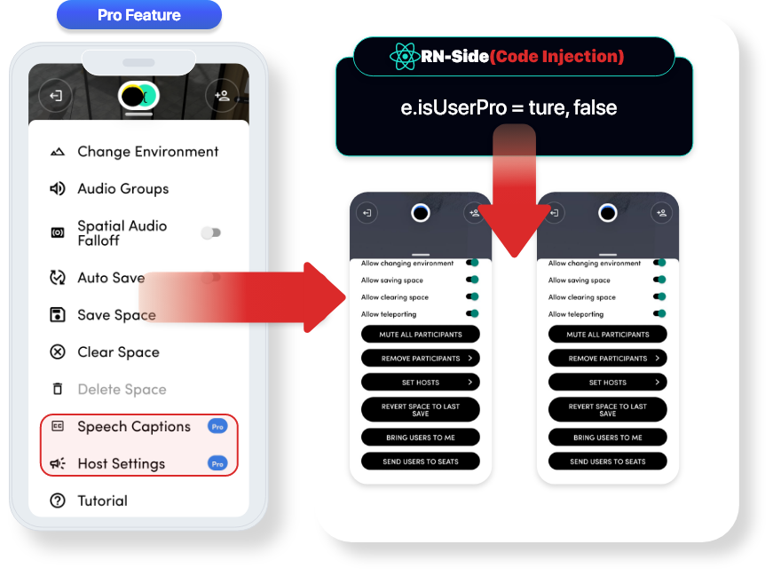
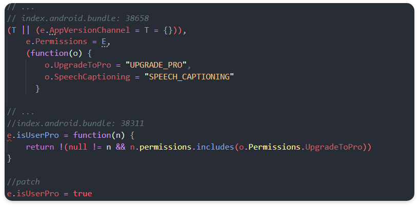
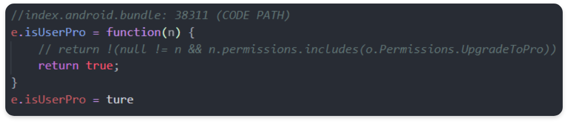
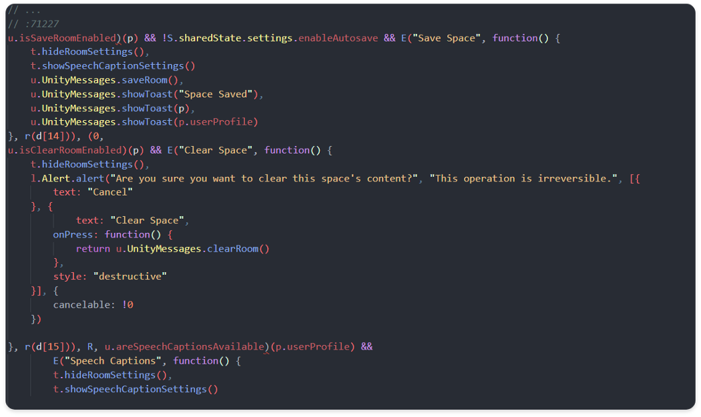
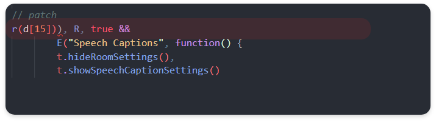
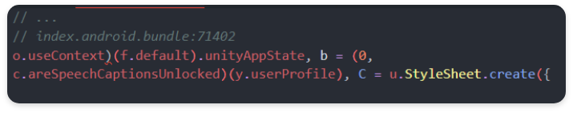
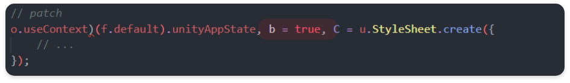
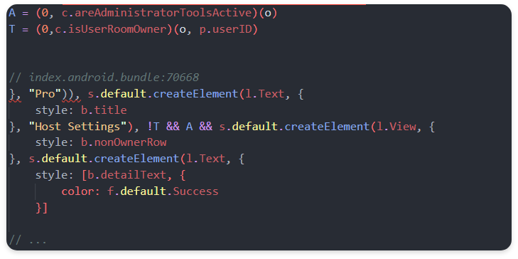
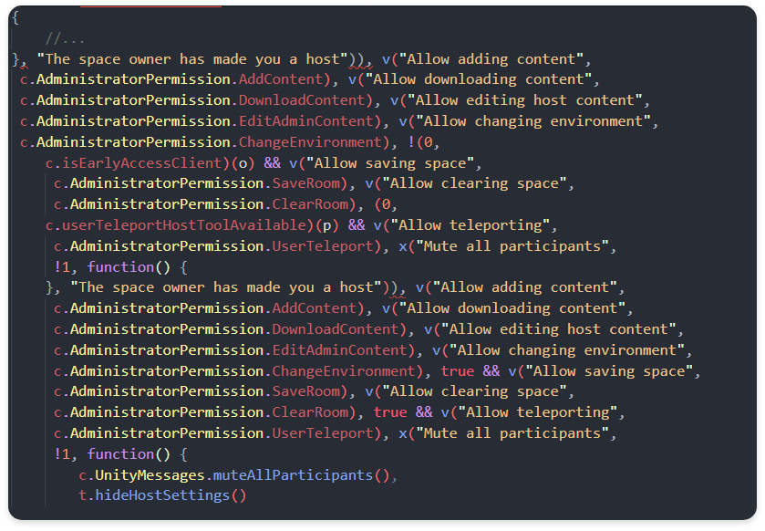
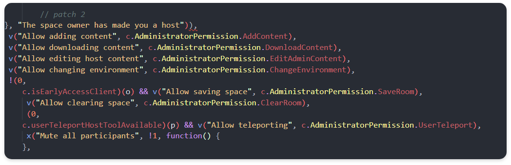

## Overview
During last year’s research, we conducted vulnerability analysis targeting metaverse-based commercial platforms. Among them, we would like to share some of the vulnerabilities that have been reported to the target company and have passed over time.
When you think of the real metaverse as a category, you can see that all technologies are gathered in one place and are harmonious. Among them, based on mobile and VR equipment, you will feel closer to the three major elements of the metaverse: SPACE, AVATAR, and ITEM. However, depending on how each element is implemented and used, vulnerabilities and attack vectors occur, resulting in metaverse hacking, causing great damage.
In this story, we will describe some of the several vulnerability analysis reports based on the https://spatial.io/ platform.

## Summary Titile
- Pro Feature Bypass


## Attack Type
- Client Side Code Injection (Clacking)

## Attack Effect

- Normal operation function bypass (Pro function: Paid version function bypass)
- By bypassing the Pro function, it can be used without the purchase process of the actual Pro/Team: `$240.00/year and $25.00/month`, resulting in financial damage in terms of the target service.
- Mobile operates the same in VR equipment, so there is a concern that one platform target will have a financial impact even in various platform environments.

## Vulnerability Detected Location

- Android/io.spatial.spatial
- /data/app/io.spatial.spatial-Ah0l8y0agajyPsJ-biIlRg==/base.apk
- React Native Side (index.android.bundle)

## Attack Point

**ReactNative index.android.bundle**

- Facebook, Hermes JavaScript Engine Migration → ReactNative
- `index.android.bundle` file serves as an interface function with the main source code, and some formats can be modified because the code does not have Javascript obfuscation and symbol values.
- By modifying the `index.android.bundle` file, it is possible to induce and reversing abnormal operation by cracking various functions processed in the actual client environment.

``` text
- base
    - assets
        - index.android.bundle
```

## Vulnerability Description

## React Native Javascript: Interface User Pro Function Check Logic Bypass
**Pro Check Object (pro value)**

``` tsx
e.isUserPro = ture, false
```

- It is an object used as a branch that can determine whether the user functions as a Pro through the isUserPro object.
- Through the object, it is possible to determine whether the Pro function can be used.
b
**normal flow (React Native Javascript: index.android.bundle)**


- In order for the App to check User Profile information for the User at entrypoint during operation, it currently receives data on `permissions` while performing session management through okHttp communication.
- If it is a Pro function, it contains a `PRO` string, which returns the Boolean value to the `isUserPro` object after checking whether the `UPGRADE_PRO` string is included in the next Pro function condition test section.

**abnormal flow (code patch)**


## Vulnerability

- In the process of performing the User Profile inspection on the server side, authentication is performed on the user, but the actual React Native Javascript side is vulnerable to Client Code Injection because only condition processing is implemented on the Client-side based on authentication on the user.

### Code Path (POC)

- The part where the internal logic for `isUserPro` function is received from the server and permissions is checked is returned to True unconditionally so that the Pro function can be used without actual permission, allowing all data flows to be modulated.

**normal flow (React Native Javascript: Index.android.bundle Speech Caption Feature (Pro))**

- When using the Pro service, you can use the `Speech Caption` function, and it is an automatic translation system that translates the language you speak into a language that the other party can understand when communicating with Voice and provides it in the form of captions.



- This function is also a logic that can be used after performing a user profile inspection, performing a user profile, and checking whether the user can use the Pro function in the Room Session.
- Among the logic to check whether the Speech Caption function is available, the server again inserts the returned data through user profile inspection in two guest houses, `areSpeech CaptionsAvailable` and `userProfile`, passing through branch conditions for the previous `isUserPro` object.
- If all three objects `isUserPro`, `areSpeechCaptionAvailable`, and `userProfile` are true, the UI function `showSpeechCaptionSetting` can be activated.

**abnormal flow (code patch)**




## Vulnerability
- Client Code Injection vulnerability exists because Client-side blocked the activation of the Pro function with the UI concept.

### Code Path (POC)

- Change the return value of the areSpeechCaptureAvailable function to True to activate the UI button function so that the showSpeechCaptureSettings UI can be used as the event handler of the UI button.

**normal flow (React Native Javascript: index.android.bundle SpeechCaptions Unlocked**



- The logic that can perform the function in the actual client is that the data of the `areSpeechCaptionsUnlocked` object on the next 71402 line must also contain the string "SPEECH_CAPTONING" and can perform the professional function through userProfile inspection.

**abnormal flow (code patch)**


## Vulnerability

- Client Code Injection vulnerability exists because Client-side blocked the activation of the Pro function with the UI concept.

### Code Path (POC)

- The final correction is completed by manipulating the data flow by manipulating the conditions of the data insertion part of the unitAppState with the true value as follows.

**normal flow (React Native Javascript: Host Settings (PRO))**

- The Host Settings function that can be used in the Host authority is one of the Pro functions that can use various Space internal settings, authority changes, and user eviction functions.



- When the isUserPro object is activated, it goes to the logic related to the HostSettings UI function and checks for activation, and when the T and A variables are respectively True, the UI of the function can be used.


``` text
, A = (0, c.areAdministratorToolsActive)(o)
, T = (0,c.isUserRoomOwner)(o, p.userID)
```


- `areAdministratorToolsActive` :→ True
- Based on the current userID, the server profile received from the server side should be checked once again from the isUserRoomOwner function to confirm whether it is the owner and the returned result should be True.


**abnormal flow (code patch)**

`}, "Host Settings"), false && s.default.createElement(l.View, {`

- In order to activate the corresponding UI function, the data flow is changed so that the next UI function can be released and used.

## Vulnerability

- Client Code Injection vulnerability exists because Client-side blocked the activation of the Pro function with the UI concept.

**normal flow (React Native Javascript: Host Settings (PRO))**



- In order to activate all of the Host Settings function internal setting functions, function check function v performs functions on the Unity side through actual Unity Process IPC communication after securing objects for each attribute.

**abnormal flow (code path)**



## Vulnerability

CodePathClient Code Injection vulnerability exists because Client-side blocked the activation of the Pro function with the UI concept.

UserProfile object check function (v) and return value for each object are modulated according to the data flow so that the final Host Settings function can be performed.

## Other Attachments (File)
**Client Code Injection Vulnerability Pro Function Bypass Attack POC Video1**


## Any additional information?

### Mitigation 1: Client Code Injection Vulnerability Prevention: React Native Javascript Anti Reversing Proguard obfuscation and ReactNative obfuscation?

- Javascript obfuscation application is required using Proguard, which is a concept of reducing the size of code and resources, but can be prepared for application cracking by performing internal logic analysis during decompile.
- Use the `getJSBundleFile` method of the abstract class ReactNativeHost to modify the path of the bundle file and proceed in the following order to encrypt the index.android.bundle file

### Android to ReactNativeHosts Method

- Within the MainApplication.java code, the onCreate method is called onCreate() when the corresponding component object is created on Android, so it is a good idea to perform bundle operations on the OnCreate method in the MainApplication.
- Use the `getJSBundleFile` method of the abstract class ReactNativeHost to modify the path of the bundle file and proceed in the following order to encrypt the index.android.bundle file.

1. index.android.bundle custom file encryption
2. eplace index.android.bundle.encfile and proceed with the compile and signature operation.
3. In MainApplicationonCreate, encrypt the index.android.bundle file in the asset folder with index.android.bundle.enc.
4. Decrypt the index.android.bundle.enc file into the External file folder and temporarily save it.
5. Overload the getJSBundleFIle method so that the file can be loaded from React Native.

- The index.android.bundle source code should be obfuscated and encrypted in the following way so that it cannot be modified through actual anti-reversing technology.

### Mitigation 2: Vulnerability of insufficient server profile inspection

- The server conducts a User Profile inspection on the user, manages the permissions and various sessions in the room, and performs some functions using third party api, but after the User Profile inspection, the attacker can bypass some functions through client injection.

```toc
```