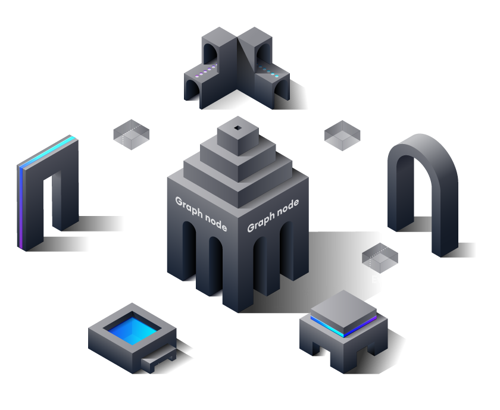

## SubGraph
- Decentralized protocol for indexing and querying data on the blockchain, starting with Ethereum
- Possible to inquire data that is difficult to inquire directly
- Uniswap complex smart contracts
- When it is difficult to read anything other than the underlying data directly from the blockchain, such as projects such as the Bored Ape Yacht Club NFT initiative

## Bored Ape Yacht Club

- Get the owner of a specific Ape
- Perform basic read operations on contracts such as getting Ape content URI or total supply based on ID
    - Because read operations are programmed
- Can be directly inserted into smart contracts, but not advanced expression queries and operations such as tweezers, searches, relationships and non-critical filtering
    - If you want to query data owned by a specific address and filter it by one of its characteristics, you cannot interact directly with the contract itself to get that information.
    - To get this data, you need to process every single event with `transfer` event, read the metadata from IPFS using tokenid and IPFS hash and aggregate it.
    - Distributed applications running in browsers take a long time to get answers to even relatively simple questions of this type
- Blockchain properties such as chain reorganization and non-regular blocks make this process more complex and time consuming
- Solve problems using a distributed protocol that indexes and enables performance and efficient queries of blockchain data
    - You can query these APIs (indexed “subGraphs”) with standard GraphQL APIs.

### How Graphs Work

- Graph
    - subGraph == manifest
    - Learn items and methods of indexing Ethereum data based on subGraph describe.
    - Define the smart contract for the SubGraph, the events in that contract that need attention, and how the graph maps the event data to the data to be stored in the database.
    - Use the `subgraph manifest` graph CLI to instruct the indexer that defines and stores in IPFS to start indexing data for that subgraph



- Data flow after the `subgraph manifest` that handles Ethereum transactions is deployed
1. dApps add data to Ethereum through smart contract transactions
2. A smart contract generates one or more events while processing a transaction.
3. Graph nodes are constantly searching for new blocks in Ethereum and the data of subgraphs they can contain.
4. The graph node finds Ethereum events for the subgraph in this block and executes the mapping handler provided.
5. Mapping is a WASM module that creates or updates data entities that graph nodes store in response to Ethereum events.
6. The dApp uses the node's GraphQL endpoint to query the graph node for indexed data on the blockchain.
7. The graph node uses the indexing capabilities of the repository to fetch this data by converting the GraphQL query into a query for the underlying data store.
8. The dApp will display this data in a rich UI for the end users, who will use this data to issue new transactions in Ethereum.

# Graph Network

- The network is a decentralized indexing protocol for organizing blockchain data.
- Applications use GraphQL to query an open API called a subgraph to retrieve indexed data from the network.
- Graph allows developers to build serverless applications that run on completely public infrastructure.

- Graph networks provide services in the network
    - Indexers that provide data to Web3 applications
    - Curator
    - Delegator
    - Consumers use applications and consume data

- Participants stake and use Graph Token (GRT) to ensure the economic security of the graph network and the integrity of the data being queried.
- GRT is a work token that is ERC-20 on the Ethereum blockchain.
- Used to allocate resources on the network
- Halseong Indexer
- Curator
- Delegators can provide services and earn income on the network in proportion to the amount of work they perform and their stake in GRT.

---

# Quick Start

- Subgraph Studio - Etheruem mainnet indexing
- Hosting Service
    - Etheruem mainnet ↔ External Network (ex.. Binance, Matic..)

# Subgraph Studio

## Graph CLI install

```jsx
npm, install -g @graphprotocol/graph-cli
```

## subgraph init

```jsx
graph init --studio <SUBGRAPH_SLUG>
```

## subgraph writer

- Subgraph construction work
- Manifest (subgraph.yaml)
     - Define the data sources the subgraph will index
- Schema (schema.graphql)
     - The GraphQL schema defines the data you want to retrieve from the subgraph.
- AssemblyScript (mapping.ts)
     - Code that converts to entities defined in the data schema of the data source


### Contract Event data query matching operation

- After subgraph initialization, modify the generated `schema.graphql` file to develop GraphQl queries for the events of the contract that will collect events.

```graphql
# Swapper Contract Receive
type Receive @entity {
  id: ID!
  address: Bytes!
  balance: BigInt!
  
}

# Swapper Event
type StakeManagermentType @entity {
  id: ID!
  sender: Bytes!
  recipient: Bytes!
  srcToken: Bytes!
  destToken: Bytes!
  expectedAmount: BigInt!
  receivedAmount: BigInt!
  percent: BigInt!
}

# history area
enum LogType {
  SWAP
}

# Logging 
type Log @entity {
  id: ID!
  logType: LogType!
  createAt: BigInt!
  tx: String!
}

# history event
type History @entity {
  id: ID!
  logs: [Log!]!
}
```

- The following is the schema structure written to query the events that occur in the `Swapper.sol` contract, and the event structure of the contract developed and deployed earlier is as follows.

```solidity
event Received(address, uint256);

event Swap(
    address indexed sender,
    address indexed recipient,
    address srcToken,
    address destToken,
    uint256 expectedAmount,
    uint256 receivedAmount,
    uint256 percent
);
```

- Because it exists on-chain, in order to generate the corresponding event, the event must be triggered by calling a method that performs the swap function.
- The `Received` event is triggered when an Ether exchange occurs when calling this contract externally, and it was added to collect who makes the exchange.
- The `Swap` event generates a corresponding event when the swap is finally completed through the `multiSwapExactInput` function. It was added to collect data such as who used this function and which token pair was used as a swap.
- If you return to the `schema.graphql` file again, you can check that the mapping has been performed according to the corresponding event type using the GraphQL syntax. In case of `Log` Type, it is added for transaction logging.

### GraphQL schema handling work in progress

- If the schema design is complete, you will be able to verify that each handling function is implemented by referencing the information of each function against the built contract abi and parsing the values configured from each event keyword. You can check the signature mapped to `eventHandlers` in the `subgraph.yaml` file below.

```solidity
- event: Received(address,uint256)
handler: handleReceived
- event: Swap(indexed address,indexed address,address,address,uint256,uint256,uint256)
handler: handleSwap
```

- Since this file is the role of the manifest, which is the area that Graph refers to for the first time, you need to define which event handler to use before proceeding with the work.
- If it is created, you can check the created file in the src directory with the contract name specified when it was first set. This file is defined as follows. It informs the vector where the event handling is located, and development should proceed after checking it.

```solidity
file: ./src/mapping.ts
```

- The functions specified as prefix handle play the role of handling the previously designed GraphQL schema. It parses various events that occur in a transaction into an object form and provides a reference.
- The important point is to execute the `graph codegen` command to transform the redesigned schema into a code that can be understood in the graph binary. Then `generated/schema` is generated and each keyword must be used as an entity.

```tsx
import { BigInt } from "@graphprotocol/graph-ts"
import { evtHistoryPush } from "./utils"
import {
  Received as EvtReceived,
  Swap as EvtSwap 
} from "../generated/Swapper/Swapper"
import { Receive, Swap, Log} from "../generated/schema"

// - event: Received(address,uint256)
// handler: handleReceived
// - event: Swap(indexed address,indexed address,address,address,uint256,uint256,uint256)
// handler: handleSwap

export function handleReceived(event: EvtReceived): void {
  let entity = new Receive(
    `${event.transaction.hash.toHex()}-${event.logIndex.toString()}`
  )
  entity.address = event.params.param0
  entity.balance = event.params.param1
  entity.save()

  logReceived(entity.id, event)
}

export function logReceived(IDs: string, event: EvtReceived): void {
  let log = new Log(`${event.transaction.hash.toHex()}-${event.logIndex.toString()}`)

  log.logType = "RECEIVE"
  log.createAt = event.block.timestamp
  log.tx = event.transaction.hash.toHex()

  log.save()
  evtHistoryPush(IDs, log)
}

export function handleSwap(event: EvtSwap): void {
  let entity = new Swap(
    `${event.transaction.hash.toHex()}-${event.logIndex.toString()}`
  )
  entity.sender = event.params.sender
  entity.recipient = event.params.recipient
  entity.srcToken = event.params.srcToken
  entity.destToken = event.params.destToken
  entity.expectedAmount = event.params.expectedAmount
  entity.receivedAmount = event.params.receivedAmount
  entity.percent = event.params.percent
  entity.save()

  logSwap(entity.id, event)
}
export function logSwap(IDs: string, event: EvtSwap): void {
  let log = new Log(`${event.transaction.hash.toHex()}-${event.logIndex.toString()}`)

  log.logType = "SWAP"
  log.createAt = event.block.timestamp
  log.tx = event.transaction.hash.toHex()

  log.save()
  evtHistoryPush(IDs, log)
}
```

- After allocating each value to the instance implemented as entity, finally complete `save`.
- Here, log functions attached as prefix are added as a separate logging role to extract time and hash information generated in a separate transaction.

### Graph build task

- If you have completed up to this point, you should proceed with the final build to prepare for event connection.
- Proceed with the build through the `graph build` command.


### Graph-Node Setup

- After deploying Subgraph, you need to configure the following to run the node for each data management locally.

[https://github.com/graphprotocol/graph-node](https://github.com/graphprotocol/graph-node)

> Graph-Node
> 
> 
> [The Graph](https://thegraph.com/) is a protocol for building decentralized applications (dApps) quickly on Ethereum and IPFS using GraphQL.
> 
> Graph Node is an open source Rust implementation that 
> event sources the Ethereum blockchain to deterministically update a data
>  store that can be queried via the GraphQL endpoint.
> 
> For detailed instructions and more context, check out the [Getting Started Guide](https://github.com/graphprotocol/graph-node/blob/master/docs/getting-started.md).
> 
- You can set up the relevant settings by referring to the following, but there are parts that need to be set up for each project.

```yaml
version: '3'
services:
  graph-node:
    image: graphprotocol/graph-node
    ports:
      - '8000:8000'
      - '8001:8001'
      - '8020:8020'
      - '8030:8030'
      - '8040:8040'
    depends_on:
      - postgres
    extra_hosts:
      - 172.19.0.1:host-gateway
    environment:
      postgres_host: postgres
      postgres_user: graph-node
      postgres_pass: let-me-in
      postgres_db: graph-node
      ipfs: 'https://ipfs.io'
      ethereum: 'rinkeby:https://rinkeby.infura.io/v3/8c6f778de9a94b6e9ebc0481745ad286'
      GRAPH_LOG: info
      GRAPH_ALLOW_NON_DETERMINISTIC_FULLTEXT_SEARCH: 'true'
      GRAPH_ALLOW_NON_DETERMINISTIC_IPFS: 'true'
  postgres:
    image: postgres
    ports:
      - '5432:5432'
    command:
      [
        "postgres",
        "-cshared_preload_libraries=pg_stat_statements"
      ]
    environment:
      POSTGRES_USER: graph-node
      POSTGRES_PASSWORD: let-me-in
      POSTGRES_DB: graph-node
      PGDATA: "/data/postgres"
    volumes:
      - ./data/postgres:/var/lib/postgresql/data
```

### Subgraph Studio Deploy

- After completing the build, proceed with deployment. This is the currently defined `package.json`, and I use the `deploy-local` command because I plan to run my own `graph-node` locally to work.

```json
{
  "name": "Uniswap",
  "license": "UNLICENSED",
  "scripts": {
    "codegen": "graph codegen",
    "build": "graph build",
    "deploy": "graph deploy --node https://api.studio.thegraph.com/deploy/ Uniswap",
    "create-local": "graph create --node http://localhost:8020/ Uniswap",
    "remove-local": "graph remove --node http://localhost:8020/ Uniswap",
    "deploy-local": "graph deploy --node http://localhost:8020/ --ipfs http://localhost:5001 Uniswap",
    "test": "graph test"
  },
  "dependencies": {
    "@graphprotocol/graph-cli": "0.33.0",
    "@graphprotocol/graph-ts": "0.27.0"
  },
  "devDependencies": { "matchstick-as": "0.5.0" }
}
```

- When initializing is performed, the following command sequence shows the next call sequence. If you modify the code, you do not need to call `graph create` and proceed in order.

```json
> graph codegen
> graph build
> graph create --node http://localhost:8020/ Uniswap
> graph deploy --node http://localhost:8020/ --ipfs http://localhost:5001 Uniswap
```

- 최종적으로 완료가 되면 해당 노드에서 시퀸스를 전송해 트랜잭션상에서 발생하는 이벤트를 쿼리하여 데이터 수집이 가능하다.
- https://thegraph.com/studio/
    - Create subgraph
        
        [Subgraph Studio](https://thegraph.com/studio/subgraph/nftmarket/)
### Uniswap Contract Code
- Github RP:  https://github.com/dnsdudrla97/unswap-contract
- Github Graph: https://github.com/dnsdudrla97/unswap-contract-subgraph

```toc
```