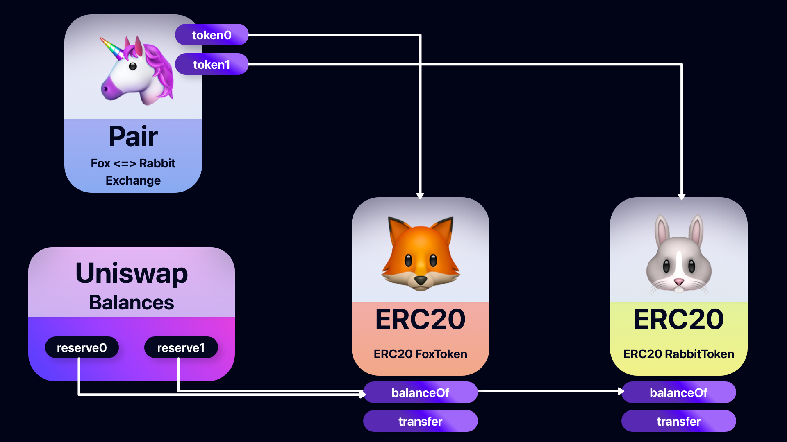

# Overview

- How it works at the uniswap code level
- uniswap code structure method
- uniswap contract
     - Core Contract: Pair
     - Core Contract: Factory
     - Periphery Contract: Router

# Core Contract

- SingleTone Factory, consists of several pairs where Factory is responsible for creation and indexing.
- Contracts with a smaller surface area are easier to reason about, more prone to bugs, and functionally better.
This means that many desired properties of the system can be asserted directly in code, leaving little room for error.
- Core Contract is somewhat unfriendly
- In practice, interacting directly with these contracts is discouraged in most use cases.

[https://github.com/Uniswap/v2-core](https://github.com/Uniswap/v2-core)

# Factory Contract

- Holds the generic bytecode that powers the factory pair.
- The main task is to create only one smart contract per unique token pair.
- Logic to control protocol power is also included.

[https://docs.uniswap.org/protocol/V2/reference/smart-contracts/factory](https://docs.uniswap.org/protocol/V2/reference/smart-contracts/factory)

# Pairs Contract

- Acts as an AMM and keeps track of pool token balances
- Exposes data that can be used to build a Decentralized Price Oracle.

[https://docs.uniswap.org/protocol/V2/reference/smart-contracts/pair](https://docs.uniswap.org/protocol/V2/reference/smart-contracts/pair)

[https://docs.uniswap.org/protocol/V2/reference/smart-contracts/pair-erc-20](https://docs.uniswap.org/protocol/V2/reference/smart-contracts/pair-erc-20)

# Periphery Contract

- A set of smart contracts designed to support core and domain-specific interactions
- Due to the permissionless nature of Uniswap, each contract has no specific authority and is actually only a part of possible peripheral-like contracts.
- Safe and efficient interaction.

[https://github.com/Uniswap/uniswap-v2-periphery](https://github.com/Uniswap/uniswap-v2-periphery)

# Library Contract

- The library provides various convenient functions for data import and pricing.

[https://docs.uniswap.org/protocol/V2/reference/smart-contracts/library](https://docs.uniswap.org/protocol/V2/reference/smart-contracts/library)

# Router Contract

- The router using the library fully supports all the basic requirements of the front-end to provide transaction and liquidity management functions.
- In particular, it basically supports multi-pair trades (e.g x to y to z), treats ETH as a first-class citizen, and provides meta-trading to eliminate liquidity.

[https://docs.uniswap.org/protocol/V2/reference/smart-contracts/router-02](https://docs.uniswap.org/protocol/V2/reference/smart-contracts/router-02)

## Uniswap Code Level

- The whole purpose of Uniswap is to enable the exchange of one ERC20 token for another token.
- For example, if you need tokenA but only have tokenB, you can use Uniswap to sell tokenB and get tokenA in return, all done in an automatic and decentralized way

### Two models of exchange way

- Order Book Model
     - Buyers and sellers place orders
     - Centralized system matches buy orders with sell orders, how traditional stock exchanges work
- Automated Market Makers (AMM)
     - There is no centralized financial execution method, and there are people who offer both tokens, which are called liquidity providers.
     - This liquidity provider uses each token to create a token pool, where traders can come and etch the tokens they want to swap and receive the tokens in return.
     - It is done automatically without a centralized entity, and traders pay a small percentage of fees for transactions going to liquidity providers for services.
- In the previous chapter, Uniswap uses AMM technology and explains each technology.

## Uniswap Code Component

- Uniswap has a total of 4 smart contracts. It is divided into (Core, Periphery).
- Core Contract
     - Storing funds (tokens) and exposing functions for token exchange, fund addition, rewards, etc.
- Periphery
     - Added convenience for interaction and development with Core Contract.

### Core Contract

- Pair (swapping, miniting, burning functions)
     - Generated for every exchange pair.
- Factory (Creates and keeps track of Pairs)
     - Create all pair contracts and proceed with tracking.
- ERC20 (Stores “ownerShip” tokens for the pool)
     - To track the Pool Owner
     - Treat the Pool as property and obtain “Pool Ownership Tokens” in return when liquidity providers provide funds to the pool
     - If you own these ownership tokens, you can get rewards. (By the trader paying a small percentage for each trade)
     - When the liquidity provider wants the funds returned, resubmit the ownership token and return the funds + accumulated rewards.
     - The ERC20 contract tracks ownership tokens.

## Periphery Contract

- Consists of only one smart contract.
- Router(Interacts with the core)
     - Provides functions such as `swapExactETHForTokens` and `swapETHForEactTokens` to interact with the Core Contract

# Uniswap Features

- Liquidity provider
    - Deposit more funds and withdraw funds with rewards.
- Trader
    - Exchange each pool and funds.
- Pool Ownership Token Management
    - Address management of the owner deposited in the pool and tracking function for fund management, etc.
- Protocol fee
    - Uniswap V2 introduces convertible protocol fees.
    - This protocol fee is turned off, but you can enable it later through settings.
    - If enabled, traders pay the same transaction fee, but 1/6 of this fee goes to uniswap and the remaining 5/6 goes to liquidity providers as a reward for providing funds.
- Money management
- Oracle price
    - Track token prices against each other
    - Can be used as Oracle Price for other smart contracts in the Ethereum ecosystem.
    - Due to arbitrage, Uniswap Price tends to closely follow the token's actual starting price. Therefore, Uniswap Price Oracle is an approximation to the actual price.

---

# Uniswap Contract

## Core. Contract (Pair)

- It implements the exchange between each token pair. Here is the full code snippet.

[https://github.com/Uniswap/v2-core/blob/master/contracts/UniswapV2Pair.sol](https://github.com/Uniswap/v2-core/blob/master/contracts/UniswapV2Pair.sol)

### Contract Init && State Variable

```solidity
contract UniswapV2Pair is IUniswapV2Pair, UniswapV2ERC20 {
  using SafeMath  for uint;
  using UQ112x112 for uint224;

  uint public constant MINIMUM_LIQUIDITY = 10**3;
  bytes4 private constant SELECTOR = bytes4(keccak256(bytes('transfer(address,uint256)')));

  address public factory;
  address public token0;
  address public token1;

  uint112 private reserve0;           // uses single storage slot, accessible via getReserves
  uint112 private reserve1;           // uses single storage slot, accessible via getReserves
  uint32  private blockTimestampLast; // uses single storage slot, accessible via getReserves

  uint public price0CumulativeLast;
  uint public price1CumulativeLast;
  uint public kLast; // reserve0 * reserve1, as of immediately after the most recent liquidity event

  uint private unlocked = 1;
  modifier lock() {
      require(unlocked == 1, 'UniswapV2: LOCKED');
      unlocked = 0;
      _;
      unlocked = 1;
  }
// ...
}
```

- It relies on the `IUniswapV2Pair, UniswapV2ERC20` contract, and the function implementation for each interface must be carried out.
- The `UniswapV2ERC20` Contract manages the full ownership token.

### Vaults Managerment features

- Exchange between token pairs such as Uniswap Pair tokenA and tokenB.
- These tokens are indicated as `token0` in the contract and are the address of the ERC20 Smart Contract to implement `token1`.
- `reserve0 ~ 1` state variables store the amount of tokens in the pair.

### How to store tokens?

- It is performed in the ERC20 contract of the token itself, not in the pair contract.
- Pair Contract tracks the reserve, and from the point of view of ERC20, it is just a general user who can send and receive Pair Contract Tokens, and has its own balance.



- How to manage funds in each of 3 smart contracts
- Calls ERC20 functions such as Pair Contractdms (OwnerAddress ⇒ Pair Contract address) and manages tokens.

```solidity
// .. [OMIT]
bytes4 private constant SELECTOR = bytes4(keccak256(bytes('transfer(address,uint256)')));

// .. [OMIT]

function _safeTransfer(address token, address to, uint value) private {
    (bool success, bytes memory data) = token.call(abi.encodeWithSelector(SELECTOR, to, value));
    require(success && (data.length == 0 || abi.decode(data, (bool))), 'UniswapV2: TRANSFER_FAILED');
}
// .. [OMIT]
```

- In Pair Contract, the ERC20 function implements the function selector as follows and calls the transfer function in the raw calling format.
- The `_update` function is called whenever there is a new fund deposited or withdrawn by the liquidity provider or a trader swaps tokens.

```solidity
function _update(uint balance0, uint balance1, uint112 _reserve0, uint112 _reserve1) private {
    require(balance0 <= uint112(-1) && balance1 <= uint112(-1), 'UniswapV2: OVERFLOW');
    uint32 blockTimestamp = uint32(block.timestamp % 2**32);
    uint32 timeElapsed = blockTimestamp - blockTimestampLast; // overflow is desired
    if (timeElapsed > 0 && _reserve0 != 0 && _reserve1 != 0) {
        // * never overflows, and + overflow is desired
        price0CumulativeLast += uint(UQ112x112.encode(_reserve1).uqdiv(_reserve0)) * timeElapsed;
        price1CumulativeLast += uint(UQ112x112.encode(_reserve0).uqdiv(_reserve1)) * timeElapsed;
    }
    reserve0 = uint112(balance0);
    reserve1 = uint112(balance1);
    blockTimestampLast = blockTimestamp;
    emit Sync(reserve0, reserve1);
}
```

- ERC20 The return value of `balanceOf` function `balance0, balance1` is the token balance of ERC20.
- Uniswap `_reserve0, _reserve1` previously known balance. (Confirmed with the last `balanceOf` .)
- Check Overflow, update Oracle Price, update `reserve` and update event `Sync`.
- The difference between the `_reserve0, _reserve1` parameters and the stored variables `reserve0, reserve1` is essentially the same.
- The function caller already reads the variable from storage and passes it as an argument in the `_update` function.
- Just a way to save gas. (Reading from Storage is more expensive than reading from Memory)
- Uniswap is implemented in an optimized way for efficiency and gas savings, and represents a single performance point.

```solidity
uint112 private reserve0;           // uses single storage slot, accessible via getReserves
uint112 private reserve1;           // uses single storage slot, accessible via getReserves
uint32  private blockTimestampLast; // uses single storage slot, accessible via getReserves
```

### Mint , Burn Features

- `Mint` is a liquidity provider adding funds to the pool and consequently a new pool ownership token is issued for the liquidity provider.
- ‘Burn’, liquidity providers withdraw funds (and accumulated rewards) and pool ownership tokens are destroyed.

```solidity
// this low-level function should be called from a contract which performs important safety checks
function mint(address to) external lock returns (uint liquidity) {
    (uint112 _reserve0, uint112 _reserve1,) = getReserves(); // gas savings
    uint balance0 = IERC20(token0).balanceOf(address(this));
    uint balance1 = IERC20(token1).balanceOf(address(this));
    uint amount0 = balance0.sub(_reserve0);
    uint amount1 = balance1.sub(_reserve1);

    bool feeOn = _mintFee(_reserve0, _reserve1);
    uint _totalSupply = totalSupply; // gas savings, must be defined here since totalSupply can update in _mintFee
    if (_totalSupply == 0) {
        liquidity = Math.sqrt(amount0.mul(amount1)).sub(MINIMUM_LIQUIDITY);
       _mint(address(0), MINIMUM_LIQUIDITY); // permanently lock the first MINIMUM_LIQUIDITY tokens
    } else {
        liquidity = Math.min(amount0.mul(_totalSupply) / _reserve0, amount1.mul(_totalSupply) / _reserve1);
    }
    require(liquidity > 0, 'UniswapV2: INSUFFICIENT_LIQUIDITY_MINTED');
    _mint(to, liquidity);

    _update(balance0, balance1, _reserve0, _reserve1);
    if (feeOn) kLast = uint(reserve0).mul(reserve1); // reserve0 and reserve1 are up-to-date
    emit Mint(msg.sender, amount0, amount1);
}
```

- You can check the logic to save gas. `reserve0, reserve1, totalSupply` These values are transferred from storage to memory to be cheaper to write.

```solidity

//.. [OMIT]   
bool feeOn = _mintFee(_reserve0, _reserve1);
//.. [OMIT]
if (feeOn) kLast = uint(reserve0).mul(reserve1); // reserve0 and reserve1 are up-to-date
```

- You can check the fee and fee calculation logic of the optional protocol.
- `totalSupply` represents the total supply of pool ownership tokens, and is a variable stored in the contract.
- The pair contract expands, so you can access the variables.
- If `totalSupply` is 0, it means that the pool is an entirely new `MINIMIUM_LIQUIDITY` Pool and the amount of pool ownership tokens should be fixed to avoid dividing by zero in liquidity calculations.
- `_mint(**address**(**0**), **MINIMUM_LIQUIDITY**); // permanently lock the first MINIMUM_LIQUIDITY tokens` Since we don't know the private key that leads to address(0), sending funds to address(0) essentially locks the funds forever.
- The ‘liquidity’ variable is the amount of new pool ownership tokens that must be issued to the liquidity provider, and the liquidity provider can receive a proportional amount of pool ownership tokens according to the number of new funds provided.
- Issue a new pool ownership token to the corresponding `to` address, the address of the liquidity provider (this uses a router that calls the function `to` )
- The way that adding funds works is deposited into the ERC20 contract.
- Pair Contract refers to the balance data, compares it with the last known balance, and then executes the final logic.
- This is a method that allows the pair contract to check the deposited balance.

```solidity
// this low-level function should be called from a contract which performs important safety checks
function burn(address to) external lock returns (uint amount0, uint amount1) {
    (uint112 _reserve0, uint112 _reserve1,) = getReserves(); // gas savings
    address _token0 = token0;                                // gas savings
    address _token1 = token1;                                // gas savings
    uint balance0 = IERC20(_token0).balanceOf(address(this));
    uint balance1 = IERC20(_token1).balanceOf(address(this));
    uint liquidity = balanceOf[address(this)];

    bool feeOn = _mintFee(_reserve0, _reserve1);
    uint _totalSupply = totalSupply; // gas savings, must be defined here since totalSupply can update in _mintFee
    amount0 = liquidity.mul(balance0) / _totalSupply; // using balances ensures pro-rata distribution
    amount1 = liquidity.mul(balance1) / _totalSupply; // using balances ensures pro-rata distribution
    require(amount0 > 0 && amount1 > 0, 'UniswapV2: INSUFFICIENT_LIQUIDITY_BURNED');
    _burn(address(this), liquidity);
    _safeTransfer(_token0, to, amount0);
    _safeTransfer(_token1, to, amount1);
    balance0 = IERC20(_token0).balanceOf(address(this));
    balance1 = IERC20(_token1).balanceOf(address(this));

    _update(balance0, balance1, _reserve0, _reserve1);
    if (feeOn) kLast = uint(reserve0).mul(reserve1); // reserve0 and reserve1 are up-to-date
    emit Burn(msg.sender, amount0, amount1, to);
}
```

- Used for deletion of liquidity pool tracking tokens issued by `mint` function. This logic is equally used to save gas.
- ‘balance0, balance1’ total balance of tokens in pool ‘liquidity’ amount of pool ownership tokens held by the provider
- You can check that all liquidity has been transferred to the Pair Contract by accessing the liquidity token with the balance of `address(this)`.
- Calculate the amount of tokens to be withdrawn to the liquidity provider in proportion to how much liquidity the liquidity provider has.
- Burn liquidity and transfer tokens, rewards to liquidity providers are automatically withdrawn with these funds.
- Make sure that the rewards for profits are properly accumulated and you get more than you deposit.

# Uniswap Swapper Contract Dev + Event Data Query (Subgraph)

- We are going to develop a simple swap contract focusing on each contract function described above.
- With reference to the SDK provided by Uniswap, the dependency management of contracts configured by function is carried out.
- Finally, the Uniswap Liquidity Pool performs the swapping function for each coin, and manages the liquidity pool based on CPMM. Tokens that will be used for deposit and reserve in the pool will be swapped in the form of ETH, DAI, and UDSC by selecting a pair of ‘DAI, USDC’ ERC20 tokens placed on the Ethereum chain.
- The overall contract is going to be distributed on the Ethereum test net, and event data collection and handling are also carried out by locally turning a subgraph node that triggers each event issued by the transaction call of the deployed contract.

### Contract Dependencies

- Uniswap contract dependency `@uniswap/sdk` is used as follows, and it is used as a transaction utility when writing deployment scripts and test codes.

```solidity
yarn add @uniswap/sdk
```

### Interface

- First, we will design the contract interface to proceed with the function definition.

```solidity
IAdapter
IAsset 
ISwapper
IUniswapV2Pair
IUniswapV2Router01
IUniswapV2Router02
IWETH
```

**Interface Adapter**

- Adaptar contracts can be designed to facilitate liquidity management and multi-pair trade function management can do.
- The core function in this contract is `swapExactTokensForTokens` among the methods of Uniswap Router Contract. Swapping according to the specified amount is executed by referring to the instance of each token specified by `path`.

> IAdapter.sol ⇒ (UniswapV2Adapter.sol : swapExactInputSingle)
> 

```solidity

function swapExactInputSingle(
    uint256 routerId,
    uint256 amountIn,
    uint256 amountOut,
    address srcToken,
    address destToken,
    address from,
    address to,
    uint256 deadline
) external returns (uint256 amountSwapped) {
    require(routers[routerId] != address(0), "ERR-01");
    IUniswapV2Router02 router = IUniswapV2Router02(routers[routerId]);
    IERC20 tokenToSell = IERC20(srcToken);
    swapper.transferFrom(tokenToSell, from, address(this), amountIn);

    address[] memory path = new address[](2);
    path[0] = address(srcToken);
    path[1] = address(destToken);
    assert(tokenToSell.approve(address(router), amountIn));

    amountSwapped = router.swapExactTokensForTokens(
        amountIn,
        amountOut,
        path,
        to,
        deadline
    )[1];
}
```

- The operation is carried out for the token pair to be swapped, and only for each of the two token pairs. Returns the swapped amount of the swapped token pair.

✅ The address value of routers[routerId] must not be 0x0, that is, a valid address must be assigned.

- For ERC20 token, type cast srcToken and destToken respectively and send to the destination address.
- To proceed with the two token pairs, refer to each address address to assign a value, then refer to the address of the corresponding router to confirm whether it is usable or not, and finally proceed with swapping.

> IAdapter.sol ⇒ (UniswapV2Adapter.sol: swapExactInput)
>

```solidity

function swapExactInput(
    uint256 routerId,
    uint256 amountIn,
    uint256 amountOut,
    address[] memory path,
    address from,
    address to,
    uint256 deadline
) external returns (uint256[] memory amounts) {
    require(routers[routerId] != address(0), "ERR-01");
    IUniswapV2Router02 router = IUniswapV2Router02(routers[routerId]);
    IERC20 tokenToSell = IERC20(path[0]);
    swapper.transferFrom(tokenToSell, from, address(this), amountIn);
    assert(tokenToSell.approve(address(router), amountIn));

    amounts = router.swapExactTokensForTokens(
        amountIn,
        amountOut,
        path,
        to,
        deadline
    );
}
```

- Same function as the previous function, but supports multiple tokens to be swapped.

> AdapterStorage.sol
>

```solidity
contract AdapterStorage is Ownable {
    mapping(uint256 => address) internal routers;

    function registerRouter(uint256 routerId, address routerAddress)
        external
        onlyOwner
    {
        routers[routerId] = routerAddress;
    }
}
```

- The main function of the adapter must be in charge of the uniswap router security element. The following `registerRouter` function manages the router address for each increase in the routers mapping structure, and it should be able to allocate only each approved data in fact. did.

### Interface Asset

- This contract can design ERC20 compliant token contracts or functions used to express ETH. Since it is not used in the current Uniswap Liquidity Pool Swapping function, I will only allocate it with an empty contract.

### Interface UniswapV2Pair

- You can check the total liquidity supply of the pair and the token balance. You need to insert it into a separate function and proceed.

✅ Each contract dependency must be configured based on the deployed pair contract's address instance.

✅ Each asset must exist in the Pair Contract.

✅ Get the total supply of Pair Liquidity.

✅ Reserves should be sorted in the order of tokenA and tokenB.

- Utilize the `getReserves` method and return the reserves of token0 and token1, which are used to set the transaction price and distribute liquidity. Returns `block.timestamp(mod 2**32)` of the last block in which the interaction occurred for the Pair.

### Interface WETH

- In order to directly transact with other altcoins outside the ERC-20 standard protocol, wrapping is required during the swapping process.
- In order to exchange ERC-20 tokens and Ether on a decentralized platform such as Radar Relay, and since it provides direct transactions between users using Ethereum smart contracts, all users receive the same tokens for all tokens traded. standards must be maintained.

```solidity
pragma solidity ^0.8.0;

library Utils {
  enum SwapType {
      GIVEN_IN,
      GIVEN_OUT
  }

  address public constant WETH =
      address(0xc778417E063141139Fce010982780140Aa0cD5Ab);
  address public constant ETH =
      address(0xEeeeeEeeeEeEeeEeEeEeeEEEeeeeEeeeeeeeEEeE);
}
```

[https://rinkeby.etherscan.io/address/0xc778417e063141139fce010982780140aa0cd5ab#code](https://rinkeby.etherscan.io/address/0xc778417e063141139fce010982780140aa0cd5ab#code)

- In order to refer to the WETH9 Contract distributed on the test net and use it, I implemented one for the corresponding access purpose.

## Swapper Contract Design

- We designed the basic utility and dependency interface before, and now we will implement the code level to perform the swapping function, which is the main contract.
- In this contract, wrapper with WETH, multi- and single-swap functions are implemented.

### How to Pricing a Transaction

- Each pair of Uniswap is actually backed by a liquidity pool.
- A liquidity pool is a smart contract that holds the balance of two unique tokens and enforces rules related to depositing and withdrawing them, and the basic rule is the constant product formula (X * Y = K).
- When you buy a token, you need to sell a proportionate amount to keep it constant.
- The token rate in the pool, along with a certain product formula, ultimately determines the price at which the swap is executed.

### How Uniswap Handles Pricing

- In v1, a transaction is always executed at the “best” price calculated at run time, and the calculation is actually done in one of two formulas depending on whether the transaction specifies an exact input or output amount.
- Functionally, the difference between these two functions is negligible, but the existence of the difference itself increases the conceptual complexity.
- Initial attempts to support both features in V2 were inappropriate and decided not to offer price features in Core
Instead, the pair directly checks whether the invariant is satisfied after every trade.
- Enforce immutability rather than relying on pricing features and V2 pairs are simple and transparent to ensure their own safety and good separation of concerns.
- One downstream advantage is that it more naturally supports other types of trades where V2 pairs can appear.

### price trading

- When exchanging tokens on Uniswap, it is common to either receive as many output tokens as possible for the correct input amount or pay as few input tokens as possible for the correct output amount.
- To calculate these amounts, the contract needs to look up the pair's current reserve to understand what the current price is.
- It is not safe to perform a lookup and rely on results without access to external prices.
- Let's say the contract naively sends 10 DAI to a DAI/WETH pair and wants to receive as much WETH as it can get given the current reserve ratio.

```solidity
> When a pure smart contract is invoked, simply querying the current price and executing a transaction?
=> Vulnerable to FlashAttack and likely to suffer economic loss.
=> We have to think about the malicious actor who sees this transaction before it is confirmed in the transaction.
=> You can execute a swap that dramatically changes the DAI/WETH price just before the naive swap.
=> You can change the price back to what it was before the naive swap by waiting for the naive swap to run at a bad rate and then swapping
=> This attack is fairly cheap, low risk, and can usually be done for profit.
```

- To prevent the above attack, it is important to submit a swap with access to information about the “fair” price at which the swap should be executed.
- Swap must be accessible to Oracle to ensure that the best practices you can get from Uniswap are close enough to what Oracle considers the “true” price.
An oracle could be as simple as an off-chain observation of a pair's current market price.
- Due to arbitrage, the reserve ratio within a pair of blocks is usually close to the “true” market price.
- Therefore, if users submit transactions with this knowledge in mind, it is possible to ensure that losses from flash loan attacks are strictly limited.
- Logic can be safely implemented client-side, and given the observed in-block price, calculate the optimal amount of input/output and perform swap using router
- Guarantees that the swap will run at a rate that is at least % worse than the observed in-block rate of `X`.

### State Variables

```solidity
using SafeERC20 for IERC20;
// ...

mapping(uint256 => address) public adapters;

struct SwapStep {
    uint256 adapterId;
    uint256 routerId;
    address[] path;
    uint256 percent;
    uint256 amountOut;
    uint256 deadline;
}

struct MultiSwapParams {
    address to;
    address srcToken;
    address destToken;
    uint256 amountIn;
    SwapStep[] swaps;
}

struct SingleSwap {
    uint adapterId;
    uint routerId;
    uint amountIn;
    uint amountOut;
    uint deadline;
    address[] path;
    address to;
}
// ...
```

- We designed the contract for adapter management earlier, but based on the increased adapterID value, we manage each adapter mapping data in the storage.
- During Uniswap Swapping, it is important to manage data by user on storage, and in the case of `SwapStep` structure, index information of data managed by mapping, address values of multi-tokens, balance of liquidity pool, amount of money, and swapping are important. Used to store instantaneous time in case of failure.
- `MultiSwapParams` and `SingleSwap` are used when implementing the `SwapExactInputSingle` function of each Swap Contract used in the Uniswap protocol, respectively.

### Functions

```solidity
function simpleSwapExactInputSingle(
    uint256 adapterId,
    uint256 routerId,
    uint256 amountIn,
    uint256 amountOut,
    address srcToken,
    address destToken,
    address to,
    uint256 deadline
) external payable returns (uint256) {
    require(adapters[adapterId] != address(0), "Adapter not registered");
    IAdapter adapter = IAdapter(adapters[adapterId]);
    address from;
    (srcToken, from) = _wrapETH(amountIn, srcToken);
    if (from == address(this)) {
        assert(IERC20(Utils.WETH).approve(address(adapter), amountIn));
    }
    return
        adapter.swapExactInputSingle(
            routerId,
            amountIn,
            amountOut,
            srcToken,
            destToken,
            from,
            to,
            deadline
        );
}
```

✅ The value of the adapters mapping data must be a valid address, that is, an authenticated address.

- If it belongs to the certified adapter contract storage, the lower router is registered.
- Wrapping before swapping (wrapperETH contract) Using `_wrapETH` function
- Approval process to deliver WETH based on the information of the contract to be swapped in. At this time, the value of `from` should be the address of the current contract instance.
- Perform a single swap function through the `swapExactInputSingle` Uniswap function after real user authentication and approval are completed

```solidity
function multiSwapExactInput(MultiSwapParams memory params)
    external
    payable
{
    address from;
    address to = params.to;
    (params.srcToken, from) = _wrapETH(params.amountIn, params.srcToken);

    if (params.destToken == Utils.ETH) {
        to = address(this);
    }
    uint256 totalAmountsOut = 0;
    for (uint256 i = 0; i < params.swaps.length; i++) {
        SwapStep memory swapParams = params.swaps[i];
        require(
            adapters[swapParams.adapterId] != address(0),
            "Adapter not registered"
        );
        address destSwapToken = swapParams.path[swapParams.path.length - 1];

        require(
            destSwapToken == params.destToken ||
                (destSwapToken == Utils.WETH &&
                    params.destToken == Utils.ETH),
            "destToken doesn't match"
        );

        uint256 amountIn = (params.amountIn * swapParams.percent) / 10000;
        IAdapter adapter = IAdapter(adapters[swapParams.adapterId]);

        uint256[] memory amounts = adapter.swapExactInput(
            swapParams.routerId,
            amountIn,
            swapParams.amountOut,
            swapParams.path,
            from,
            to,
            swapParams.deadline
        );
        totalAmountsOut += amounts[amounts.length - 1];
        emit Swap(
            msg.sender,
            params.to,
            params.srcToken,
            params.destToken,
            swapParams.amountOut,
            amounts[amounts.length - 1],
            swapParams.percent
        );
    }

    if (params.destToken == Utils.ETH) {
        IWETH(Utils.WETH).withdraw(totalAmountsOut);
        payable(msg.sender).transfer(totalAmountsOut);
    }
}
```

- 앞서 싱글 과 동일한 기능의 멀티 토큰을 지원하는 형태로 구성하였다. `SwapStep` 으로 멀티 토큰 페어 에 해당하는 데이터를 구성한 후 배열 형태로 값을 저장 한후 해당 배열의 길이 만큼 앞서 진행했던 로직을 수행해 순차적으로 Swapping을 진행한다.
- WETH 를 un-wrapping 해 ETH 로 교환이 필요하기 때문에 ether로 스와핑할 때 주소를 이 계약의 주소로 변경한 다음 사용자에게 전달

✅ 두 번째 require 조건은 대상 토큰이 스왑이고 마지막 토큰과 일치하는지 확인한 후 대상 토큰이 ETH인지 확인 및 멀티 토큰 배열의 주소 중 마지막 토큰이 WETH 여야 한다.

- 동일하게

### Util Functions

```solidity
function _wrapETH(uint256 amountToWrap, address tokenInput)
    internal
    returns (address tokenOutput, address from)
{
    if (tokenInput == Utils.ETH) {
        require(msg.value > 0, "ERR-04");
        require(msg.value == amountToWrap, "ERR-05");
        IWETH(Utils.WETH).deposit{value: msg.value}();
        tokenOutput = Utils.WETH;
        from = address(this);
    } else {
        tokenOutput = tokenInput;
        from = msg.sender;
    }
}
```

- Provides a utility function that wraps ETH into WETH. Given a token, the function returns the WETH address as the token output if the token input is ETH. `tokenInput` token input address, `amountToWrap` used as the amount of token input to wrap. If the token input is not WETH, the return value tokenOutput is the same, and if the token input is not WETH, the from address is msg.sender.

```solidity
function registerAdapter(uint256 _adapterIdx, address _routerAddress)
    external
    onlyOwner
{
    adapters[_adapterIdx] = _routerAddress;
}
```

- It is designed to update and modify mapping data for contract adapters management.

- Finally, Share-Value

```solidity
function computeLiquidityShareValue(uint liquidity, address tokenA, address tokenB) external override returns (uint tokenAAmount, uint tokenBAmount) {
      revert("TODO");
  }
```

## Contract Testing  && Deploy Testnet

- As Uniswap Swapping Contract design and development have been completed previously, simple testing and distribution will be conducted on the Rinkeby testnet.
- The data required for testing will be parsed by referring to the DAI, USDC, and USDT ERC20 token contracts that exist on the mainnet.
- For some tests, we use the functional Rouunter contract of SushiSwap and ShibaSwap contracts implemented by forking Uniswap, and the current contract that has been deployed for some tests.

```tsx
import {
  ChainId,
  Fetcher,
  Percent,
  Route,
  Token,
  TokenAmount,
  Trade,
  TradeType,
  WETH,
} from "@uniswap/sdk";
import { BigNumber } from "ethers";
const { ethers, upgrades } = require("hardhat");
const dotenv = require("dotenv");
dotenv.config({ path: "./.env.local" });

const addresses = {
  DAI: "0x6B175474E89094C44Da98b954EedeAC495271d0F",
  USDC: "0xA0b86991c6218b36c1d19D4a2e9Eb0cE3606eB48",
  DEAD: "0x000 000000000000000000000000000000000dEaD",
  USDT: ethers.utils.getAddress("0xdac17f958d2ee523a2206206994597c13d831ec7"),
  ETH: "0xEeeeeEeeeEeEeeEeEeEeeEEEeeeeEeeeeeeeEEeE",
  WETH: WETH[1].address,
  UniswapV2Router: "0x7a250d5630B4cF539739dF2C5dAcb4c659F2488D",
  SushiSwapRouter: "0xd9e1cE17f2641f24aE83637ab66a2cca9C378B9F",
  ShibaSwapRouter: "0x03f7724180AA6b939894B5Ca4314783B0b36b329",
  SwapperContract: "0x522864625577b80fFaae1B94d703a1913350811d",
};

async function main() {
  const DAIContract = await ethers.getContractAt("IERC20", addresses.DAI);
  const USDCContract = await ethers.getContractAt("IERC20", addresses.USDC);
  const WETHContractIWETH = await ethers.getContractAt("IWETH", addresses.WETH);
  const WETHContractIERC20 = await ethers.getContractAt(
    "IERC20",
    addresses.WETH
  );
  const Utils = await ethers.getContractFactory("Utils");
  const utils = await Utils.deploy();
  await utils.deployed();
  const Swapper = await ethers.getContractFactory("Swapper");
  const UniswapV2Adapter = await ethers.getContractFactory("UniswapV2Adapter");
  const swap = await Swapper.deploy();
  const uniswapV2Adapter = await UniswapV2Adapter.deploy(swap.address);
  await swap.deployed();
  console.log(`Swap contract deployed at: ${swap.address}`);
  await uniswapV2Adapter.deployed();
  console.log(
    `UniswapV2Adapter contract deployed at: ${uniswapV2Adapter.address}`
  );

  const adaptersRouters = [
    {
      adapterAddress: uniswapV2Adapter.address,
      routers: [
        addresses.UniswapV2Router,
        addresses.SushiSwapRouter,
        addresses.ShibaSwapRouter,
      ],
    },
  ];

  for (let i = 0; i < adaptersRouters.length; i++) {
    await swap.registerAdapter(i, adaptersRouters[i].adapterAddress);

    // Register routers for adapters to use
    for (let j = 0; j < adaptersRouters[i].routers.length; j++) {
      // console.log(`Index: ${j} - Address: ${adaptersRouters[i].routers[j]}`);
      await uniswapV2Adapter.registerRouter(j, adaptersRouters[i].routers[j]);
    }
  }
  return {
    DAIContract,
    USDCContract,
    WETHContractIWETH,
    WETHContractIERC20,
    utils,
    swap,
    uniswapV2Adapter,
  };
}
```

- Based on the contract that exists on each on-chain and the contract built on the off-chain, the instance is activated and the required method is called.
- The necessary part is to register each router with the adapter contract design pattern. At this time, by calling `registerRounter`, which was designed as a utility function in the Swap contract, registration is completed and distribution is completed.

```tsx
async function multiSwapp() {
  const chainId = ChainId.RINKEBY;
  const DAI = new Token(chainId, addresses.DAI, 18);
  const USDC = new Token(chainId, addresses.USDC, 6);

  const [owner] = await ethers.getSigners();
  console.log(`Owner: ${owner.address}`);
  const amountIn = ethers.utils.parseEther("1");
  const slippageTolerance = new Percent("50", "10000");
  const pair = await Fetcher.fetchPairData(DAI, WETH[DAI.chainId]);
  const pair2 = await Fetcher.fetchPairData(DAI, USDC);
  const route = new Route([pair], WETH[DAI.chainId]);
  const route2 = new Route([pair2], DAI);
  const trade = new Trade(
    route,
    new TokenAmount(WETH[DAI.chainId], amountIn.toString()),
    TradeType.EXACT_INPUT
  );
  const path = [addresses.ETH, addresses.DAI];
  const path2 = [addresses.DAI, addresses.USDC];
  const amountOutMin = trade.minimumAmountOut(slippageTolerance).raw; // needs to be converted to e.g. hex
  const deadline = Math.floor(Date.now() / 1000) + 60 * 20; // 20 minutes from the current Unix time

  const SwapperFactory = await ethers.getContractFactory("Swapper");
  const Swapper = await SwapperFactory.attach(addresses.SwapperContract);
  console.log("approve Swapper transfer for init..");
  const tx = await Swapper.multiSwapExactInput(
    {
      to: owner.address,
      amountIn,
      srcToken: path[0],
      destToken: path[path.length - 1],
      swaps: [
        {
          routerId: 0,
          adapterId: 0,
          amountOut: amountOutMin.toString(),
          deadline,
          path: [addresses.WETH, addresses.DAI],
          percent: 10000,
        },
      ],
    },
    { value: amountIn }
  );
  console.log(`MultiSwapExactInput tx: ${tx.hash}`);
}
```

- Next, in the state of simple deployment, we plan to test the swapping function for each token with the test net and query the data of the event that occurred in SubGraph.
- Test the ETH↔DAI pair token through Uniswap Swapping.
- Finally, deployment and testing are completed.

### Uniswap Contract Code
- Github RP:  https://github.com/dnsdudrla97/unswap-contract


```toc
```