# 윈도우 실행 파일 구조

## PE 파일 (Portable Excutable)

- 다양한 정보를 포함한 커다란 구조체들로 이루어져 있다.
- 수만은 테이블과 멤버들을 포함하고 있다.

## PE 파일의 종류

|종류|설명|
|----|----|
|EXE|실행파일|
|SCR|실행파일 (화면 보호기)|
|DLL|라이브러리|
|OCX|라이브러리 (ActivieX)|
|SYS|시스템 드라이버|
|OBJ|오브젝트 파일|

- SCR 파일이 실행 파일임을 인지 하지 못한채 악성 코드로 동작하게 되어 피해가 발생한 경우가 다수
- 첫 바이트 부터 시작된다. PE 파일은 파일에 존재할 때의 구조와 메모리에 로드된 후의 모습이 달라진다.
- 파일에서는 첫 바이트부터의 거리를 offset을 사용한다.
- 메모리에서는 VA(Virtual Address), RVA(Relative Virtual Address, 상대적 가상 주소)
- 고정 주소 대신 상대 주소를 사용하는 이유는 해당 PE 파일이 메모리에 로드 될 때 한 주소에 고정적으로 로딩되는 것이 아니기 떄문이다.
- 메모리에 로드된 후에 조금 사이즈가 커진 것을 볼 수 있다. 일반 적으로 File Alignment 값 보다 Section Alignment 값이 더 크기 때문이다.
- Alignment란 여러 가지 내부 연산 등 처리상의 효율성을 위해 특정 단위로 간격을 맞춰주는 것을 의미  한다.
- 섹션이 파일 상태에서는 사이즈가 0이지만 메모리에 로드된 후에는 용량이 커지는 경우도 존재

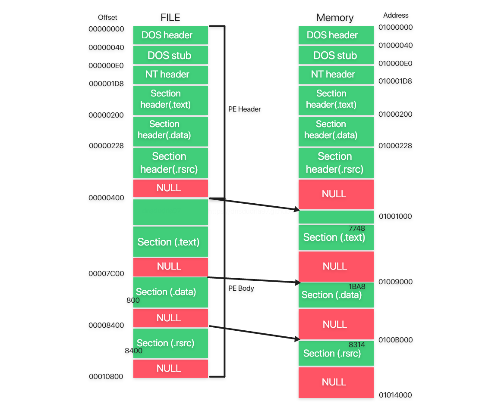

## Calc.exe PE 구조 분석

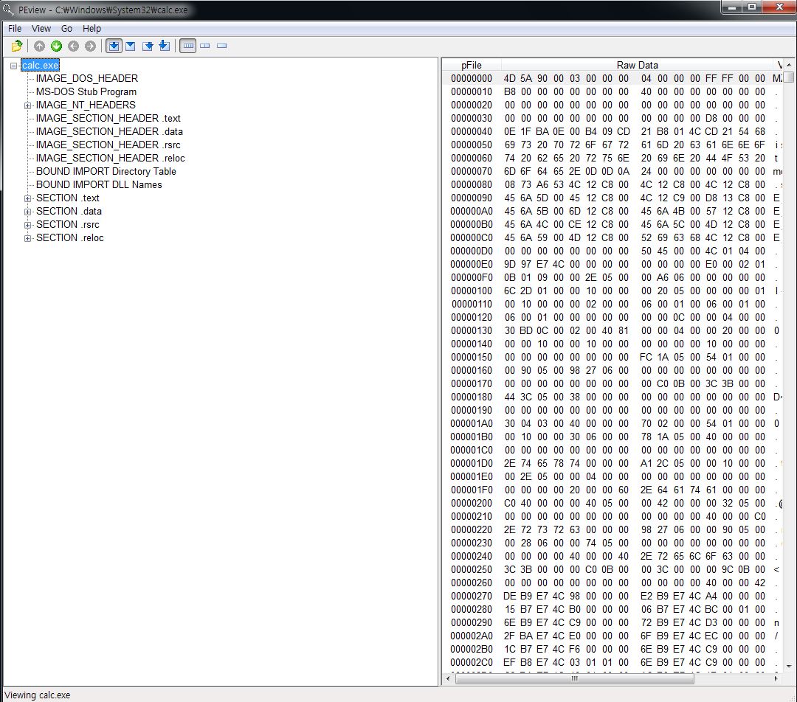

### Image_DOS_HEADER, DOS Stub

- PE 포맷의 시작 부분에 위차한 40바이트의 구조체인 DOS Header, Stub는 Windwos가 아닌 DOS 운영체제를 위한 것
- DOS에서 PE 파일이 실행되는 경우를 위해 만들어진 헤더

```c
typedef struct _IMAGE_DOS_HEADER {              // DOS header
        WORD    e_magic;                        // Magic number
        WORD    e_cblp;
        WORD    e_cp;
        WORD    e_crlc;                         // Relocations
                                                // ...
        WORD    e_res2[10];                     // Reserved words
        LONG    e-lfanew;                       // File address of new exe header
} IMAGE_DOS_HEADER, *PIMAGE_DOS_HEADER          // winNT.h
```

- e_magic, e_lfanew 를 주로 사용하는 구조체 멤버이며 나머지 멤버들은 현재로 서 DOS를 자주 사용하지 않기 때문에 빈도가 적다.

**e_magic**

- 파일 시그니처라 생각 하면되고 이 파일이 PE 파일임을 나타내주는 첫 2개의 바이트로 , MZ(5A4D)로 고정 되어 있다.
- 첫 2바이트가 MZ가 아니면 로더는 해당 파일을 PE로 인식하지 않는다.

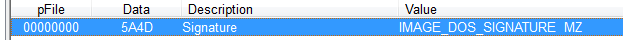

**e_lfanew**

- NT Header가 시작되는 오프셋을 나타낸다.
- calc.exe에서는 다음과 같이 NT Header까지의 Offset을 나타낸다.


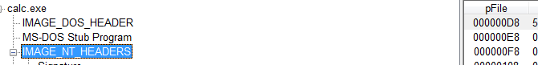

### DOS Stub

- DOS Header 바로 아래 위차하며 대부분의 PE 파일에 존자해지만 없어도 실행에 아무 지장 없는 DOS 용 실행 코드

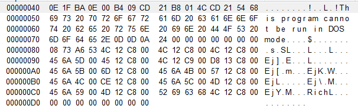

- 이 부분의 코드는 16비트 코드로 32비트 윈도우에는 실행 조차 되지 않는다. 위의 문자열에서도 보이듯이 단지 DOS에서는 실행 불가능하다는 메시지를 출력하기 위한 코드

### IMAGE_NT_HEADERS

- NT 헤더임을 나타내는 시그니처 "P E 0 0 " 4바이트를 시작으로 FileHeader, OptionalHeader를 멤버로 가지는 구조체이다.

IMAGE_NT_HEADERS32

```c
typedef struct _IMAGE_NT_HEADERS {
        DWORD Signature;
        IMAGE_FILE_HEADER FileHeader;
        IMAGE_OPTIONAL_HEADER32 OptionalHeader;
} IMAGE_NT_HEADERS32, *PIMAGE_NT_HEADERS32;
```

IMAGE_FILE_HEADER

```c
typedef struct _IMAGE_FILE_HEADER {
        WORD            Machine;
        WORD            NumberOfSections;
        DWORD           TimeDataStamp;
        DWORD           PointerToSymbolTable;
        WORD            SizeOptionalHeader;
        WORD            Characteristics;
} IMAGE_FILE_HEADER, *PIMAGE_FILE_HEADER;
```

**Machine**

- **파일의 실행 대상 플랫폼을 나타낸다.**
- Machine을 나타내는 상수값 역시 WinNT.h에 정의되어 있다. 일반적으로 접근하게 될 파일들은 대부분 Intel3836, Intel64, ARM 등

```c
#define IMAGE_FILE_UKNOWN               // 0
#define IMAGE_FILE_MACHINE_I386         // 0x014c Intel 386
#define IMAGE_FILE_MACHINE_R3000        // 0x0162 MIPS
#define IMAGE_FILE_MACHINE_ARM          // 0x01c0 ARM
#define IMAGE_FILE_MACHINE_IA64         // 0x0200 Intel 64
```

**NumberOfSections**

- 파일에 존재하느 섹션의 수
- 섹션은 파일에 따라 갯수가 달라질 수 있기 때문에 이를 알려 주기 위함이다.

SizeOFOptionalHeader는 바로 이어지는 Optional Header의 크기를 알려준다.

**Characteristics**

- PE 파일의 특성을 알려주며 이 부분을 통해 DLL 인지, 실행 파일인지 알 수 있다.
- 최종 값은 해당되는 속성들의 OR값으로 표시된다.

```c
#define IMAGE_FILE_EXECUTABLE_IMAGE             0x0002
// File is executable
#define IMAGE_FILE_32BIT_MACHINE                0x0100
// 32 bit word machine.
#define IMAGE_FILE_DLL                          0x2000
// File is a DLL
```

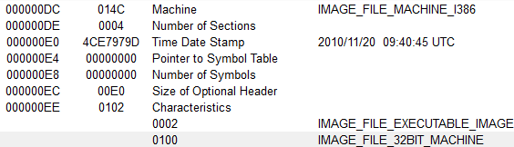

- Intel x86용 바이너리 임을 알 수 있다.
- 4개의 섹션을 가지고 있다.
- Characteristics의 값은 0x102 = 0x100 + 0x002

### IMAGE_OPTIONAL_HEADER

```c
typedef struct _IMAGE_OPTIONAL_HEADER {
  **WORD                 Magic;**
  BYTE                 MajorLinkerVersion;
  BYTE                 MinorLinkerVersion;
  DWORD                SizeOfCode;
  DWORD                SizeOfInitializedData;
  DWORD                SizeOfUninitializedData;
  DWORD                AddressOfEntryPoint;
  DWORD                BaseOfCode;
  DWORD                BaseOfData;
  DWORD                ImageBase;
  DWORD                SectionAlignment;
  DWORD                FileAlignment;
  WORD                 MajorOperatingSystemVersion;
  WORD                 MinorOperatingSystemVersion;
  WORD                 MajorImageVersion;
  WORD                 MinorImageVersion;
  WORD                 MajorSubsystemVersion;
  WORD                 MinorSubsystemVersion;
  DWORD                Win32VersionValue;
  DWORD                SizeOfImage;
  DWORD                SizeOfHeaders;
  DWORD                CheckSum;
  WORD                 Subsystem;
  WORD                 DllCharacteristics;
  DWORD                SizeOfStackReserve;
  DWORD                SizeOfStackCommit;
  DWORD                SizeOfHeapReserve;
  DWORD                SizeOfHeapCommit;
  DWORD                LoaderFlags;
  DWORD                NumberOfRvaAnds;
  IMAGE_DATA_DIRECTORY DataDirectory[IMAGE_NUMBEROF_DIRECTORY_ENTRIES];
} IMAGE_OPTIONAL_HEADER32, *PIMAGE_OPTIONAL_HEADER32;
```

**Magic**

- Image_Optional_Header32인지 64인지를 구분하게 한다.
- 32 = 0x10B, 64 = 0x20B로 표시

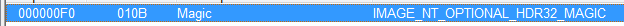

**Address of EntryPoint**

- 파일이 메모리에 매핑된 후 코드 시작 주소를 나타낸다.
- PE 로더는 ImageBase 값에 이 값을 더해서 코드 시작 지점을 설명 해 준다.

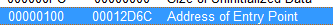

**SectionAlignment, FileAlignment**

- 각각 메모리, 파일 상태에서 정렬 값으로, 섹션에서 크기가 남더라도 0으로 채워서 Alignment 값을 맞춰 준다.
- 각 세션은 반드시 Alignment의 배수여야 한다.

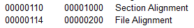

**Subsystem**

- 동작 환경을 정의한 것
- 시스템 드라이버 파일인 sys는 0x1, 대부분의 윈도우 기반 프로그램에 해당하는 GUI 프로그램의 경우 0x2, 콘솔창 기반의 CLI 프로그램의 경우 0x3의 값을 가진다.


**DataDirectory**

- NumberOfRbanAndSizes를 통해 디렉토리 수를 정해줄 수 있으나 일반적으로 아래와 같은 정형화된 16개의 디렉토리를 가진다.

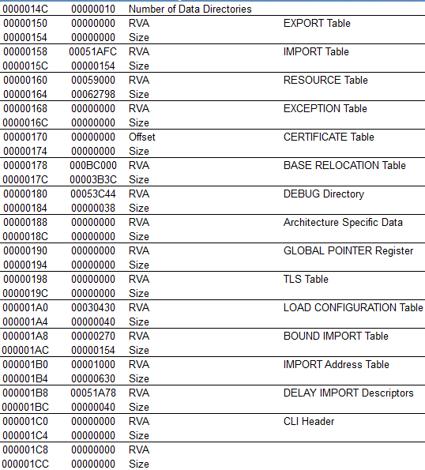

- 16개의 구조체의 배열로 이루어져 있으며 디렉토리별로 각각의 정보를 담고 있다.
- 마지막 디렉토리는 현재 사용하지 않는다.

**Export Directory** 

- DLL 들의 파일에서 외부에서 함수를 공개하기 위한 정보들을 가지고 있다.

**Import Directory**

- 프로그램을 실행 하기 위해 Import 하는 DLL 이름과 사용할 함수 정보가 담긴 INT, IAT 주소 등의 정보가 들어 있다.
- PE 로더가 실행 시 주소값을 IAT에 동적으로 입력해 주기 위해 필요한 부분으로 내부 동작 방식이 상당히 복잡하다.

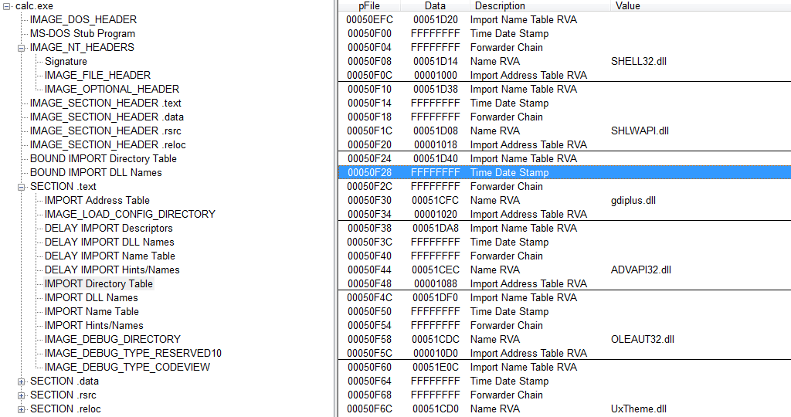

- 외부 DLL 파일의 함수 주소를 가져올 때 Export Table를 참고하고, 여기서 찾은 주소를 Import Table을 활용해서 IAT(Import Address Table)에 저장해두고 사용한다.
- DLL import, export 과정 참고

**Section Header**

- 섹션은 실제 파일의 내용들이 존재하는 부분, 각 섹션 별로 섹션의 정보를 담고 있는 헤더를 가지고 있다.

```c
typedef struct _IMAGE_SECTION_HEADER {
        BYTE  Name[IMAGE_SIZEOF_SHORT_NAME];
        union {
                DWORD PhysicalAddress;
                DWORD VirtualSize;
        } Misc;
        DWORD VirtualAddress;
        DWORD SizeOfRawData;
        DWORD PointerToRawData;
        DWORD PointerToRelocations;
        DWORD PointerToLinenumbers;
        WORD  NumberOfRelocations;
        WORD  NumberOfLinenumbers;
        DWORD Characteristics;
} IMAGE_SECTION_HEADER, *PIMAGE_SECTION_HEADER;
```

VirtualSize, VirtualAddress : 메모리상에서의 크기와 주소

SizeOfRawData, PointerToRawData :  파일 상에서의 크기 offset

Characteristics : 각 섹션의 특징
|Value|Des|
|----|----|
|IMAGE_SCN_MEN_READ0x40000000|The section can be read.|
|IMAGE_SCN_MEM_WRITE0x80000000|The section can be written to.|
|IMAGE_SCN_MEM_EXECUTE0x20000000|The section can be executed as code.|


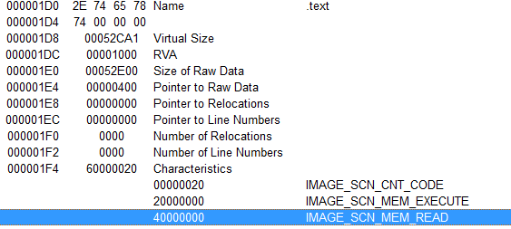

- 섹션의 크기, 위치 등을 알 수 있고 .text 섹션에 코드가 포함되어 있으며 읽기 및 실행 권한이 존재함을 알 수 있다.

```toc
```