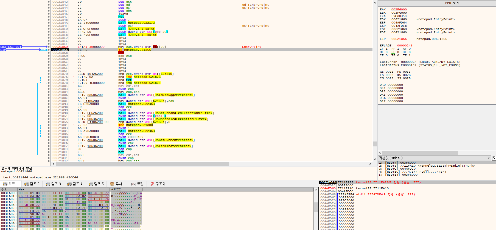
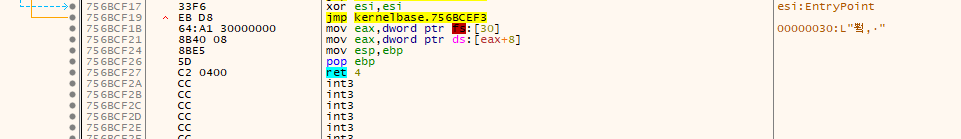

- window NT 데이터 구조체 이며 프로세스 정보를 담고 있는 구조체

## PEB 접근 방법

- TEB.ProcessEnvironmentBlock 멤버가 PEB 구조체의 주소
- TEB 구조체는 FS 세그먼트 셀렉터가 가리키는 세그먼트 메모리의 base address에 위치한다.
- 그리고 ProcessEnvironmentBlock 멤버는 TEB 구조체 시작 부터 30 옵셋만큼 떨어져 있다.

```cpp
FS:[30] = TEB.ProcessEnvironmentBlock = address of PEB
```

## method 1

- 바로 PEB 주소를 구하는 방법

```cpp
MOV EAX, DWORD PTR FS:[30]      ; FS[30] = address of PEB
```

## method 2

- TEB 주소를 구한후 ProcessEnvironmentBlock 멤버를 이용

```cpp
MOV EAX, DWORD PTR FS:[18]       ; FS[18] = address of TEB
MOV EAX, DWORD PTR DS:[EAX+30]   ; DS[EAX+30] = address of PEB
```



- FS:[0x30] 주소 값을 확인할 수 있다.

## PEB 구조체 정의

```cpp
typedef struct _PEB {
  BYTE                          Reserved1[2];
  BYTE                          BeingDebugged;
  BYTE                          Reserved2[1];
  PVOID                         Reserved3[2];
  PPEB_LDR_DATA                 Ldr;
  PRTL_USER_PROCESS_PARAMETERS  ProcessParameters;
  BYTE                          Reserved4[104];
  PVOID                         Reserved5[52];
  PPS_POST_PROCESS_INIT_ROUTINE PostProcessInitRoutine;
  BYTE                          Reserved6[128];
  PVOID                         Reserved7[1];
  ULONG                         SessionId;
} PEB, *PPEB;
```

```cpp
ntdll!_PEB
   +0x000 InheritedAddressSpace : UChar
   +0x001 ReadImageFileExecOptions : UChar
   +0x002 BeingDebugged    : UChar
   +0x003 BitField         : UChar
   +0x003 ImageUsesLargePages : Pos 0, 1 Bit
   +0x003 IsProtectedProcess : Pos 1, 1 Bit
   +0x003 IsImageDynamicallyRelocated : Pos 2, 1 Bit
   +0x003 SkipPatchingUser32Forwarders : Pos 3, 1 Bit
   +0x003 IsPackagedProcess : Pos 4, 1 Bit
   +0x003 IsAppContainer   : Pos 5, 1 Bit
   +0x003 IsProtectedProcessLight : Pos 6, 1 Bit
   +0x003 IsLongPathAwareProcess : Pos 7, 1 Bit
   +0x004 Padding0         : [4] UChar
   +0x008 Mutant           : Ptr64 Void
   +0x010 ImageBaseAddress : Ptr64 Void
   +0x018 Ldr              : Ptr64 _PEB_LDR_DATA
   +0x020 ProcessParameters : Ptr64 _RTL_USER_PROCESS_PARAMETERS
   +0x028 SubSystemData    : Ptr64 Void
   +0x030 ProcessHeap      : Ptr64 Void
   +0x038 FastPebLock      : Ptr64 _RTL_CRITICAL_SECTION
   +0x040 AtlThunkSListPtr : Ptr64 _SLIST_HEADER
   +0x048 IFEOKey          : Ptr64 Void
   +0x050 CrossProcessFlags : Uint4B
   +0x050 ProcessInJob     : Pos 0, 1 Bit
   +0x050 ProcessInitializing : Pos 1, 1 Bit
   +0x050 ProcessUsingVEH  : Pos 2, 1 Bit
   +0x050 ProcessUsingVCH  : Pos 3, 1 Bit
   +0x050 ProcessUsingFTH  : Pos 4, 1 Bit
   +0x050 ProcessPreviouslyThrottled : Pos 5, 1 Bit
   +0x050 ProcessCurrentlyThrottled : Pos 6, 1 Bit
   +0x050 ProcessImagesHotPatched : Pos 7, 1 Bit
   +0x050 ReservedBits0    : Pos 8, 24 Bits
   +0x054 Padding1         : [4] UChar
   +0x058 KernelCallbackTable : Ptr64 Void
   +0x058 UserSharedInfoPtr : Ptr64 Void
   +0x060 SystemReserved   : Uint4B
   +0x064 AtlThunkSListPtr32 : Uint4B
   +0x068 ApiSetMap        : Ptr64 Void
   +0x070 TlsExpansionCounter : Uint4B
   +0x074 Padding2         : [4] UChar
   +0x078 TlsBitmap        : Ptr64 Void
   +0x080 TlsBitmapBits    : [2] Uint4B
   +0x088 ReadOnlySharedMemoryBase : Ptr64 Void
   +0x090 SharedData       : Ptr64 Void
   +0x098 ReadOnlyStaticServerData : Ptr64 Ptr64 Void
   +0x0a0 AnsiCodePageData : Ptr64 Void
   +0x0a8 OemCodePageData  : Ptr64 Void
   +0x0b0 UnicodeCaseTableData : Ptr64 Void
   +0x0b8 NumberOfProcessors : Uint4B
   +0x0bc NtGlobalFlag     : Uint4B
   +0x0c0 CriticalSectionTimeout : _LARGE_INTEGER
   +0x0c8 HeapSegmentReserve : Uint8B
   +0x0d0 HeapSegmentCommit : Uint8B
   +0x0d8 HeapDeCommitTotalFreeThreshold : Uint8B
   +0x0e0 HeapDeCommitFreeBlockThreshold : Uint8B
   +0x0e8 NumberOfHeaps    : Uint4B
   +0x0ec MaximumNumberOfHeaps : Uint4B
   +0x0f0 ProcessHeaps     : Ptr64 Ptr64 Void
   +0x0f8 GdiSharedHandleTable : Ptr64 Void
   +0x100 ProcessStarterHelper : Ptr64 Void
   +0x108 GdiDCAttributeList : Uint4B
   +0x10c Padding3         : [4] UChar
   +0x110 LoaderLock       : Ptr64 _RTL_CRITICAL_SECTION
   +0x118 OSMajorVersion   : Uint4B
   +0x11c OSMinorVersion   : Uint4B
   +0x120 OSBuildNumber    : Uint2B
   +0x122 OSCSDVersion     : Uint2B
   +0x124 OSPlatformId     : Uint4B
   +0x128 ImageSubsystem   : Uint4B
   +0x12c ImageSubsystemMajorVersion : Uint4B
   +0x130 ImageSubsystemMinorVersion : Uint4B
   +0x134 Padding4         : [4] UChar
   +0x138 ActiveProcessAffinityMask : Uint8B
   +0x140 GdiHandleBuffer  : [60] Uint4B
   +0x230 PostProcessInitRoutine : Ptr64     void 
   +0x238 TlsExpansionBitmap : Ptr64 Void
   +0x240 TlsExpansionBitmapBits : [32] Uint4B
   +0x2c0 SessionId        : Uint4B
   +0x2c4 Padding5         : [4] UChar
   +0x2c8 AppCompatFlags   : _ULARGE_INTEGER
   +0x2d0 AppCompatFlagsUser : _ULARGE_INTEGER
   +0x2d8 pShimData        : Ptr64 Void
   +0x2e0 AppCompatInfo    : Ptr64 Void
   +0x2e8 CSDVersion       : _UNICODE_STRING
   +0x2f8 ActivationContextData : Ptr64 _ACTIVATION_CONTEXT_DATA
   +0x300 ProcessAssemblyStorageMap : Ptr64 _ASSEMBLY_STORAGE_MAP
   +0x308 SystemDefaultActivationContextData : Ptr64 _ACTIVATION_CONTEXT_DATA
   +0x310 SystemAssemblyStorageMap : Ptr64 _ASSEMBLY_STORAGE_MAP
   +0x318 MinimumStackCommit : Uint8B
   +0x320 SparePointers    : [4] Ptr64 Void
   +0x340 SpareUlongs      : [5] Uint4B
   +0x358 WerRegistrationData : Ptr64 Void
   +0x360 WerShipAssertPtr : Ptr64 Void
   +0x368 pUnused          : Ptr64 Void
   +0x370 pImageHeaderHash : Ptr64 Void
   +0x378 TracingFlags     : Uint4B
   +0x378 HeapTracingEnabled : Pos 0, 1 Bit
   +0x378 CritSecTracingEnabled : Pos 1, 1 Bit
   +0x378 LibLoaderTracingEnabled : Pos 2, 1 Bit
   +0x378 SpareTracingBits : Pos 3, 29 Bits
   +0x37c Padding6         : [4] UChar
   +0x380 CsrServerReadOnlySharedMemoryBase : Uint8B
   +0x388 TppWorkerpListLock : Uint8B
   +0x390 TppWorkerpList   : _LIST_ENTRY
   +0x3a0 WaitOnAddressHashTable : [128] Ptr64 Void
   +0x7a0 TelemetryCoverageHeader : Ptr64 Void
   +0x7a8 CloudFileFlags   : Uint4B
   +0x7ac CloudFileDiagFlags : Uint4B
   +0x7b0 PlaceholderCompatibilityMode : Char
   +0x7b1 PlaceholderCompatibilityModeReserved : [7] Char
   +0x7b8 LeapSecondData   : Ptr64 _LEAP_SECOND_DATA
   +0x7c0 LeapSecondFlags  : Uint4B
   +0x7c0 SixtySecondEnabled : Pos 0, 1 Bit
   +0x7c0 Reserved         : Pos 1, 31 Bits
   +0x7c4 NtGlobalFlag2    : Uint4B
```

```cpp
tdll!_PEB 
   +0x002 BeingDebugged    : UChar
   +0x010 ImageBaseAddress : Ptr64 Void
   +0x018 Ldr              : Ptr64 _PEB_LDR_DATA
   +0x030 ProcessHeap      : Ptr64 Void
```

## PEB.BeingDebugged

- Kernel32!IsDebuggerPresent() API

```cpp
BOOL WINAPI IsDebuggerPresent(void);
```

- 현재 프로세스가 디버깅을 당하는지를 판단해서 결과를 반환한다.
- API가 참조하는 정보가 바로 PEB.BeingDebugged 멤버이다. (디버깅 중이면1, 아니면 0을 반환)

## PEB.ImageBaseAddress

- PEB.ImageBaseAddress 멤버는 프로세스의 ImageBase 를 표시한다.
- GetModuleHandle() API는 ImageBase를 얻어내는 API이다.

```cpp
HMOUDLE WINAPI GetModuleHandle (
	__in_opt  LPCTSTR lpModuleName
);
```

- lpModuleName 파라미터에 NULL을 입력하고 GetModuleHandle()을 호출하면 프로세스가 로딩된 ImageBase를 리턴한다.



- PEB.ImageBaseAddress 멤버를 EAX 레지스터 에 세팅하는 것을 확인할 수 있다.

 

## PEB.Ldr

- _PEB_LDR_DATA 구조체의 포인터이다.
- _PEB_LDR_DAT 구조체

```cpp
typedef struct _PEB_LDR_DATA {
  BYTE       Reserved1[8];
  PVOID      Reserved2[3];
  LIST_ENTRY InMemoryOrderModuleList;
} PEB_LDR_DATA, *PPEB_LDR_DATA;
```

```cpp
0:007> dt _PEB_LDR_DATA
ntdll!_PEB_LDR_DATA
   +0x000 Length           : Uint4B
   +0x004 Initialized      : UChar
   +0x008 SsHandle         : Ptr32 Void
   +0x00c InLoadOrderModuleList : _LIST_ENTRY
   +0x014 InMemoryOrderModuleList : _LIST_ENTRY
   +0x01c InInitializationOrderModuleList : _LIST_ENTRY
   +0x024 EntryInProgress  : Ptr32 Void
   +0x028 ShutdownInProgress : UChar
   +0x02c ShutdownThreadId : Ptr32 Void
```

- 프로세스에 로딩된 모듈(DLL)의 로딩 베이스 주소를 직접 구할 수 있는 방법을 제공하기 때문이다.
- _LIST_ENTRY 타입의 멤버가 세 개 있다.
    - InLoadOrderModuleList
    - InMemoryOrderModuleList
    - InInitializationOrderModuleList
- _LIST_ENTRY 구조체 정의는

```cpp
typedef struct _LIST_ENTRY {
	struct _LIST_ENTRY *Flink;
	struct _LIST_ENTRY *Blink;
} LIST_ENTRY, *PLIST_ENTRY;
```

- 구조체 정의를 보면 _LIST_ENTRY는 양방향 연결 리스트 메커니즘을 제공하는 구조체이다.
- 연결 리스트에는 _LDR_DATA_TABLE_ENTRY 구조체 정보가 담겨 있다.

```cpp
typedef struct _LDR_DATA_TABLE_ENTRY {
    PVOID Reserved1[2];
    LIST_ENTRY InMemoryOrderLinks;
    PVOID Reserved2[2];
    PVOID DllBase;
    PVOID EntryPoint;
    PVOID Reserved3;
    UNICODE_STRING FullDllName;
    BYTE Reserved4[8];
    PVOID Reserved5[3];
    union {
        ULONG CheckSum;
        PVOID Reserved6;
    };
    ULONG TimeDateStamp;
} LDR_DATA_TABLE_ENTRY, *PLDR_DATA_TABLE_ENTRY;
```

- 프로세스에 로딩된 DLL 모듈 마다 _LDR_DATA_TABLE_ENTRY 구조체가 하나씩 생성되고 이 구조체 들은 _LIST_ENTRY 양방향 연결 리스트로 연결된다.
- _LDR_DATA_TABLE_ENTRY 구조체 들이 많이 있는 데 연결 방법을 세 가지를 제공한다.

## PEB.ProcessHeap & PEB.NtGlobalFlag

- PEB.ProcessHeap 멤버, PEB.NtGlobalFlag 멤버는 (PEB.BeingDebugged 멤버와 마찬가지로) 안티 디버깅에 사용된다.
- 프로세스가 디버깅 중이라면 ProcessHeap, NtGlobalFlag 멤버는 특정한 값을 갖는다.

```toc
```