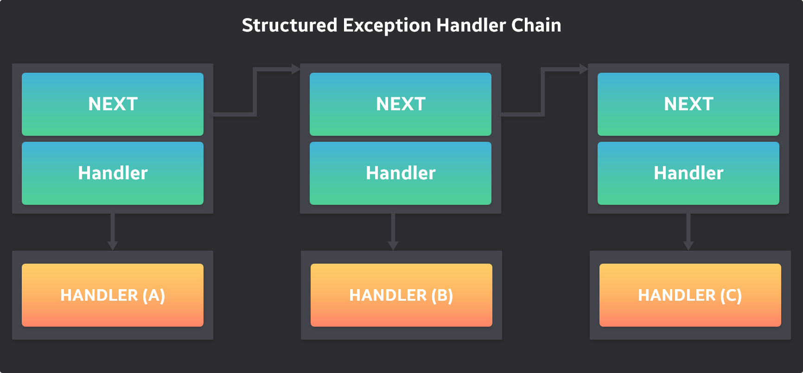

# SEH (Structured Exception Handler)

- SEH Windows 운영체제에서 제공하는 예외처리 시스템이다.
- `__try, __except, __finally` 키워드로 간단히 구현할 수 있다.
- 하드웨어 오류와 같은 특정 예외 코드 상황을 정상적으로 처리하기 위해 C에 대한 Microsoft 확장이다.
- SEH를 사용하면 실행이 예기치 않게 종료 되는 경우 메모리 블록 및 파일과 같은 리소스가 올바르게 해제 되도록 할 수 있다.

### SEH 매커니즘

- 예외 처리기 , `_except` 예외에 응답 하거나 해제할 수 있는 블록
- Termination Handlers `_finally` 예외가 종료를 발생 시키는 지 여부에 관계 없이 항상 호출되는 종료 처리기 또는 블록

### 일반 실행의 경우 예외 처리 방법

- OS는 프로세스 실행 중에 예외가 발생하면 프로세스에게 처리를 맡긴다.
- 프로세스 코드에 (SEH...) 예외처 리가 구현되어 있다면, 해당 예외를 잘 처리한 후 게속 실행될 것이다.
- 구현되어 있지 않다면 기본 예외 처리기를 동작시켜 프로세스를 종료 시킨다.

### 디버깅 실행의 경우 예외 처리 방법

- 디버깅 중에 디버기 프로세스에 에외가 발생하면 OS는 우선적으로 디버거에게 에외를 넘겨서 처리하도록 한다.
- 디버거는 디버기에 대한 거의 모든 소유권을 가지고 있다.
- 즉 디버기의 실행, 종료의 제어뿐만 아니라 디버기 프로세스 내부의 가상 메모리, 레지스터에 때한 읽기/쓰기 권한도 가지고 있다.
- 이버기의 내부에서 발생하는 모든 에외(에러) 상황을 처리해야 한다.
- 디버기의 SEH는 우선순위에서 디버거에게 밀린다.

### 디버거 실행 중지시 조치

1. 예외 직접 수정 : 코드, 레지스터, 메모리
    - 디버거는 예외가 발생한 코드 주소에 멈춰 있기 때문에 문제가 발생한 코드, 메모리, 레지스터 등을 디버거를 통하여 직접 수정하면 예외는 해결된다.
2. 예외를 디버기에게 넘겨서 처리
    - 디버기 내부에 이미 SEH가 존재하여 예외를 처리할 수 있다.
    - 예외 (EXCEPTION) 통지를 그대로 디버기에게 되돌려 보내서 자체 해결하도록 만들 수 있다.
    - '일반 실행' 의 예외 처리와 동일한 상황이 된다.

3. 기본 예외처리기
    - 현재 발생한 예외를 디버거와 디버기에서 처리할 수 없다면 (혹은 의도적으로 처리하지 않는다면), 마지막으로 OS의 기본 예외 처리기에서 처리한다.
    - 디버기 프로세스가 종료되면서 디버깅은 완전히 중지된다.

## Excpetion

```cpp
#ifndef UMDF_USING_NTSTATUS 
#ifndef WIN32_NO_STATUS 
/*lint -save -e767 */  
#define STATUS_WAIT_0                           ((DWORD   )0x00000000L) 
#define STATUS_ABANDONED_WAIT_0          ((DWORD   )0x00000080L)    
#define STATUS_USER_APC                  ((DWORD   )0x000000C0L)    
#define STATUS_TIMEOUT                   ((DWORD   )0x00000102L)    
#define STATUS_PENDING                   ((DWORD   )0x00000103L)    
#define DBG_EXCEPTION_HANDLED            ((DWORD   )0x00010001L)    
#define DBG_CONTINUE                     ((DWORD   )0x00010002L)    
#define STATUS_SEGMENT_NOTIFICATION      ((DWORD   )0x40000005L)    
#define STATUS_FATAL_APP_EXIT            ((DWORD   )0x40000015L)    
#define DBG_REPLY_LATER                  ((DWORD   )0x40010001L)    
#define DBG_TERMINATE_THREAD             ((DWORD   )0x40010003L)    
#define DBG_TERMINATE_PROCESS            ((DWORD   )0x40010004L)    
#define DBG_CONTROL_C                    ((DWORD   )0x40010005L)    
#define DBG_PRINTEXCEPTION_C             ((DWORD   )0x40010006L)    
#define DBG_RIPEXCEPTION                 ((DWORD   )0x40010007L)    
#define DBG_CONTROL_BREAK                ((DWORD   )0x40010008L)    
#define DBG_COMMAND_EXCEPTION            ((DWORD   )0x40010009L)    
#define DBG_PRINTEXCEPTION_WIDE_C        ((DWORD   )0x4001000AL)    
#define STATUS_GUARD_PAGE_VIOLATION      ((DWORD   )0x80000001L)    
#define STATUS_DATATYPE_MISALIGNMENT     ((DWORD   )0x80000002L)    
#define STATUS_BREAKPOINT                ((DWORD   )0x80000003L)    
#define STATUS_SINGLE_STEP               ((DWORD   )0x80000004L)    
#define STATUS_LONGJUMP                  ((DWORD   )0x80000026L)    
#define STATUS_UNWIND_CONSOLIDATE        ((DWORD   )0x80000029L)    
#define DBG_EXCEPTION_NOT_HANDLED        ((DWORD   )0x80010001L)    
#define STATUS_ACCESS_VIOLATION          ((DWORD   )0xC0000005L)    
#define STATUS_IN_PAGE_ERROR             ((DWORD   )0xC0000006L)    
#define STATUS_INVALID_HANDLE            ((DWORD   )0xC0000008L)    
#define STATUS_INVALID_PARAMETER         ((DWORD   )0xC000000DL)    
#define STATUS_NO_MEMORY                 ((DWORD   )0xC0000017L)    
#define STATUS_ILLEGAL_INSTRUCTION       ((DWORD   )0xC000001DL)    
#define STATUS_NONCONTINUABLE_EXCEPTION  ((DWORD   )0xC0000025L)    
#define STATUS_INVALID_DISPOSITION       ((DWORD   )0xC0000026L)    
#define STATUS_ARRAY_BOUNDS_EXCEEDED     ((DWORD   )0xC000008CL)    
#define STATUS_FLOAT_DENORMAL_OPERAND    ((DWORD   )0xC000008DL)    
#define STATUS_FLOAT_DIVIDE_BY_ZERO      ((DWORD   )0xC000008EL)    
#define STATUS_FLOAT_INEXACT_RESULT      ((DWORD   )0xC000008FL)    
#define STATUS_FLOAT_INVALID_OPERATION   ((DWORD   )0xC0000090L)    
#define STATUS_FLOAT_OVERFLOW            ((DWORD   )0xC0000091L)    
#define STATUS_FLOAT_STACK_CHECK         ((DWORD   )0xC0000092L)    
#define STATUS_FLOAT_UNDERFLOW           ((DWORD   )0xC0000093L)    
#define STATUS_INTEGER_DIVIDE_BY_ZERO    ((DWORD   )0xC0000094L)    
#define STATUS_INTEGER_OVERFLOW          ((DWORD   )0xC0000095L)    
#define STATUS_PRIVILEGED_INSTRUCTION    ((DWORD   )0xC0000096L)    
#define STATUS_STACK_OVERFLOW            ((DWORD   )0xC00000FDL)    
#define STATUS_DLL_NOT_FOUND             ((DWORD   )0xC0000135L)    
#define STATUS_ORDINAL_NOT_FOUND         ((DWORD   )0xC0000138L)    
#define STATUS_ENTRYPOINT_NOT_FOUND      ((DWORD   )0xC0000139L)    
#define STATUS_CONTROL_C_EXIT            ((DWORD   )0xC000013AL)    
#define STATUS_DLL_INIT_FAILED           ((DWORD   )0xC0000142L)    
#define STATUS_FLOAT_MULTIPLE_FAULTS     ((DWORD   )0xC00002B4L)    
#define STATUS_FLOAT_MULTIPLE_TRAPS      ((DWORD   )0xC00002B5L)    
#define STATUS_REG_NAT_CONSUMPTION       ((DWORD   )0xC00002C9L)    
#define STATUS_HEAP_CORRUPTION           ((DWORD   )0xC0000374L)    
#define STATUS_STACK_BUFFER_OVERRUN      ((DWORD   )0xC0000409L)    
#define STATUS_INVALID_CRUNTIME_PARAMETER ((DWORD   )0xC0000417L)    
#define STATUS_ASSERTION_FAILURE         ((DWORD   )0xC0000420L)    
#define STATUS_ENCLAVE_VIOLATION         ((DWORD   )0xC00004A2L)    
#define STATUS_INTERRUPTED               ((DWORD   )0xC0000515L)    
#define STATUS_THREAD_NOT_RUNNING        ((DWORD   )0xC0000516L)    
#define STATUS_ALREADY_REGISTERED        ((DWORD   )0xC0000718L)    
#if defined(STATUS_SUCCESS) || (_WIN32_WINNT > 0x0500) || (_WIN32_FUSION >= 0x0100) 
#define STATUS_SXS_EARLY_DEACTIVATION    ((DWORD   )0xC015000FL)    
#define STATUS_SXS_INVALID_DEACTIVATION  ((DWORD   )0xC0150010L)    
#endif
```

### STATUS_ACCESS_VIOLATION  (DWORD   )0xC0000005L

- 존재하지 않거나 접근 권하니 없는 메모리 영역에 대해서 접근을 시도할 때 발생하는 예외

```cpp
MOV DWORD PTR DS:[0], 1
=> 메모리 주소 0은 할당된 영역이 아니다.

ADD DWORD PTR DS:[0x401000], 1
=> .text 섹션의 시작 주소 0x401000은 READ 속성만을 가지고 있다. (WRITE 속성 없음)

XOR DWORD PTR DS:[80000000], 1234
=> 메모리 주소 0x80000000 은 Kernel 영역이라 user 모드에선 접근 불가
```

### STATUS_BREAKPOINT (DWORD   )0x80000003L

- 실행 코드에 BP가 설치되면 CPU가 그 주소를 실행하려 할 때 EXCEPTION_BREAKPOINT 예외가 발생한다.
- 디버거는 바로 이 EXCEPTION_BREAKPOINT 예외를 이용하여 BP 기능을 제공하는 것이다.

## BreakPoint 구현 방법

### INT 3

- BP를 설치하는 명령어는 어셈블리 명령어로 `INT 3` 입니다.
- 해당 명령어의 기계어 (IA32 Instruction) 형태는 `0xCC` 이다.
- CPU는 코드 실행 과정에서 어셈블리 명령어 INT3을 만나면 EXCPETION_BREAKPOINT 예외를 발생시킨다.
- 디버거 상에서는 사용자 임시 BP (User Temporary Break Point)이기 때문에 화면 상에 표시하지 ㅇ낳는다.
- 해당 Instuction이 0xcc로 변경된 것을 확인할려면 프로세스 덤프를 한후에 해당 주소에서 확인이 가능하다.

### STATUS_ILLEGAL_INSTRUCTION       ((DWORD   )0xC000001DL)

- CPU가 해석할 수 없는 Instuction을 만날 때 발생하는 예외이다.

```cpp
0FFF
```

- 해당 Insturction은 x86 CPU에 정의된 Instruction이 아니기 때문에 EXCEPTION_ILLEGAL_INSTRUCTION 예외를 발생시킨다.

### STATUS_INTEGER_DIVIDE_BY_ZERO    (DWORD   )0xC0000094L

- INTEGER (정수) 나눗셈 연산에서 분모가 0인 경우 (0으로나누는 경우) 발생하는 예외이다.
- 프로그램 개발할 때 간혹 발생하는 예외
- 분모가 변수로 잡혀 값이 0이 되었을 때 나누기 연산을 수행하면 EXCEPTION_INTEGER_DIVIDE_BY_ZERO 예외가 발생한다.

## SEH Chain

- 체인 형태로 구성되어 있다.
- 첫 번째 에외 처리기에서 해당 예외를 처리하지 못하면 (처리될 때 까지) 다음 예외 처리기로 예외를 넘겨주는 형식이다.
- 기술적으로 SEH는 EXCEPTION_REGISTRATION_RECORD 구조체 연결 리스트의 형태로 구성된다.

```cpp
typedef struct _EXCEPTION_REGISTRATION_RECORD
{
     PEXCEPTION_REGISTRATION_RECORD Next;
     PEXCEPTION_DISPOSITION Handler;
} EXCEPTION_REGISTRATION_RECORD, *PEXCEPTION_REGISTRATION_RECORD;
```

- Next 멤버는 다음 *EXCPETION*REGISTRATION_RECORD 구조체 포인터이며, Handler 멤버가 예외처리기 함수 (예외 처리기)이다.
- NEXT 멤버의 값이 `FFFFFFFF` 이면 연결리스트의 마지막을 나타낸다.
- 프로세스의 SEH 체인 구조를 그림으로 표현하면



- 총 3개의 SEH가 존재한다. 어떤 예외가 발생하면, 예외가 해결될 때까지 처리기 (A) → (B) → (C) 순서대로 예외 처리기가 호출된다.

## SEH 함수 정의

- EXCEPTION_DISPOSITION

```cpp
EXCPETION_DISPOSITION _except_handler (
	EXCEPTION_RECORD               *pRecord,
	EXCEPTION_REGISTRATION_RECORD  *pFrame
	CONTEXT                        *pContext,
	PVOID                           pValue
);
```

- 예외 처리기는 4개의 파라미터를 입력 받으며, EXCEPTION_DISPOSITION 이라는 열거형을 반환한다.
- 해당 예외 처리 함수는 시스템에 의해서 호출되는 콜백 함수이다.
- 입력 파라미터들에 예외와 관련된 정보가 저장되어 있다.

**EXCEPTION_RECORD 구조체 정의**

```cpp
typedef struct _EXCEPTION_RECORD {
  DWORD                    ExceptionCode;                // 예외 코드
  DWORD                    ExceptionFlags;
  struct _EXCEPTION_RECORD *ExceptionRecord;
  PVOID                    ExceptionAddress;             // 예외 발생 주소
  DWORD                    NumberParameters;
  ULONG_PTR                ExceptionInformation[EXCEPTION_MAXIMUM_PARAMETERS];
} EXCEPTION_RECORD;
```

- ExceptionCode : 발생한 예외의 종류를 의미
- ExcpetionAddress : 예외가 발생한 코드 주소를 나타낸다.

**CONTEXT 구조체 정의**

```cpp
typedef struct _CONTEXT {
  DWORD64 P1Home;
  DWORD64 P2Home;
  DWORD64 P3Home;
  DWORD64 P4Home;
  DWORD64 P5Home;
  DWORD64 P6Home;
  DWORD   ContextFlags;
  DWORD   MxCsr;
  WORD    SegCs;
  WORD    SegDs;
  WORD    SegEs;
  WORD    SegFs;
  WORD    SegGs;
  WORD    SegSs;
  DWORD   EFlags;
  DWORD64 Dr0;
  DWORD64 Dr1;
  DWORD64 Dr2;
  DWORD64 Dr3;
  DWORD64 Dr6;
  DWORD64 Dr7;
  DWORD64 Rax;
  DWORD64 Rcx;
  DWORD64 Rdx;
  DWORD64 Rbx;
  DWORD64 Rsp;
  DWORD64 Rbp;
  DWORD64 Rsi;
  DWORD64 Rdi;
  DWORD64 R8;
  DWORD64 R9;
  DWORD64 R10;
  DWORD64 R11;
  DWORD64 R12;
  DWORD64 R13;
  DWORD64 R14;
  DWORD64 R15;
  DWORD64 Rip;
  union {
    XMM_SAVE_AREA32 FltSave;
    NEON128         Q[16];
    ULONGLONG       D[32];
    struct {
      M128A Header[2];
      M128A Legacy[8];
      M128A Xmm0;
      M128A Xmm1;
      M128A Xmm2;
      M128A Xmm3;
      M128A Xmm4;
      M128A Xmm5;
      M128A Xmm6;
      M128A Xmm7;
      M128A Xmm8;
      M128A Xmm9;
      M128A Xmm10;
      M128A Xmm11;
      M128A Xmm12;
      M128A Xmm13;
      M128A Xmm14;
      M128A Xmm15;
    } DUMMYSTRUCTNAME;
    DWORD           S[32];
  } DUMMYUNIONNAME;
  M128A   VectorRegister[26];
  DWORD64 VectorControl;
  DWORD64 DebugControl;
  DWORD64 LastBranchToRip;
  DWORD64 LastBranchFromRip;
  DWORD64 LastExceptionToRip;
  DWORD64 LastExceptionFromRip;
} CONTEXT, *PCONTEXT;
```

- CONTEXT 구조체는 CPU 레지스터 값을 백업하는 용도로 사용된다.
- CPU 레지스터 값을 백업하는 이유는 멀티 스레드(Multi-Thread) 환경 때문이다.
- 스레드는 내부적으로 CONTEXT 구조체를 하나씩 가지고 있다.
- CPU가 다른 스레드를 실행하러 잠시 이동할 때 CPU 레지스터들의 값을 현재 스레드의 CONTEXT 구조체에 백업한다.
- 그후 CPU가 다시 에전 스레드를 실행하러 오면 CONTEXT 구조체에 백업된 레지스터 값들을 실제 CPU 레지스터에 덮어쓴다.
- 아까 실행이 멈춰졌던 코드 위치부터 실행을 다시 시작한다.
- OS는 멀티 스레드 환경에서 안전하게 스레드 단위별로 실행이 가능하다.

### Multi-Thread

- CPU의 시분할 (Time-Slicing) 방식
- CPU가 각 스레드를 차례대로 일정 시간 동안 실행해주는 것이다.
- 그 시간 간격이 극히 짧기 때문에 동시에 여러 개의 스레드가 실행되는 것처럼 보이는 것이다.
- 스레드의 우선순위에 따라서 CPU 제어권을 얻는 횟수에 차이가 발생한다.

- 예외가 발생하면 그 코드를 실행한 스레드는 중지되고 SEH(예외 처리기)가 실행된다.
- OS는 예외 처리기의 파라미터에 해당 스레드의 CONTEXT 구조체 포인터를 넘겨준다.
- 구조체 멤버 중 EIP 멤버가 있다.(offset: B8)
- 예외 처리기에서 파라미터로 넘어온 CONTEXT.Eip 를 다른 주소로 설정한 후 예외 처리기 함수를 리턴시키면, 아까 중지된 스레드는 새로 설정된 EIP 주소의 코드를 실행한다.

### EXCEPTION_DISPOSITION enum

```cpp
typedef enum _EXCEPTION_DISPOSITION
{
         ExceptionContinueExecution = 0,
         ExceptionContinueSearch = 1,
         ExceptionNestedException = 2,
         ExceptionCollidedUnwind = 3
} EXCEPTION_DISPOSITION;
```

- 예외 처리기 (SEH)에서 예외를 처리했다면 `ExceptionContinueExecution(0)` 을 리턴할 경우 예외가 발생한 코드부터 재실행된다.
- 만약 예외를 처리할 수 없다면 ExceptionContinueSearch(1)을 리턴하여 SEH chain에서 다음 예외 처리기에서 처리하도록 한다.

### TEB.NtTib.ExceptionList

- 프로세스의 SEH chain.에 접근하는 방법은 간단하다.
- TEB(THREAD ENVIRONMENT BLOCK) 구조체의 NtTib 멤버를 따라가면 된다.

```cpp
0:003> dt _NT_TIB
ntdll!_NT_TIB
   +0x000 ExceptionList    : Ptr32 _EXCEPTION_REGISTRATION_RECORD
   +0x004 StackBase        : Ptr32 Void
   +0x008 StackLimit       : Ptr32 Void
   +0x00c SubSystemTib     : Ptr32 Void
   +0x010 FiberData        : Ptr32 Void
   +0x010 Version          : Uint4B
   +0x014 ArbitraryUserPointer : Ptr32 Void
   +0x018 Self             : Ptr32 _NT_TIB
```

- TEB 구조체에서 가장 첫 멤버임을 확인할 수 있다.
- TEB는 FS 세그먼트 레지스터가 가리키는 세그먼트 메모리의 시작 주소 (base address)에 위치한다.

```cpp
TEB.NtTib.ExceptionList = FS:[0]
```

```toc
```