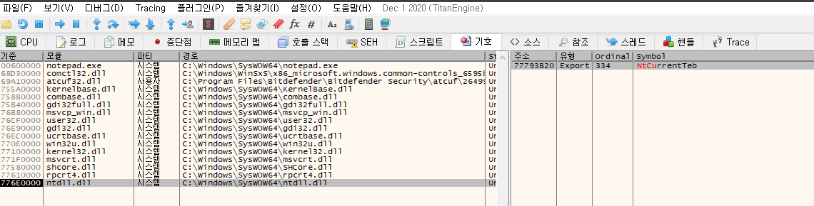
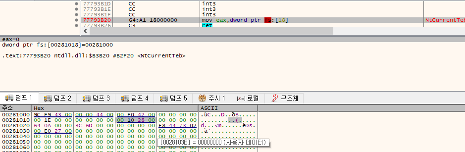
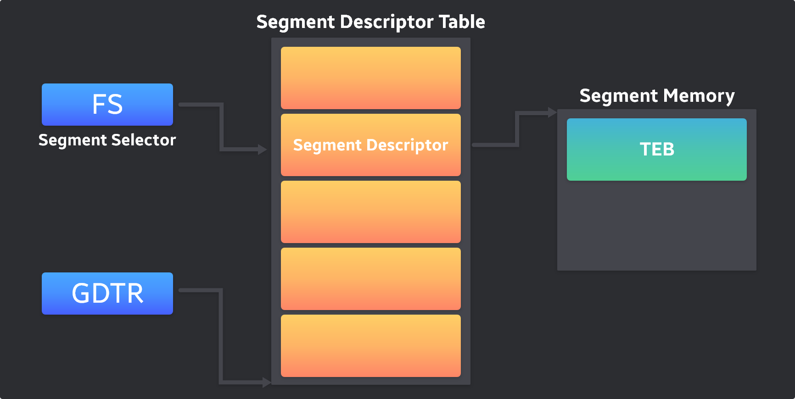

# TEB (Thread Environment Block)

- 프로세스에서 실행되는 스레드에 대한 정보를 담고 있는 구조체
- 스레드별로 TEB 구조체가 하나씩 할당된다.
- OS 종류별로 해당 모양이 조금씩 달라진다.

```cpp
typedef struct _TEB {
  PVOID Reserved1[12];
  PPEB  ProcessEnvironmentBlock;
  PVOID Reserved2[399];
  BYTE  Reserved3[1952];
  PVOID TlsSlots[64];
  BYTE  Reserved4[8];
  PVOID Reserved5[26];
  PVOID ReservedForOle;
  PVOID Reserved6[4];
  PVOID TlsExpansionSlots;
} TEB, *PTEB;
```

```cpp
0:001> dt _TEB
ntdll!_TEB
   +0x000 NtTib            : _NT_TIB
   +0x01c EnvironmentPointer : Ptr32 Void
   +0x020 ClientId         : _CLIENT_ID
   +0x028 ActiveRpcHandle  : Ptr32 Void
   +0x02c ThreadLocalStoragePointer : Ptr32 Void
   +0x030 ProcessEnvironmentBlock : Ptr32 _PEB
   +0x034 LastErrorValue   : Uint4B
   +0x038 CountOfOwnedCriticalSections : Uint4B
   +0x03c CsrClientThread  : Ptr32 Void
   +0x040 Win32ThreadInfo  : Ptr32 Void
   +0x044 User32Reserved   : [26] Uint4B
   +0x0ac UserReserved     : [5] Uint4B
   +0x0c0 WOW32Reserved    : Ptr32 Void
   +0x0c4 CurrentLocale    : Uint4B
   +0x0c8 FpSoftwareStatusRegister : Uint4B
   +0x0cc ReservedForDebuggerInstrumentation : [16] Ptr32 Void
   +0x10c SystemReserved1  : [26] Ptr32 Void
   +0x174 PlaceholderCompatibilityMode : Char
   +0x175 PlaceholderHydrationAlwaysExplicit : UChar
   +0x176 PlaceholderReserved : [10] Char
   +0x180 ProxiedProcessId : Uint4B
   +0x184 _ActivationStack : _ACTIVATION_CONTEXT_STACK
   +0x19c WorkingOnBehalfTicket : [8] UChar
   +0x1a4 ExceptionCode    : Int4B
   +0x1a8 ActivationContextStackPointer : Ptr32 _ACTIVATION_CONTEXT_STACK
   +0x1ac InstrumentationCallbackSp : Uint4B
   +0x1b0 InstrumentationCallbackPreviousPc : Uint4B
   +0x1b4 InstrumentationCallbackPreviousSp : Uint4B
   +0x1b8 InstrumentationCallbackDisabled : UChar
   +0x1b9 SpareBytes       : [23] UChar
   +0x1d0 TxFsContext      : Uint4B
   +0x1d4 GdiTebBatch      : _GDI_TEB_BATCH
   +0x6b4 RealClientId     : _CLIENT_ID
   +0x6bc GdiCachedProcessHandle : Ptr32 Void
   +0x6c0 GdiClientPID     : Uint4B
   +0x6c4 GdiClientTID     : Uint4B
   +0x6c8 GdiThreadLocalInfo : Ptr32 Void
   +0x6cc Win32ClientInfo  : [62] Uint4B
   +0x7c4 glDispatchTable  : [233] Ptr32 Void
   +0xb68 glReserved1      : [29] Uint4B
   +0xbdc glReserved2      : Ptr32 Void
   +0xbe0 glSectionInfo    : Ptr32 Void
   +0xbe4 glSection        : Ptr32 Void
   +0xbe8 glTable          : Ptr32 Void
   +0xbec glCurrentRC      : Ptr32 Void
   +0xbf0 glContext        : Ptr32 Void
   +0xbf4 LastStatusValue  : Uint4B
   +0xbf8 StaticUnicodeString : _UNICODE_STRING
   +0xc00 StaticUnicodeBuffer : [261] Wchar
   +0xe0c DeallocationStack : Ptr32 Void
   +0xe10 TlsSlots         : [64] Ptr32 Void
   +0xf10 TlsLinks         : _LIST_ENTRY
   +0xf18 Vdm              : Ptr32 Void
   +0xf1c ReservedForNtRpc : Ptr32 Void
   +0xf20 DbgSsReserved    : [2] Ptr32 Void
   +0xf28 HardErrorMode    : Uint4B
   +0xf2c Instrumentation  : [9] Ptr32 Void
   +0xf50 ActivityId       : _GUID
   +0xf60 SubProcessTag    : Ptr32 Void
   +0xf64 PerflibData      : Ptr32 Void
   +0xf68 EtwTraceData     : Ptr32 Void
   +0xf6c WinSockData      : Ptr32 Void
   +0xf70 GdiBatchCount    : Uint4B
   +0xf74 CurrentIdealProcessor : _PROCESSOR_NUMBER
   +0xf74 IdealProcessorValue : Uint4B
   +0xf74 ReservedPad0     : UChar
   +0xf75 ReservedPad1     : UChar
   +0xf76 ReservedPad2     : UChar
   +0xf77 IdealProcessor   : UChar
   +0xf78 GuaranteedStackBytes : Uint4B
   +0xf7c ReservedForPerf  : Ptr32 Void
   +0xf80 ReservedForOle   : Ptr32 Void
   +0xf84 WaitingOnLoaderLock : Uint4B
   +0xf88 SavedPriorityState : Ptr32 Void
   +0xf8c ReservedForCodeCoverage : Uint4B
   +0xf90 ThreadPoolData   : Ptr32 Void
   +0xf94 TlsExpansionSlots : Ptr32 Ptr32 Void
   +0xf98 MuiGeneration    : Uint4B
   +0xf9c IsImpersonating  : Uint4B
   +0xfa0 NlsCache         : Ptr32 Void
   +0xfa4 pShimData        : Ptr32 Void
   +0xfa8 HeapData         : Uint4B
   +0xfac CurrentTransactionHandle : Ptr32 Void
   +0xfb0 ActiveFrame      : Ptr32 _TEB_ACTIVE_FRAME
   +0xfb4 FlsData          : Ptr32 Void
   +0xfb8 PreferredLanguages : Ptr32 Void
   +0xfbc UserPrefLanguages : Ptr32 Void
   +0xfc0 MergedPrefLanguages : Ptr32 Void
   +0xfc4 MuiImpersonation : Uint4B
   +0xfc8 CrossTebFlags    : Uint2B
   +0xfc8 SpareCrossTebBits : Pos 0, 16 Bits
   +0xfca SameTebFlags     : Uint2B
   +0xfca SafeThunkCall    : Pos 0, 1 Bit
   +0xfca InDebugPrint     : Pos 1, 1 Bit
   +0xfca HasFiberData     : Pos 2, 1 Bit
   +0xfca SkipThreadAttach : Pos 3, 1 Bit
   +0xfca WerInShipAssertCode : Pos 4, 1 Bit
   +0xfca RanProcessInit   : Pos 5, 1 Bit
   +0xfca ClonedThread     : Pos 6, 1 Bit
   +0xfca SuppressDebugMsg : Pos 7, 1 Bit
   +0xfca DisableUserStackWalk : Pos 8, 1 Bit
   +0xfca RtlExceptionAttached : Pos 9, 1 Bit
   +0xfca InitialThread    : Pos 10, 1 Bit
   +0xfca SessionAware     : Pos 11, 1 Bit
   +0xfca LoadOwner        : Pos 12, 1 Bit
   +0xfca LoaderWorker     : Pos 13, 1 Bit
   +0xfca SkipLoaderInit   : Pos 14, 1 Bit
   +0xfca SpareSameTebBits : Pos 15, 1 Bit
   +0xfcc TxnScopeEnterCallback : Ptr32 Void
   +0xfd0 TxnScopeExitCallback : Ptr32 Void
   +0xfd4 TxnScopeContext  : Ptr32 Void
   +0xfd8 LockCount        : Uint4B
   +0xfdc WowTebOffset     : Int4B
   +0xfe0 ResourceRetValue : Ptr32 Void
   +0xfe4 ReservedForWdf   : Ptr32 Void
   +0xfe8 ReservedForCrt   : Uint8B
   +0xff0 EffectiveContainerId : _GUID
```

```cpp
0:001> dt _TEB
ntdll!_TEB
   +0x000 NtTib            : _NT_TIB
   +0x01c EnvironmentPointer : Ptr32 Void
   +0x020 ClientId         : _CLIENT_ID
   +0x028 ActiveRpcHandle  : Ptr32 Void
   +0x02c ThreadLocalStoragePointer : Ptr32 Void
   +0x030 ProcessEnvironmentBlock : Ptr32 _PEB
	 ...
```

### ProcessEnvironmentBlock member

- 0x30 offset 에 위치한 ProcessEnvironmentBlock member
- PEB(Process Environment Block) 구조체의 포인터이다.
- PEB는 프로세스 별로 하나만 생성된다.

### NtTib member

- TEB 구조체의 첫 번째 멤버는 `_NT_TIB` 구조체이다.
- _NT_TIB (_NT_Thread information Block)
- 현재 실행 중인 스레드에 대한 정보를 저장하고 있다.

```cpp
typedef struct _NT_TIB {
    struct _EXCEPTION_REGISTRATION_RECORD *ExceptionList;
    PVOID StackBase;
    PVOID StackLimit;
    PVOID SubSystemTib;
#if defined(_MSC_EXTENSIONS)
    union {
        PVOID FiberData;
        DWORD Version;
    };
#else
    PVOID FiberData;
#endif
    PVOID ArbitraryUserPointer;
    struct _NT_TIB *Self;
} NT_TIB;
typedef NT_TIB *PNT_TIB;
```

- ExceptionList member는 _EXCEPTION_REGISTRATION_RECORD 구조체 연결 리스트를 가리키고 있다. 이것은 SEH(Structured Exception Handler) 라고 하는 Window OS의 예외 처리 메커니즘에 사용된다.
- Self 멤버는 _NT_TIB 구조체의 셀프 포인터이며 곧 TEB 구조체 포인터이기도 한다. (TEB 구조체 첫 번째 멤버가 _NT_TIB 구조체이기 때문이다.)

## 유저 모드 TEB 접근 방법

### Ntdll.NtCurrentTeb()

- Ntdll.NtCurrentTeb() API는 현재 스레드의 TEB 구조체 주소를 리턴하는 함수이다.





- NtCurrentTeb() 의 내부 코드는 아주 간단하게 구성되어 있다.
- `FS:[18]` 주소의 값을 리턴 한다.
- FS:[18] 실제 주소 `00281018` 을 확인할 수 있는데 메모리 창에서 주소를 확인해보면 `00281000` 값이 들어 있다.
- NtCuurentTeb() API 는 이 값을 리턴하고 있다.
- 따라서 이 값이 바로 현재 스레드의 TEB 주소 이다.
- TEB 주소(00281000) 주소는 FS 세그먼트 레지스터가 가리키는 세그먼트 메모리의 베이스 주소와 일치한다.

## FS Segment Register

- FS 세그먼트 레지스터는 현재 스레드의 TEB를 지시하는데 사용한다.
- `IA32` 시스템에서는 프로세스의 가상 메모리 크기가 4GB이므로 32비트 크기의 포인터를 이용해야 전체 메모리 공간에 접근이 가능하다.
- FS 레지스터의 크기는 16비트밖에 안된다.
- FS 레지스터는 직접 TEB 주소를 가리키는 것이 아니라, 실제 TEB 주소를 가지고 있는 `Segment Descriptor Table` 의 Index를 가지고 있는것이다.

```cpp
Segment Descriptor Table은 커널 메모리 영역에 존재하며
특수 레지스터인 GDTR(Global Descriptor Table Register)에 그 주소가 저장되어 있다.
```



- 세그먼트 레지스터는 실제로 Segment Descriptor Table의 Index를 가지고 있기 때문에 Segment Selector 라는 별칭을 가지고 있다.
- FS 세그먼트 셀렉터가 가리키는 세그먼트 메모리의 시작주소 (base address) 에 TEB 구조체가 위치하는 것을 확인할 수 있다.

### FS:[0x18] = TEB base address

```cpp
FS:[0x18] = TEB.NtTib.Self = address of TIB = address of TEB = FS:0 = 0x2810100

FS:0 의 의미는 FS 레지스터가 Indexing 하는 Segment Descriptor가 가리키는 Segment Memory의
시작 주소이다.
```

### FS:[0x30] = PEB base address

```cpp
FS:[0x30] = TEB.ProcessEnvironmentBlock = address of PEB
```

### FS:[0x0] = SEH base address

```cpp
FS:[0] = TEB.NtTib.ExceptionList = address of SEH
```

```toc
```