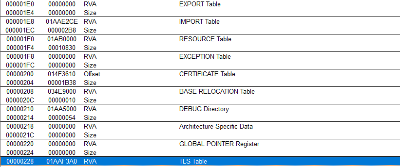
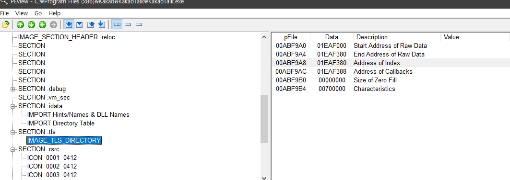

# Thread Local Storage (TLS)

- 프로세스의 모든 스레드는 가상 주소 공간을 공유한다.
- 함수의 지역 변수는 함수를 실행하는 각 스레드에 공유한다.
- 정적 및 전역 변수는 프로세스의 모든 스레드에서 공유된다.
- 즉, 스레드 별로 독립된 데이터 저장 공간이며 스레드 내에서 프로세스의 전역(Global) 데이터나 정적(static) 데이터를 마치 지역(Local) 데이터 처럼 독립적으로 취급하고 싶을 때 사용한다.

[](http://msdn.microsoft.com/en-us/library/ms686749(VS.85),aspx)

### IMAGE_DATA_DIRECTORY[9]

- PE 헤더의 TLS Table 항목이 세팅된다.
- IMAGE_NT_HEADERS - IMAGE_OPTIONAL_HEADER - IMAGE_DATA_DIRECTORY[9]

{: width="65%" height="65%"}

- RVA 01AAF3A0 주소에는 IMAGE_TLS_DIRECTORY 구조체가 있다.

### IMAGE_TLS_DIRECTORY

```cpp
typedef struct _IMAGE_TLS_DIRECTORY64 {
    ULONGLONG StartAddressOfRawData;
    ULONGLONG EndAddressOfRawData;
    ULONGLONG AddressOfIndex;         // PDWORD
    ULONGLONG AddressOfCallBacks;     // PIMAGE_TLS_CALLBACK *;
    DWORD SizeOfZeroFill;
    union {
        DWORD Characteristics;
        struct {
            DWORD Reserved0 : 20;
            DWORD Alignment : 4;
            DWORD Reserved1 : 8;
        } DUMMYSTRUCTNAME;
    } DUMMYUNIONNAME;

} IMAGE_TLS_DIRECTORY64;

typedef IMAGE_TLS_DIRECTORY64 * PIMAGE_TLS_DIRECTORY64;

typedef struct _IMAGE_TLS_DIRECTORY32 {
    DWORD   StartAddressOfRawData;
    DWORD   EndAddressOfRawData;
    DWORD   AddressOfIndex;             // PDWORD
    DWORD   AddressOfCallBacks;         // PIMAGE_TLS_CALLBACK *
    DWORD   SizeOfZeroFill;
    union {
        DWORD Characteristics;
        struct {
            DWORD Reserved0 : 20;
            DWORD Alignment : 4;
            DWORD Reserved1 : 8;
        } DUMMYSTRUCTNAME;
    } DUMMYUNIONNAME;

} IMAGE_TLS_DIRECTORY32;
typedef IMAGE_TLS_DIRECTORY32 * PIMAGE_TLS_DIRECTORY32;

#ifdef _WIN64
#define IMAGE_ORDINAL_FLAG              IMAGE_ORDINAL_FLAG64
#define IMAGE_ORDINAL(Ordinal)          IMAGE_ORDINAL64(Ordinal)
typedef IMAGE_THUNK_DATA64              IMAGE_THUNK_DATA;
typedef PIMAGE_THUNK_DATA64             PIMAGE_THUNK_DATA;
#define IMAGE_SNAP_BY_ORDINAL(Ordinal)  IMAGE_SNAP_BY_ORDINAL64(Ordinal)
typedef IMAGE_TLS_DIRECTORY64           IMAGE_TLS_DIRECTORY;
typedef PIMAGE_TLS_DIRECTORY64          PIMAGE_TLS_DIRECTORY;
#else
#define IMAGE_ORDINAL_FLAG              IMAGE_ORDINAL_FLAG32
#define IMAGE_ORDINAL(Ordinal)          IMAGE_ORDINAL32(Ordinal)
typedef IMAGE_THUNK_DATA32              IMAGE_THUNK_DATA;
typedef PIMAGE_THUNK_DATA32             PIMAGE_THUNK_DATA;
#define IMAGE_SNAP_BY_ORDINAL(Ordinal)  IMAGE_SNAP_BY_ORDINAL32(Ordinal)
typedef IMAGE_TLS_DIRECTORY32           IMAGE_TLS_DIRECTORY;
typedef PIMAGE_TLS_DIRECTORY32          PIMAGE_TLS_DIRECTORY;
#endif
```

- IMAGE_TLS_DIRECTORY 구조체는 x86/x64 bit로 설계되어 있다.



- RVA 01AAF3A0 해당 위치에 구조체 멤버를 확인해보겠다.
- `AddressOfCallbacks` 멤버는 TLS 콜백 함수 주소 (VA 형태) 배열을 가리키며 배열의 끝은 NULL로 표시한다.
- 프로그램에 TLS Call Back Function 를 여러 개등록할 수 있다.
- 프로세스가 시작될 때 Entry Point 코드 실행 전에 시스템에서 AddressOfCallback 의 배열에 저장된 함수를 하나씩 호출한다.

### TLS Call Back Function

- 리버싱 분야에서 Anti-Debugging 기법으로 주로 많이 사용된다.
- TLS Call Back Function은 EP(Entry-Point) 보다 먼저 실행되는 특징을 가지고 있다.
- 프로세스의 스레드가 생성/종료될 때 마다 자동으로 호출되는 콜백 함수
- 프로세스의 메인 스레드가 생성될 때도 콜백 함수가 호출된다.
- Entry Point 코드보다 먼저 호출되어 Anti-Debugging에서 많이 쓰인다.
- 스레드의 생성시점과 종료시점에 2번 자동으로 호출되는 함수이다.
- 프로세스의 EP 코드를 실해하는 메인 스레드가 실행될 때 TLS 콜백 함수가 먼저 호출되는 원리이다.

### IMAGE_TLS_CALLBACK

```cpp
typedef VOID
(NTAPI *PIMAGE_TLS_CALLBACK) (
    PVOID DllHandle,
    DWORD Reason,
    PVOID Reserved
    );
```

- TLS 콜백 함수 정의는 DllMain() 함수 정의와 비슷 한 것을 알 수있다.

### DllMain()

```cpp
BOOL WINAPI DllMain(
    HINSTANCE hinstDLL,  // handle to DLL module
    DWORD fdwReason,     // reason for calling function
    LPVOID lpReserved )  // reserved
```

- 파라미터의 순서와 의미도 동일하다.
- DllHandle 파라미터는 모듈의 핸들, 로딩 주소 이다.
- Reason 파라미터는 TLS 콜백 함수가 호출된 이유

    ```cpp
    #defind DLL_PROCESS_ATTACH  1
    #define DLL_THREAD_ATTACH   2
    #define DLL_THREAD_DETACH   3
    #DEFINE DLL_PROCESS_DETACH  0
    ```

### DLL_PROCESS_ATTACH

- 프로세스의 메인 스레드가 main 함수를 호출하기 전에 등록된 TLS 콜백 함수들이 호출된다.
- 이때 Reason  값은 1(DLL_PROCESS_ATTACH)

### DLL_THREAD_ATTACH

- TLS 콜백 함수들이 모두 종료되면 main 함수가 실행된다.
- 사용자 스레드를 생성하는 순간 Reason = 2(DLL_THREAD_ATTACH)로 TLS 콜백 함수들이 동작한다.

### DLL_THREAD_DETACH

- TLS 콜백 함수들이 모두 종료되면 사용자 스레드로 생성한 해당 함수가 실행된다.
- 그리고 스레드 함수가 종료되는 순간 Reason = 3(DLL_THREAD_DETACH)로 TLS 콜백 함수들이 호출된다.

### DLL_PROCESS_DETACH

- 사용자 쓰레드가 종료되면 스레드의 종료를 기다리던 main 함수(메인 스레드) 역시 종료한다.
- 이때 마지막으로 Reason = 0 (DLL_PROCESS_DETACH) 값으로 TLS 콜백 함수들이 호출된다.

