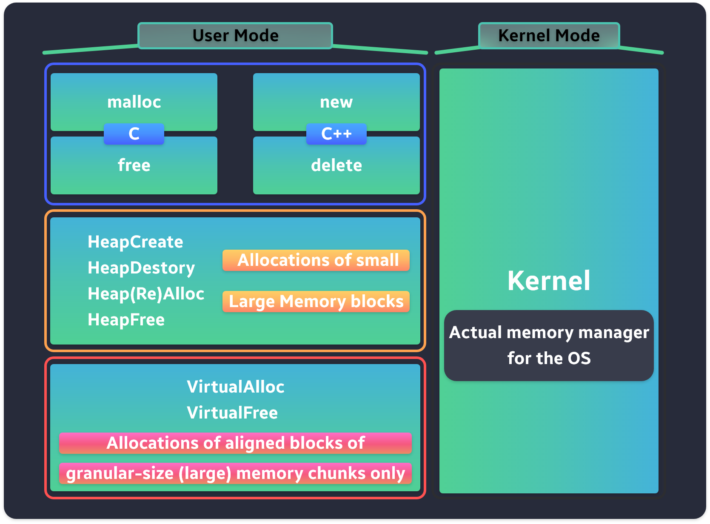

# Window Heap Management



- 메모리 할당 방식이 상위일경우 더 높은 수준의 구현을 사용한다.

***

## Kernel-Mode Memory Manager


- 운영 체제에 대한 모든 메모리 예약 및 할당
- 메모리 매핑 파일
- 공유 메모리
- 쓰기 작업 복사
- 사용자 모드에서 직접 접근 불가
***

## VirtualAlloc/VirtualFree

- User Mode 에서 사용할 수 있는 가장 낮은 수준의 API
- `ZwAllocateVirtualMemory` 를 호출하고 해당 기능을 바탕으로 빠른 SYSCALL을 `ring0` 으로 호출하여 추가 처리를 커널 메모리 관리자에 다시 할당한다.

### 두 가지 주요 조건

- `시스템 세분화` 경계에 정렬된 메모리 블록만 할당할 수 있다.
- `시스템 세분화`의 배수인 크기의 메모리 블록만 할당할 수 있다.

### 시스템 세분화

- `GetSystemInfo` 에 호출시 해당 정보를 받을 수 있는데
- `dwAllocationGranularity` 매개 변수로 반환된다.
- 해당 값의 구현(및 하드웨어)에 따라 달라지지만 64bit Window System에서는 0x10000 바이트 또는 64kb로 설정된다.

- 즉, 시스템 세분화는 `virtualAlloc` 다음과 같이 8바이트 메모리 블록을 할당할려고 하면 다음과 같이 사용하면 된다.

```cpp
void* pAddress = VirtualAlloc(NULL, 8, MEM_COMMIT | MEM_RESERVE, PAGE_READWRITE);
```

- 성공시 `pAddress` 는 `0x10000` 바이트 경계에 정렬된다.
- 후에 8바이트 만 요청했음에도 실제 메모리 블록은 전체 `page` (또는 `4kb` 와 같으며, 정확한 페이지 크기는 `dwPageSize` 매개 변수에 반환된다)
- pAddress에서 0x10000 바이트(64kb) 에 이르는 전체 메모리 블록은 추가로 할당에 사용할 수 없다.
- 8바이트를 할당함으로써 `65536` 값을 요구할 수 있다.

- 애플리케이션의 일반적인 메모리 할당으로 `VirtualAlloc` 을 대체하는 것은 위험하며 매우 구체적인 경우에 사용해야 한다.
- 주로 대용향 메모리 블록을 할당/예약 하기 위해 사용한다.


> VirtualAlloc을 잘못 하용하면 메모리 조각화가 심각해질 수 있다.
***

## HeapCreate/HeapAlloc/HeapFree/HeapDestory

- 힙 함수는 기본적으로 VirtualAlloc 함수의 Wrapper이다.

- `HeapCreate`는 내부적으로 VirtualAllocate(or, ZwAllocateVirtualMemory)를 호출하여 대규모의 가상 메모리 블록을 예약한다.
- 또한 예약된 가상 메모리 블록 내에서 더 작은 크기의 할당을 가리킬 수 있는 내부 데이터 구조를 설정한다.
- `HeapAlloc`, `HeapFree` 에 대한 모든 호출은 실제로 새 메모리를 할당/해제 하지 않지만 (힙 할당 요청이 HeapCreate에 이미 예약된 것을 초과하지 않는 한) 대신 이전에 예약된 큰 청크를 사용자가 요청하는 더 작은 메모리 블록으로 분할하여 커밋을 진행한다.
- `HeapDestory` 는 `VirtualFree`를 호출하여 실제로 가상 메모리를 해제하여 확보한다.

- heap function을 응용 프로그램의 일반 메모리 할당에 있어 우수하다고 볼 수 있다.
- 임의 크기 메모리 할당에 적합한 구조이다.
- 하지만 heap function을 위해 사용해야 하는 패턴에 있어 더 큰 메모리 블록을 예약할 때 `VirtualAlloc` 보다 약간의 Overhead를 발생시킨다는 점
- Heap 의 또 다른 장법은 힙을 만들 필요가 없다, 일반적으로 프로세스가 시작될 때 사용자를 위해 생성된다.
- `GetProcessHeap`함수를 호출하여 접근할 수 있다.
***
## malloc/free

- 힙 함수에 대한 C 언어 Wrapper이다.
- `HeapAlloc`, `HeapFree`등 과 달리 이러한 기능은 코드가 Windows용으로 컴파일된 경우뿐만 아니라 다른 운영체제에서도 작동한다.
- 해당 방법은 C에서 프로그래밍 할 경우 메모리를 할당/사용할 수 있는 권장방법이다.
***
## new/delete

- 높은 수준의 메모리 관리 연산자로 제공된다.
- 해당 C++ 언어에 한정
- C의 malloc과 마찬가지로 힙 합수의 Wrapper 이다.
- 생성자의 C++ 특정 초기화, 파괴자 할당/해제/예외 등을 다루는 코드 뭉치를 가진다.
- 해당 방법은 C++로 프로그래밍 할 경우 메모리 및 개체를 할당/해제하는 권장방법이다.
***

```toc
```