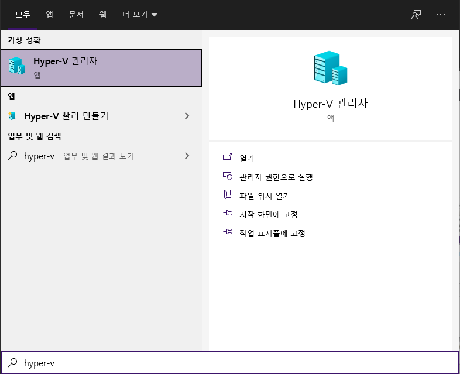

# 윈도우 하이퍼바이저 Ubuntu 20.04 VM

## 윈도우 하이버바이저 기능 설정 후



## 윈도우 하이버바이저 관리자


- 하이퍼관라자  에서 `빨리 만들기` 선택후 가상 컴퓨터 만들기 창으로 이동
- `Ubuntu 20.04` 선택후 가상 컴퓨터 만들기 클릭 후 대기


- 설치 완료후 Ubuntu 부팅 완료

## Ubuntu VM Full screen 설정 방법

```
vim /etc/default/grub
```

- grub 설정 파일 편집


- line 10 편집

```
GRUB_CMDLINE_LINUX_DEFAULT="quiet splash video=hyperv_fb:1920x1080
```


- 설정 편집후 업데이트 명령 실행


```
init 6
```

- 재부팅

## 전체 화면 설정 완료


```toc
```